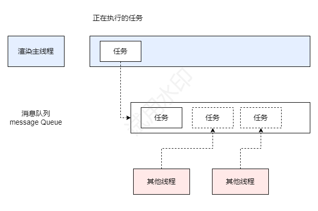
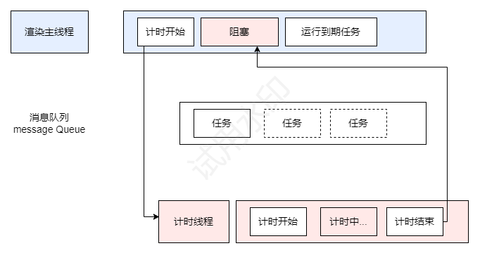
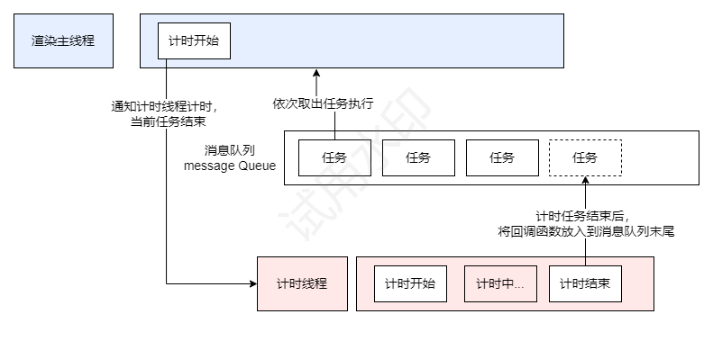

<!--
 * @Author: jiangmengxia jiangmengxia@nnuo.com
 * @Date: 2024-08-26 13:16:31
 * @LastEditors: jiangmengxia jiangmengxia@nnuo.com
 * @LastEditTime: 2024-08-26 16:30:21
 * @FilePath: \jiangmengxia.github.io\browser-problems\event-loop.md
 * @Description: Description
-->
# 事件循环机制


## 浏览器进程模型

### 什么是进程？

运行程序都有它自己的内存空间，可以把这块内存空间简单的理解为进程（当然不仅仅是一块内存）。
每个进程都有自己的内存空间、文件描述符、进程ID等资源，可以独立地执行应用程序、维护自身的状态，进程间也可以通信。
每个应用至少有一个进程，进程之间相互独立、隔离，即便要通信，也需要双方同意。


### 什么是线程？

有了进程之后，就可以运行程序代码了。
运行程序代码的【人】称值为【线程】。

一个进程至少有一个线程，所以在进程开启后会自动创建一个线程来运行代码，称该线程为主线程。
如果程序需要同时执行多块代码，主线程就会启动更多的线程来执行代码，所以一个进程可以包含多个线程。

比如一个游戏应用，它会有主线程、游戏线程、网络线程、渲染线程、音频线程等，这些线程可以同时运行，互不干扰。
浏览器也是一样的道理，它除了主线程外，还有很多其他线程。

###  浏览器有哪些进程和线程？

浏览器是多进程多线程的应用程序。

浏览器内部工作极其复杂。
为了避免各个功能模块相互影响，为了减少连环崩溃的几率，当启动浏览器后，它会自动启动多个进程。


浏览器进程主要有：
* 浏览器进程：
   负责界面（不是页面）的展示，比如工具栏、标签页等；
   负责用户交互；
   负责子进程的创建、销毁等管理，其中浏览器进程时主进程，其他进程时由主进程启动出来的。
   浏览器进程会启动多个线程处理不同的任务。
* 网络进程：负责加载网络资源。网络进程内部会启动多个线程来处理不同的网络任务。
* 渲染进程：一个标签页，一个渲染进程。渲染进程启动后，会开启一个渲染主线程，主线程负责执行HTML、CSS、JS代码，渲染主线程会启动多个线程来处理不同的任务。
           默认情况下，浏览器会为每个标签页启动一个渲染进行，以保证不同标签页之间独立，不相互影响。
* GPU进程
* 插件进程
* 其他辅助进程
这么设计的好处是：当其中一个进程崩溃后，不会影响到其他进程的运行。

缺点：chrome特别占内存

## 渲染主线程是如何工作的？
渲染主线程是浏览器中最繁忙的线程，需要它处理的任务包括但不限于：
* 解析HTML，构建DOM树
* 解析CSS，构建CSSOM树
* 计算样式
* 布局
* 处理图层
* 每秒页面画60次，也就是每16.7ms需要渲染一次页面
* 处理用户交互
* 处理JS代码
* 处理计时器的回调函数
* 处理网络请求
* 处理事件
* 处理动画
* 处理Web Worker
* 处理WebAssembly
* 处理Service Worker
* 处理IndexedDB
* 处理Cache Storage
* 处理WebSocket
* 处理WebRTC
* 处理Web Audio
* 处理WebGL
* 处理Canvas
* 处理SVG
* 处理WebVTT
* 其他

渲染主线程的工作非常繁忙，所以如果主线程被阻塞，页面就会卡顿，用户体验就会变差。
所以，为了优化性能，浏览器会使用事件循环机制来处理任务，将任务分成一个个任务队列，按顺序执行。


##### 思考：为什么渲染进程不适用于多个线程来处理这些事情？

因为渲染进程需要处理的事情非常多，如果使用多个线程来处理，会出现以下问题：

* 线程同步问题：
渲染进程需要处理大量的任务，这些任务之间可能存在依赖关系，如JavaScript代码可能需要等待DOM树构建完成才能执行。如果使用多个线程，就需要处理线程同步问题，这会增加代码的复杂性和出错的风险。
* 性能问题：
渲染进程需要处理大量的任务，如果使用多个线程，就需要处理线程间的切换和同步，这会增加CPU的开销，降低渲染进程的性能。
* 内存问题：
渲染进程需要处理大量的数据，如果使用多个线程，就需要处理线程间的数据共享和同步，这会增加内存的使用，降低渲染进程的内存使用效率。
* 安全问题：
渲染进程需要处理用户输入和网页内容，如果使用多个线程，就需要处理线程间的安全问题和隔离问题，这会增加安全风险。


##### 要处理这么多的任务，主线程问到了一个前所未有的难题：如何调度任务？

比如：
*  我正在执行一个JS函数，执行到一半，用户点击了按钮，我该立即去执行点击事件的处理函数吗？
*  我正在执行一个JS函数，执行到一半，定时器到期了，我该立即去执行定时器的回调函数吗？
*  我正在执行一个JS函数，执行到一半，网络请求返回了，我该立即去处理网络请求的结果吗？
*  我正在执行一个JS函数，执行到一半，用户滚动页面了，我该立即去处理滚动事件吗？

如果主线程立即去处理这些任务，那么主线程就会变得非常繁忙，页面就会卡顿，用户体验就会变差。

渲染主线程相出了一个绝妙的主意：排队



1. 在最开始的时候，渲染主线程会进入一个无限循环
2. 每次循环会检查消息队列是否有任务存在。如果有，则取出第一个任务，执行完后，再进入下一次循环，如果没有则进入休眠状态。
3. 其他所有线程（包括其他进程的线程）可以随时向消息队列添加任务。新任务会加到消息队列的末尾。在添加新任务时，如果主线程是休眠状态，则会将其唤醒以继续循环拿取任务。

这样一来，就可以让每个任务有条不紊、持续进行下去了。


### 何为异步？
在代码执行过程中，会遇到一些无法立即执行的任务，比如：
* 计时完成后需要执行的任务 -- setTimeout、 setInterval
* 网络通信完成后需要执行的任务 -- XMLHttpRequest
* 用户操作后需要执行的任务 -- addEventListener
* IO操作完成后需要执行的任务 -- FileReader
* 其他异步API

如果让渲染主线程等待这些任务的实际到达，就会导致主线程长期处于【阻塞】状态，从而导致浏览器【卡死】，如下图所示（同步）：




##### 使用异步的方式，渲染主线程永不阻塞



<blockquote style='padding:20px'>
面试题：如何理解js的异步？
<br/><br/>
参考答案：<br/>
JS是一门单线程的语言，这是因为它运行在浏览器的渲染主线程中，而一个渲染进程只有一个渲染主线程。<br/><br/>

而渲染主线程承担着众多工作，渲染页面、执行JS等。

如果使用同步的方式，那么当某个任务执行时间过长时，就会阻塞渲染主线程，从而导致消息队列中的人物无法得到执行。这样一来，一方面会导致频繁的主线程长时间等待，白白消耗时间，另一方面导致页面无法及时刷新，给用户造成卡死现象。

所以浏览器采用<b>异步</b>方式来避免，具体的做法是当某些任务发生时，比如计时器、网络、事件监听，主线程将这些任务交由其他线程去处理，自身就结束任务的执行，转而执行下一个任务。当其他线程处理完任务后，会将任务的回调函数添加到消息队列中，等待主线程调度执行。

在这种异步模式下，浏览器永不阻塞，从而最大限度地保证单线程的流畅执行。

所以，JS的异步是通过事件循环机制来实现的，事件循环机制的核心是消息队列 + 异步。

</blockquote>


### JS为何会阻碍渲染？

```js
// 死循环等待（while)
const delay = (duration)=>{
      // ...
}

btn.onClick = ()=>{
   // 设置了DOM文本，但是需要渲染后才能看到结果，绘制任务放到了消息队列里排队
   h1.textContent='阻塞了'  // 主线程队列
   delay(3000) // 等待3秒 放到了主线程队列
}
```
现象是，点击按钮后，页面卡死了，3秒后才显示“阻塞了”文字。

原因：当点击按钮后，渲染主线程会执行JS函数，当执行到`delay(3000)`时，渲染主线程会等待3秒，在这期间，渲染主线程无法处理其他任务，包括渲染页面、执行其他JS函数、处理事件等，从而导致页面卡死。

解决：使用异步，将`delay(3000)`改为`setTimeout(delay, 3000)`，这样渲染主线程就不会被阻塞了。

```js
// 异步等待
const delay = (duration)=>{
   setTimeout(()=>{
      // ...
   }, duration)
}
btn.onClick = ()=>{
   h1.textContent='阻塞了'
   delay(3000) // 等待3秒
}
```

### 任务有优先级吗？

任务没有优先级，在消息队列中先进先出

但消息队列是有优先级的

根据W3C标准的最新解释：
* 每个任务都有一个任务类型，同一个类型的任务必须在一个队列，不同类型的任务可以分属于不同的队列。在依次事件循环中，浏览器可以根据实际情况从不同队列中读取任务执行。

* 浏览器必须准备好一个微队列，微队列中的任务优先所有其他任务执行。
https://html.spec.whatwg.org/multipage/webappapis.html#perform-a-microtask-checkpoint


<blockquote style='padding:20px'>
   随着浏览器的复杂度急剧提升，W3C不再使用宏队列的说法。
</blockquote>


在目前的chrome实现中，至少包括以下队列：
* 延时队列：用于存放计时器到达后的回调任务，优先级【中】
* 交互队列：用户存放用户操作后的事件回调任务，优先级【高】
* 微队列：用户存放需要最快执行的任务，优先级【最高】


<blockquote style='padding:20px'>
   添加任务到微队列的主要方式是使用 Promise、 MutationObserver和 process.nextTick（Node.js 环境）。
   <br/><br/>
   例如：

   ```js
      // 立即把一个函数添加到微队列
      Promise.resolve().then(()=>{})
   ```
   
</blockquote>


<blockquote style='padding:20px'>
   面试题：阐述一下JS事件循环<br/><br/>

   参考答案：
   事件循环又叫“消息循环”，是浏览器渲染主线程的工作方式。
   在Chrome的源码中，它开启一个无限循环，每次循环会检查消息队列中是否有待执行的任务，如果有，就取出一个任务执行，如果没有，就什么都不做。而其他线程只需要在合适的时机把任务加入到消息队列的末尾即可。

   过去把消息队列简单分成宏任务和微任务，这种说法目前已经无法满足复杂的浏览器环境，取而代之的是一种更加灵活的处理方式。

   根据W3C官方解释，每个任务有不同类型，同类型的任务必须在同一个队列中，不同的任务可以属于不同队列，不同任务队列有不同的优先级，在每一次事件循环中，由浏览器自行决定从哪一个队列取任务，但浏览器必须有一个任务队列：微任务队列，微任务队列的优先级最高，必须优先调度。
</blockquote>


<blockquote style='padding:20px'>
   面试题：JS中的计时器能做到精确计时吗？为什么？<br/><br/>

   参考答案：
   
   不能。因为：
   1. 计算机硬件没有原子钟，无法做到精确计时
   2. 操作系统计时函数本身就有少量偏差，而JS的计时器最终调用的就是操作系统的计时器，就携带了偏差
   3. 按照W3C的标准，浏览器实现计时器时，如果嵌套层级超过5层，则会带有4ms的最少时间，这样在计时时间少于4ms时，又带来了偏差。
</blockquote>


