# 浏览器垃圾回收

## 1. 概述

### 1.1 初始回收机制

代码执行完成后，变量不再被使用，这些变量如果没有被及时回收，易造成内存占用过满，无法为新的变量分配内存，从而发生内存泄漏。

回收机制需要解决的点：

（1）何时触发回收

（2）回收的是不再使用的变量，如何判断是否是不再使用的变量，如引用环存在，如何判断

（3）如何保证回收后，有连续的空间分配给对象，即如何将碎片化内存转化成大块的内存，供分配大变量

### 1.2 关于浏览器回收机制

浏览器垃圾回收（Garbage Collection，GC）是一种自动内存管理机制，它用于回收不再使用的内存空间。

浏览器垃圾回收机制的详细说明：

* 内存管理：在浏览器中，内存管理是指分配和释放内存的过程。当浏览器加载网页时，它会分配内存来存储网页的内容和资源。当网页被关闭或卸载时，浏览器会释放这些内存空间。
* 垃圾回收：垃圾回收是指自动检测和释放不再使用的内存空间的过程。垃圾回收器会定期扫描内存空间，找出不再使用的对象，并将其标记为垃圾。然后，垃圾回收器会释放这些对象的内存空间。
* 垃圾回收算法：浏览器使用不同的垃圾回收算法，如标记-清除算法、引用计数算法等，来检测和释放垃圾。标记-清除算法是一种常见的垃圾回收算法，它通过标记和清除两个阶段，来检测和释放垃圾。
* 垃圾回收触发：垃圾回收的触发时机取决于浏览器的实现和配置。一般来说，垃圾回收会在以下情况下触发：
  * 内存不足：当浏览器的内存不足时，垃圾回收器会自动触发，以释放内存空间。
  * 定期触发：垃圾回收器会定期触发，以检测和释放垃圾。触发的时间间隔取决于浏览器的实现和配置。
  * <mark style="color:green;">手动触发</mark>：浏览器提供了一些API，如<mark style="color:purple;">window.gc()</mark>，可以手动触发垃圾回收。
* 垃圾回收性能：垃圾回收会消耗一定的CPU资源和时间，因此可能会影响浏览器的性能。为了提高垃圾回收的性能，浏览器使用了一些优化技术，如<mark style="color:purple;">分代回收、增量回收、并行机制</mark>等。

### 1.3 GC引擎和JS引擎的互斥性

大多数现代浏览器（如Chrome、Firefox、Safari等）的JavaScript引擎（如V8、SpiderMonkey、JavaScriptCore等）在执行垃圾回收（GC）时，都会暂停JavaScript引擎的执行。这是为了保证垃圾回收的正确性和效率。

在垃圾回收过程中，JavaScript引擎会遍历堆内存中的所有对象，标记出存活的对象，并将它们移动到新的位置。在这个过程中，JavaScript引擎会暂停内存分配，以避免在移动对象的过程中出现<mark style="color:red;">**数据竞争**</mark>等问题。

需要注意的是，虽然大多数浏览器的JavaScript引擎在执行垃圾回收时都会暂停JavaScript引擎的执行，但也有一些浏览器（如IE）的JavaScript引擎采用了并发垃圾回收（Concurrent Garbage Collection）等技术，可以在不暂停JavaScript引擎执行的情况下进行垃圾回收。这些技术可以在一定程度上提高垃圾回收的效率，但仍然需要考虑垃圾回收的正确性和数据竞争等问题。

## 2. 常见垃圾回收机制

* <mark style="color:red;">**引用计数器法**</mark>：当该对象被其他对象使用一次，计数器加1，反之不被引用时，计数器减1，当计数器为0，表示不被使用，该变量可以被回收。&#x20;

&#x20;       优点：计算简单、效率高&#x20;

&#x20;       缺点：存在引用环的时候，无法判断变量是否可以被回收

* <mark style="color:red;">**标记-清除法（Mark-Sweep ）**</mark>：分为标记阶段和清除阶段。 标记阶段从根节点出发，根据引用关系链，在链上面的变量被认为是在使用的，不再链上面的变量被认为可以回收。 清除阶段将不再引用链上面的变量清除。

&#x20;       优点：解决了引用环的问题&#x20;

&#x20;       缺点：清除阶段会带来内存碎片，导致内存空间不连续，影响内存分配效率。

* <mark style="color:red;">**标记-整理-清除（Mark-Compact）**</mark>：或称<mark style="color:red;">**标记-压缩**</mark>算法，可以看作是标记-清除的增强版本，他在标记阶段的操作和标记清除一致，但是清除阶段之前会先执行整理，移动对象位置，对内存空间进行压缩，目的是为将碎片化内存合并成更大的内存。&#x20;

&#x20;      优点：解决了内存碎片问题&#x20;

&#x20;      缺点：整理阶段会消耗更多的时间

任何垃圾回收测量，目前都无法完全解决内存碎片问题，也就是内存不连续问题。

<mark style="color:purple;">**如何为新对象分配内存呢，一般有以下三种方式：**</mark>

<figure><figcaption></figcaption></figure>

其中<mark style="color:green;">First-fit是性能最好</mark>的，也是最常用的。

## 3. V8回收机制

V8是Google开发的一种高性能JavaScript引擎，它被广泛用于Chrome浏览器和Node.js等环境中。V8引擎使用了一种称为<mark style="color:red;">**分代垃圾回收**</mark>（Generational Garbage Collection）的机制来管理内存。

在Chrome中，v8被<mark style="color:red;">限制</mark>了内存的使用（64位约1.4G/1464MB ， 32位约0.7G/732MB），为什么要限制呢？

1. 表层原因是，V8最初为浏览器而设计，不太可能遇到用大量内存的场景
2. 深层原因是，V8的垃圾回收机制的限制（如果清理大量的内存垃圾是很耗时间，这样回引起JavaScript线程暂停执行的时间，那么性能和应用直线下降）

<mark style="background-color:red;">在JavaScript中，其实绝大多数的对象存活周期都很短，大部分在经过一次的垃圾回收之后，内存就会被释放掉</mark>，而少部分的对象存活周期将会很长，一直是活跃的对象，不需要被回收。为了提高回收效率，V8 将堆分为两类新生代和老生代，<mark style="color:red;">**新生代**</mark><mark style="color:red;">中存放的是生存时间短的对象</mark>，如局部变量和临时对象。<mark style="color:red;">**老生代**</mark><mark style="color:red;">中存放的生存时间久的对象，</mark>如全局变量。

新生区通常只支持 1～8M 的容量，而老生区支持的容量就大很多了。对于这两块区域，V8 分别使用两个不同的垃圾回收器，以便更高效地实施垃圾回收。

* 副垃圾回收器 - Scavenge算法：主要负责新生代的垃圾回收，回收频次高。
* 主垃圾回收器 - Mark-Sweep & Mark-Compact算法：主要负责老生代的垃圾回收，回收频次低。

### 3.1 新生代回收过程

新生代内存区分为：

* Eden区（伊甸园）：通常占新生代的绝大部分，大约80%到90%。主要用于<mark style="color:green;">**分配新创建的对象**</mark>。大多数新对象都会在Eden区被创建。当Eden区满了之后，V8会触发一次Minor GC。
* Surviver区：通常占比大约10%到20%。分为From区和To区
  * <mark style="color:red;">**From**</mark>区：
  * <mark style="color:red;">**To**</mark>区：To区最后都是保持空的，它存在的作用是将From、Eden区的存货对象重新分配内存，从而去除定期去除内存不连续的问题。

·<mark style="background-color:red;">备注：在一些文档或资料中，可能会看到只提到From区和To区，而没有提到Eden区。这是因为Eden区在逻辑上可以看作是From区的一部分，即From区包含了Eden区和部分From区中的对象。这种简化描述是为了简化理解，实际上V8引擎在实现中是包含Eden区的。</mark>

#### <mark style="background-color:purple;">3.1.1 第一次回收</mark>

备注：这里把新生代区初始为空，进行初始回收，称做“**第一次回收**”

从刚开始创建对象起，对象会被分配到Eden区。

<figure><figcaption></figcaption></figure>

之后会有越来越多的对象被创建在**Eden** 里，直至**Eden**内存被<mark style="color:red;">占用满（并不是真正没有空间，而是无法再分配给新的对象）</mark>这个时候就会出现一次垃圾回收，新生代的垃圾回收叫做 <mark style="color:red;">**minor GC**</mark>**（**翻译为“小回收”**，**也称为<mark style="color:red;">Young GC</mark>，翻译为新生代回收，是Java虚拟机（JVM）中的一种垃圾回收操作，主要用于新生代（Young Generation）的垃圾回收）

<figure><figcaption>
Eden区饱和
</figcaption></figure>

**minor GC**流程就会采用Mark-Sweep（标记-清除） 对Eden区进行回收，回收完后大部分对象都被回收了，还剩余少部分对象，这些对象所占用的内存也不一定是连续的，如图：

<figure><figcaption>
经过一次标记清除回收Eden区
</figcaption></figure>

然后会使用<mark style="background-color:green;">Scavenge算法</mark>把剩余存活对象转移到<mark style="color:red;">**To区**</mark>中，并且会把幸存的对象<mark style="color:red;">寿命</mark><mark style="color:red;">**加1**</mark>**。**这里我们发现，移到To区的内存已经是<mark style="color:red;">连续的</mark>，这里要得益于<mark style="background-color:green;">Scavenge算法的整理算法，</mark><mark style="color:red;">同时内存被压缩过。</mark>这里是得益于<mark style="background-color:green;">Scavenge算法</mark>的“<mark style="color:purple;">指针压缩</mark>”技术

<figure><figcaption></figcaption></figure>

之后会使用<mark style="background-color:green;">Scavenge算法</mark>交换<mark style="color:orange;">**From**</mark>区和<mark style="color:orange;">**TO**</mark>区的数据，最后将To区数据清空**，**这里我们会发现，每次回收后To区清空的**作用（**个人觉得）是：

* **使To区始终保持空的，方便下一次回收时From->TO或Eden->TO转移，同时保持回收流程的一致性。**

<figure><figcaption></figcaption></figure>

#### <mark style="background-color:purple;">**3.1.2 第二次回收**</mark>

在使用过程中，<mark style="color:purple;">Eden区和From区都不为空</mark>，等下一次Eden区空间再次接近饱和，无法为下一个对象分配内存空间的时候（如下图），这是需要再次进行回收，这种From区不为空时的回收，我称之为“第二次回收”。

<figure><figcaption>
Eden内存已满，待回收
</figcaption></figure>

这时**minor GC**流程就会采用Mark-Sweep（标记-清除） 、 Mark-Compact（标记-整理）对Eden区、From区进行回收（个人觉得这里可能采用双线程分别去处理两个区的回收），回收完成后，Eden和From区还剩少量的幸存对象，如图。

<figure><figcaption></figcaption></figure>

然后也会使用<mark style="background-color:green;">Scavenge算法</mark>把Eden区、From区中剩余存活对象转移到<mark style="color:red;">**To区**</mark>中，并且把幸存的对象<mark style="color:red;">寿命</mark><mark style="color:red;">**加1**</mark>**。**这个步骤跟“第一次回收”是类似的，采用了<mark style="color:red;">整理算法+压缩技术</mark>，如图

<figure><figcaption></figcaption></figure>

最后与“第一次回收”一样，使用<mark style="background-color:green;">Scavenge算法</mark>交换<mark style="color:orange;">**From**</mark>区和<mark style="color:orange;">**TO**</mark>区的数据，最后得到的内存分布如图。

<figure><figcaption></figcaption></figure>

#### <mark style="background-color:purple;">3.1.3 第N次回收</mark>

假设一个对象的寿命超过了一个域值了，就证明这个对象是比较有价值的，那么就会晋升到老年代中，新生代继续进行**minor GC**策略。

### 3.2 新生代回收算法

**minor GC的**算法具体包含：

* <mark style="color:orange;">Mark-Sweep（标记-清除）</mark>&#x20;
* <mark style="color:orange;">Compact（整理）算法</mark>
* <mark style="color:orange;">Scavenge算法</mark>

再次简述回收过程如下：

* **标记阶段（Marking）阶段**：V8引擎会遍历堆内存中的所有对象，标记出存活的对象。在这个过程中，V8引擎会使用一种称为“<mark style="color:red;">三色标记</mark>”（Tri-color Marking）的算法，将对象分为白色、灰色和黑色三种颜色。白色表示未访问的对象，灰色表示已访问但未处理的对象，黑色表示已处理的对象。
* **清除（Sweeping）阶段**：在标记阶段完成后，V8引擎会<mark style="color:red;">清除所有未被标记（即白色）的对象</mark>，这些对象就是垃圾。清除阶段会释放这些对象的内存，以便后续的内存分配。
* <mark style="background-color:purple;">**复制&整理（Copying）阶段**</mark>：个人认为可理解为“整理阶段”，对于标记为存活的对象，V8引擎会将它们复制到To区。在这个过程中，V8引擎会使用一种称为“<mark style="color:red;">Scavenge</mark>”的算法，将Eden区和From区中的存活对象复制到To区。这个过程做到了以下性能优化：
  * **快速回收**：复制阶段快速回收Eden区、From区的垃圾，同时会<mark style="color:red;">更新存活对象的指针</mark>，以便正确地引用新位置的对象。
  * **避免碎片化**：采用“整理”算法，会将这些对象所占的内存<mark style="color:red;">整理成占用连续的内存</mark>，减少碎片内存，方便后续的内存分配。
  * **减少内存**：会使用一种称为<mark style="color:red;">指针压缩</mark>（Pointer Compression）的技术，将64位的指针压缩为32位，从而减少内存的使用。
* **交换（Swapping）**：在复制阶段完成后，V8引擎会将From区和To区的角色互换。这样，下一次垃圾回收时，From区将作为Eden区，To区将作为From区。
* **晋升机制**：当对象在From空间中存活了一定的时间后，Scavenge算法会将这些对象晋升到老生代。晋升过程会使用一种称为晋升阈值（Promotion Threshold）的机制，当对象的年龄超过晋升阈值时，Scavenge算法会将对象晋升到老生代。

● **优点**：算法简单

● **缺点**：新生代回收算法，在回收阶段（含清除、空间交换）是依次在复制阶段之后的，因此可以认为是<mark style="color:red;">串行</mark>的，也就是说回收会存在“<mark style="color:red;">卡顿</mark>”，同时进入回收过程（4个阶段）的时候，与<mark style="color:red;">JS执行是互斥的</mark>，JS执行会“卡顿”，综合以上2点，<mark style="color:red;">性能相对差</mark>，但由于新生代的变量都是小变量、内存空间小，因此这点“卡顿”的影响并不明显。

### 3.3 老生代回收

上面讲到新生代中每次垃圾收集时都发现有大量对象回收，在多次**minor GC**回收后会有部分对象逐步**晋升**到老年代中存放，这里的<mark style="color:red;">**晋升机制**</mark>是：

* 内存占用达到阈值：当对象的内存占用大于一定的比例（一般是25%-50%），该变量自动存放到老生区，并从新生区移除（若已存在于新生区）
* 年龄达到阈值：当对象长时间占用新生区（也就是回收多次后仍存在，一般5次），该变量自动存放到老生区，并从新生区移除

介于新生代的“<mark style="color:red;">卡顿</mark>”问题，由于老生代的变量大、内存空间大，回收时间长，因此若采用与新生代一样的算法，停顿问题将放大（成为严重性能瓶颈），因此老生代会配合<mark style="color:red;">并行、增量、并发机制</mark>结合<mark style="color:red;">标记-清除（</mark>标记用的是三色标记<mark style="color:red;">）、标记-整理算法</mark>进行回收。标记清除、标记整理算法，上面有介绍过，这里不再重复说明，下面主要对多线程中的三个机制：<mark style="color:red;">并行、增量、并发</mark>进行详细说明。

#### 3.3.1 并行机制

并行机制是指在垃圾回收过程中，启用多个辅助线程来同时进行垃圾回收工作（如图GC任务），以减少垃圾回收的时间。

<figure><figcaption></figcaption></figure>

如上图所示，对于当前GC任务，除了主线程外，另外启用了两个辅助线程来进行GC，由于GC与JS引擎的互斥性，必须等持续时间最长的GC任务（如图中辅助线程1的GC任务）执行完成后，才可以继续后续的JS任务。

由此可见，仅使用并行机制可以在一定程度上提高垃圾回收的效率，但仍然需要暂停JavaScript引擎的执行，当遇到较长时间的GC时，还是需要等待当前所有并行的GC都均完成的。

#### 3.3.2 增量机制

增量机制是指将GC任务拆分成多个GC子任务，每个GC子任务只处理一小部分对象的GC（<mark style="color:purple;">理论上拆分的同一时间线的并行GC子任务不会对同一个对象进行回收</mark>），从而减少每次垃圾回收的暂停时间，提高JS的执行效率。

一般可以采用分配时间片的方式，为每个GC子任务设置最长工作时间。

增量GC的效果如图：

<figure><figcaption>
主线程增量
</figcaption></figure>

当<mark style="color:red;">并行机制与增量机制结合</mark>使用时，GC和JS依旧是互斥的，如图：

<figure><figcaption>
并行&#x26;增量
</figcaption></figure>

#### <mark style="color:red;">此外，GC任务可以拆的更细，比如标记任务、清除任务、整理任务、复制任务。</mark>

<mark style="background-color:purple;">其中标记与JS执行可能同时使用到同一个变量，是互斥的。但是其他任务并不会与JS执行用到同一变量，因此完全可以并行的。</mark>

#### 3.3.3 并发机制

上面讲到的**并行垃圾回收**和**增量垃圾回收**依然会阻塞主线程，接下来讲的**并发垃圾回收**就可以解决这个问题。

**并发回收机制**：指主线程在执行 JavaScript 的过程中，辅助线程能够在后台完成执行垃圾回收的操作。

对于<mark style="color:red;">增量回收</mark>，<mark style="color:red;">主线程在执行JS任务，辅助线程在后台完成GC任务时，可能会同时更改或使用同一个变量</mark>，这就需要使用类似“<mark style="background-color:purple;">锁机制</mark>”来<mark style="background-color:purple;">保证数据的完整性和可靠性</mark>，这种机制属于“并发机制”的范畴。

需要注意的是，<mark style="color:purple;">并发垃圾回收技术并不是所有浏览器都采用的技术</mark>。一些浏览器（如Chrome、Firefox、Safari等）的JavaScript引擎（如V8、SpiderMonkey、JavaScriptCore等）在执行垃圾回收时，仍然需要暂停JavaScript引擎的执行。这是为了保证垃圾回收的正确性和效率，避免在垃圾回收过程中出现数据竞争等问题。

#### <mark style="color:red;">此外，当GC任务拆的更细时，比如标记任务、清除任务、整理任务、复制任务。</mark>

<mark style="background-color:purple;">其中标记与JS执行可能同时使用到同一个变量，是互斥的，因此需要用到“锁机制”。但是其他任务并不会与JS执行用到同一变量，因此完全不需要为它们并发。</mark>

## 总结

关于回收机制，主要掌握“标记-清除”和“标记-整理”方法，回收的过程万变不离其宗：

（1）找到可以回收的变量，定期回收

（2）清除后，将剩余内存进行整理，有效整合碎片化内存

（3）合理使用“压缩技术”压缩内存

此外，利用多线程机制来提升性能，比如并行、并发、增量都是常用的“多线程”或“多进程”性能提升的机制，了解即可。

【参考文档】

指针压缩  : [https://cloud.tencent.com/developer/article/2398492](https://cloud.tencent.com/developer/article/2398492)

#### [https://github.com/yacan8/blog/issues/33](https://github.com/yacan8/blog/issues/33)

[https://juejin.cn/post/7274146202496090170?searchId=20240219162701237A9D531E87A0049AD0](https://juejin.cn/post/7274146202496090170?searchId=20240219162701237A9D531E87A0049AD0)

[https://juejin.cn/post/7031549740248465439](https://juejin.cn/post/7031549740248465439)
