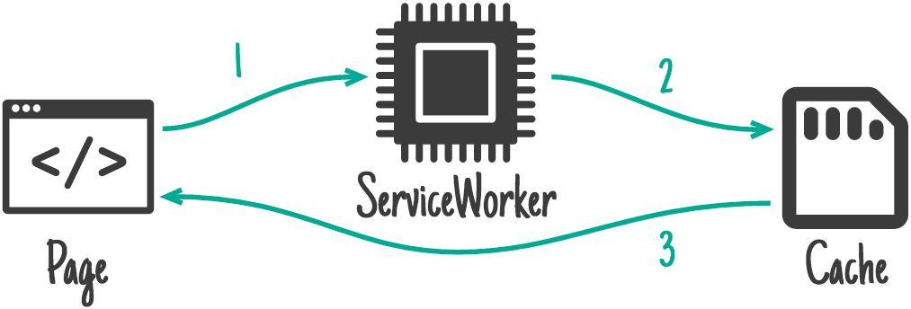

# 浏览器渲染

## 1. 浏览器渲染过程的流程图

1. 用户输入url，按下回车键，
2. DNS解析：浏览器通过DNS解析，将URL转化成IP地址
3. TCP连接：浏览器通过TCP协议，与服务器建立连接
4. 发送HTTP请求：浏览器开启一个线程，向服务器发送请求HTTP请求，请求网页内容
5. 接收HTTP响应：服务器返回HTTP响应，浏览器接收响应，解析响应头，获取响应状态码，如果状态码是200，则继续，否则，根据状态码进行错误处理
6. 解析HTML: 服务器返回html文件，浏览器会开启一个线程，解析html文件，构建DOM树
7. 解析CSS: 在解析html文件的过程中，如果遇到link标签，会同步加载css文件，构建CSSOM树（document.styleSheet可以拿到整个样式树）

<figure><figcaption><p>CSSOM树结构-document.styleSheets</p></figcaption></figure>

8. 解析JS: 在解析html文件的过程中，如果遇到script标签，会同步加载js文件，阻塞html解析，执行js代码，如果js代码中有修改DOM的操作，会重新构建DOM树，如果js代码中有修改CSS的操作，会重新构建CSSOM树，然后重新构建渲染树，重新布局，重新绘制
9. Attachment: 计算出DOM树中每个节点的具体样式，生成计算树（ComputedStyle）。
10. Layout (构建LayoutTree)：计算每个需要显示的节点和这些节点的几何信息，包括位置和大小。
11. Layer (布局渲染树LayerTree)：通过渲染树，进行分层（根据定位属性、透明属性、transform属性等）生产图层树。查看layout的方式如下，能看到各个分层：&#x20;

    <figure><figcaption></figcaption></figure>
12. Painting (绘制渲染树)：将不同的图层进行绘制，转交给合成线程处理， ○ 11.1 Composite (成线程合处理)：合成线程将图层按一定规则切分成小的图块，然后进行栅格化处理，生成位图 如何根据图层进行合成，可以通过选定图层，右键“展示绘制细节”👇🏻，会看到profile的Tab，里面能看到所有该图层的绘制指令。

&#x20;       &#x20;

<figure><figcaption></figcaption></figure>

<figure><figcaption></figcaption></figure>

&#x20;      以上的指令列表，最终会交给“合成线程”处理，合成线程将图层按一定规则切分成小的图块，然后进行栅格化处理，生成位图。 这里栅格化也是由合成线程处理的，有专门进行栅格化的线程来处理待栅格化任务的队列。 

13. Display (显示)：然后将位图交给GPU进程进行绘制，生成最终的页面  &#x20;

<figure><figcaption></figcaption></figure>

14. 用户操作后，事件监听，执行js代码，修改样式、修改DOM的操作，会重新构建渲染树，重新布局，重新绘制，则重新执行：修改DOM树、CSSOM树、9-13步骤

拓展： js 的同步加载和异步加载

&#x20;

<figure><figcaption></figcaption></figure>

```
（1）  <script/>      ：同步加载，加载后立即执行，阻塞DOM解析
（2）  <script async/> ：异步加载，加载后立即执行，阻塞DOM解析
（3）  <script defer/> ：异步加载，加载后等待DOM解析完成再执行，不阻塞DOM解析

css 的同步加载和异步加载
（1）  <link/>      ：同步加载，加载后立即执行，阻塞DOM解析
（2）  <link async/> ：异步加载，加载后立即执行，阻塞DOM解析
（3）  <link defer/> ：异步加载，加载后等待DOM解析完成再执行，不阻塞DOM解析
```

总结：&#x20;

<figure><figcaption></figcaption></figure>

```
● 浏览器可以部分渲染,遇到一个元素可以开始渲染，并不是等待整个页面加载完之后再渲染
● css下载和解析 与 html解析 是并行的，因此css的下载、解析不影响DOM解析
● css下载、解析会阻塞页面的渲染，因为渲染需要css生成CSSOM树+DOM Tree
● parserHtml -> parserStylesheet -> updateLayerTree-> paint
● js（非async/defer）会阻塞DOM解析，需要暂停DOM解析去执行js
○ 一方面JS可能会操作样式、所以需要等待上面的样式<link/>加载完成
○ 一方面JS可能会操作DOM，脚本执行完成后会再去解析DOM
```

## 2. 重绘&重排

1. 重绘：当页面中元素样式的改变并不影响它在文档流中的位置时（例如：color、background-color、visibility等），浏览器会将新样式赋予元素并重新绘制它，这个过程称为重绘。
2. 重排：当渲染树中的一部分（或全部）因为元素的规模尺寸、布局、隐藏等改变而需要重新构建，这就称为回流（回流必定会发生重绘，重绘不一定会引发回流）。回流所需的成本比重绘高的多，因为回流会影响到布局，所以回流必定会引发重绘，重绘不一定会引发回流。
3. 重排的触发条件：当页面布局和几何属性发生变化时，如元素的位置、大小、显示/隐藏等，浏览器会重新计算元素的位置和大小，重新构建渲染树，这个过程称为重排。常见的重排触发条件包括：
   * 添加或删除可见的DOM元素
   * 元素尺寸改变（宽度、高度、边距、填充、边框等）
   * 内容变化，如文本变化或图片尺寸改变
   * 浏览器窗口尺寸改变
   * 计算 offsetWidth 和 offsetHeight 等属性
4. 重绘和重排的代价：重绘和重排是浏览器性能优化的一个重要方面，因为它们会导致浏览器重新计算布局、重新绘制页面，从而影响页面的性能。因此，我们应该尽量避免频繁的重绘和重排，以提高页面的性能。

## 3. 浏览器渲染优化

浏览器渲染优化是提高网页性能和用户体验的重要手段。以下是一些常见的浏览器渲染优化策略：

从渲染流程图来思考，可以从几点去做： （1）在建立http连接前浏览器处理的加速（DNS解析）、网络通信加速、提升网络带宽等 （2）http连接加速：使用HTTP2.0 （3）浏览器内容渲染的加速： 静态资源本身的优化 浏览器缓存策略 （4）后端接口返回加速 优化接口传参、优化接口设计、后端缓存技术等 （5）性能指标检测并分析，针对性解决

1. **避免使用内联样式**：内联样式会导致浏览器频繁的重新计算样式，应该尽量避免使用内联样式，可以使用外部样式表或者CSS类来设置样式
2. **减少重绘和回流**：重绘和回流是浏览器渲染过程中的两个重要步骤，它们会消耗大量的计算资源。可以通过优化CSS选择器、避免不必要的DOM操作、使用CSS3硬件加速等技术来减少重绘和回流。
3. **使用CSS预处理器**：CSS预处理器如Sass和Less可以提供更强大的功能和更好的代码组织方式，但它们也会增加CSS文件的大小。可以通过压缩和合并CSS文件来减少文件大小。
4. **使用CSS动画代替JavaScript动画**：CSS动画可以由浏览器直接优化，而JavaScript动画需要JavaScript引擎进行计算和渲染。使用CSS动画可以减少JavaScript的计算和渲染负担，提高性能。
5. **使用Web Workers**：Web Workers可以在后台线程中执行JavaScript代码，避免阻塞主线程。使用Web Workers可以避免JavaScript代码的阻塞，提高页面性能。
6. **使用懒加载**：懒加载是一种优化网页性能的技术，它可以在用户需要时才加载资源。使用懒加载可以减少初始加载的资源大小，提高页面加载速度。
7. **使用CDN**：CDN（内容分发网络）可以将资源分发到全球的边缘节点，减少资源的加载时间。使用CDN可以加快资源的加载速度，提高页面性能。
8. **使用HTTP/2**：HTTP/2是一种新的HTTP协议，它提供了许多改进，如头部压缩、服务器推送等。使用HTTP/2可以减少HTTP请求的数量，提高页面加载速度。
9. **使用Service Worker**：Service Worker是一种可以在浏览器后台运行的脚本，它可以拦截和处理网络请求，缓存资源等。使用Service Worker可以优化资源的加载和缓存，提高页面性能。
10. **使用WebAssembly**：WebAssembly是一种新的Web编程语言，它可以在浏览器中运行高性能的应用程序。使用WebAssembly可以提供更快的计算性能，提高页面性能。
11. **使用性能分析工具**：性能分析工具可以帮助开发者找出网页的性能瓶颈，如Chrome DevTools、Lighthouse等。使用性能分析工具可以找出需要优化的地方，提高页面性能。

总的来说，浏览器渲染优化需要综合考虑多个方面，包括资源优化、代码优化、网络优化等。通过优化这些方面，可以提高页面的加载速度和渲染性能，提高用户体验。

## 4. 优化资源加载的策略

*   preFetch: 预取回，用于提示浏览器在CPU和网络带宽空闲时，预先下载指定URL的JS，图片、音频、HTML文档等各类资源，存储到浏览器本地缓存中，从而减少该资源文件后续加载的耗时，从而优化用户体验。

    ```
    <link rel="prefetch" href="https://github.com/JuniorTour/juniortour.js" />
    ```
*   preLoad:预加载，提前加载资源，当用户点击链接时，浏览器会立即加载资源，提高用户体验。 与预取回不同，预加载用于提高当前页面中资源加载的优先级，确保关键资源优先加载完成。 预加载最常见的用法是用于字体文件，减少因字体加载较慢导致的文字字体闪烁变化。例如：

    ```
    <link rel="preload" as="font" href="/main.woff" />
    ```
*   preConnect:预连接提示用于提前与目标域名握手，完成DNS寻址，并建立TCP和TLS链接。具体使用方式是将link标签的rel属性设为preconnect，并将href属性设为目标域名，例如 :

    ```
    <link rel="preconnect" href="https://github.com" />
    ```

    优化效果是通过提前完成DNS寻址、建立TCP链接和完成TLS握手，从而减少后续访问目标域名时的连接耗时，改善用户体验。 注意！ 强烈建议只对重要域名进行Preconnect优化，数量不要超过 6 个。 因为Preconnect生效后，会与目标域名的保持至少10秒钟的网络连接，占用设备的网络和内存资源，甚至阻碍其他资源的加载。
*   preRender:预渲染，是将网页内容在用户访问前生成静态HTML文件的技术，优化了首次访问速度，减少服务器压力，提升用户体验。预渲染可应用于单页面应用(SPA)、静态站点生成器和网站爬虫，但存在未处理动态元素和SEO限制。预渲染引擎如Prerender.io和Nuxt.js可自动为SPA生成预渲染页面，提高搜索引擎可见性。

    ```
    <link rel="prerender" href="https://github.com" />
    ```
*   preCache:预缓存，是指预先下载和存储网络资源，以减少未来访问延迟的技术。这适用于如视频、网页图像等大块数据。预缓存能提升用户满意度，增加页面加载速度，节省流量，优化用户体验，并提升应用程序运行效率。因此，它被广泛用于各种网络应用，如在线教育、在线游戏和电子商务等，以提高用户体验和满足需求。

    ```
    <link rel="precache" href="https://github.com/JuniorTour/juniortour.js" />
    ```
*   dnsPrefetch:DNS预解析，提前解析域名，提高页面加载速度。

    ```
    <link rel="dns-prefetch" href="https://github.com" />
    ```

## 5. 页面首屏留白问题

页面首屏留白问题通常是由于页面加载速度慢或资源加载时间长导致的。当用户打开一个网页时，如果页面内容没有立即显示，用户可能会感到困惑或不满。以下是一些可能的原因和解决方案：

* 资源加载时间长：如果网页包含大量的图片、视频、JavaScript文件或CSS文件，这些资源需要时间加载。 解决方案是优化资源，如使用压缩和合并资源文件，使用CDN加速资源加载，或者使用懒加载技术，只加载用户可视区域内的资源。
* JavaScript执行时间长：JavaScript代码可能会阻塞页面的渲染。 解决方案是优化JavaScript代码，如使用异步加载、拆分代码、使用Web Workers等。
* CSS样式计算时间长：CSS样式计算可能会影响页面的渲染。 解决方案是优化CSS代码，如使用CSS选择器的优化、使用CSS预处理器等。
* 布局计算时间长：布局计算可能会影响页面的渲染。 解决方案是优化布局，如使用CSS Flexbox或Grid布局，避免使用复杂的布局算法等。
* 浏览器渲染性能问题：浏览器渲染性能可能会影响页面的渲染。 解决方案是优化浏览器渲染性能，如使用硬件加速、减少重绘和回流等。
* 网络延迟：网络延迟可能会影响页面的加载速度。 解决方案是优化网络连接，如使用更快的网络、使用CDN等。
* 服务器响应时间：服务器响应时间可能会影响页面的加载速度。 解决方案是优化服务器性能，如使用更快的硬件、使用缓存等。
* 解决页面首屏留白问题需要综合考虑多个因素，包括资源优化、代码优化、网络优化等。 通过优化这些方面，可以提高页面的加载速度和渲染性能，减少用户等待时间，提高用户体验。

## 5. 浏览器性能指标

### 5.1  **window.performance**

\`window.performance\` 是一个Web API，它提供了关于浏览器性能的信息。它可以帮助开发者了解网页的性能，并找出性能瓶颈。以下是一些常见的 \`window.performance\` 属性和方法：

●  \*\*performance.timing\*\*：这是一个对象，它包含了与页面加载时间相关的信息，如页面开始加载的时间、DNS解析时间、TCP连接时间、请求发送时间、响应接收时间、DOM加载时间、页面完全加载时间等。

● \*\*performance.navigation\*\*：这是一个对象，它包含了与页面导航相关的信息，如页面重定向次数、页面加载类型等。

●  \*\*performance.memory\*\*：这是一个对象，它包含了与JavaScript内存使用相关的信息，如JavaScript堆的大小、JavaScript堆的使用量等。

● \*\*performance.getEntries()\*\*：这是一个方法，它返回一个PerformanceEntry对象的数组，包含了与页面加载时间相关的信息，如资源加载时间、网络请求时间等。

●  \*\*performance.now()\*\*：这是一个方法，它返回一个高精度的时间戳，用于测量时间间隔。

通过使用 \`window.performance\`，开发者可以了解网页的性能，并找出性能瓶颈。例如，开发者可以使用 \`performance.timing\` 来测量页面加载时间，使用 \`performance.getEntries()\` 来测量资源加载时间，使用 \`performance.now()\` 来测量时间间隔。通过优化这些指标，可以提高网页的性能和用户体验。

### **5.2 网络性能指标**

浏览器网络接口响应的指标是衡量浏览器处理网络请求和响应的能力的重要指标，它们可以帮助开发者了解网页的网络性能，并找出性能瓶颈。以下是一些常见的浏览器网络接口响应的指标：

[https://developer.chrome.com/docs/devtools/network/reference/?utm\_source=devtools#timing-explanation](https://developer.chrome.com/docs/devtools/network/reference/?utm\_source=devtools#timing-explanation)

● 排队时间（Queueing）

● 安装时间（Stalled)：它表示浏览器在发送请求之前等待的时间

● DNS LookUp:域名解析时间

● initial Connect & Connection Start：都表示浏览器开始建立与服务器的连接的时间。两者差异是：

&#x20; initial Connect：这个指标表示浏览器开始建立与服务器的连接的时间，包括DNS解析、TCP连接和TLS握手等步骤。这个指标可以帮助开发者了解网络连接的建立速度，从而优化网页的加载性能。

&#x20;Connection Start：这个指标表示浏览器开始建立与服务器的连接的时间，但不包括DNS解析和TCP连接等步骤。这个指标可以帮助开发者了解网络连接的建立速度，但可能不如 initial Connect 准确。

总的来说，initial Connect 和 Connection Start 都是衡量网络连接建立速度的重要指标，但 initial Connect 的范围更广，可能更准确。在优化网页的加载性能时，开发者可以根据需要选择使用这两个指标。

● Proxy negotiation 表示浏览器与代理服务器进行协商的时间

● 请求发送时间（request sent)

● 等待服务端响应时间（waiting for server）

● 响应内容下载时间（Time Content Downloaded)

<figure><figcaption></figcaption></figure>

### 5.3 **RAIL衡量模型**

RAIL, 是 Response, Animation, Idle, 和 Load 的首字母缩写，RAIL模型是一种以用户为中心的性能模型，RAIL代表Web应用生命周期的四个不同方面：响应、动画、空闲和加载。

该模型分为以下几类指标：

#### 5.3.1 **响应性能指标**

浏览器响应性能指标是衡量浏览器响应用户输入的能力的重要指标，它们可以帮助开发者了解网页的响应性能，并找出性能瓶颈。以下是一些常见的浏览器响应性能指标：

● 首次输入延迟时间（First Input Delay，FID）：首次输入延迟时间是用户首次与页面交互（如点击按钮）到浏览器响应该交互的时间。首次输入延迟时间越短，用户体验越好。

● 最大输入延迟时间（Max Input Delay，MID）：最大输入延迟时间是所有用户输入的延迟时间的最大值。最大输入延迟时间越短，用户体验越好。

● 用户可交互时间（Time To Interactive，TTI）：用户可交互时间是浏览器从开始加载到页面完全可交互的时间。用户可交互时间越短，用户体验越好。

● 首次内容绘制时间（First Contentful Paint，FCP）：首次内容绘制时间是浏览器从开始加载到第一个内容元素渲染完成的时间。首次内容绘制时间越短，用户体验越好。

● 首次有效绘制时间（First Meaningful Paint，FMP）：首次有效绘制时间是浏览器从开始加载到主要内容元素渲染完成的时间。首次有效绘制时间越短，用户体验越好。

● 最大内容绘制时间（Largest Contentful Paint，LCP）：最大内容绘制时间是浏览器从开始加载到最大内容元素渲染完成的时间。最大内容绘制时间越短，用户体验越好。

● 累积布局偏移（Cumulative Layout Shift，CLS）：累积布局偏移是测量页面在加载过程中布局变化的程度。累积布局偏移越低，用户体验越好。

#### 5.3.2 **动画性能**

浏览器动画性能指标是衡量浏览器动画性能的重要指标，它们可以帮助开发者了解动画的性能，并找出性能瓶颈。以下是一些常见的浏览器动画性能指标：

● 帧率（Frames Per Second，FPS）：帧率是指动画每秒渲染的帧数。帧率越高，动画越流畅。一般来说，60FPS是流畅动画的目标。

● 渲染时间（Rendering Time）：渲染时间是指浏览器渲染一帧动画所需的时间。渲染时间越短，动画越流畅。

● 重绘次数（Repaints）：重绘是指浏览器重新绘制网页元素的过程。重绘次数越多，性能开销越大。

● 回流次数（Reflows）：回流是指浏览器重新计算网页元素的位置和大小的过程。回流次数越多，性能开销越大。

● JavaScript执行时间（JavaScript Execution Time）：JavaScript执行时间是指执行JavaScript代码所需的时间。JavaScript执行时间越短，动画越流畅。

● 网络延迟（Network Latency）：网络延迟是指浏览器从服务器获取资源所需的时间。网络延迟越大，动画越卡顿。

● CPU使用率（CPU Usage）：CPU使用率是指CPU处理动画所需的时间。CPU使用率越高，动画越卡顿。

#### 5.3.3 **空闲性能指标**

浏览器空闲性能指标是衡量浏览器在空闲时间执行后台任务的能力的重要指标，它们可以帮助开发者了解网页的空闲性能，并找出性能瓶颈。以下是一些常见的浏览器空闲性能指标：

● 空闲时间（Idle Time）：空闲时间是浏览器处于空闲状态的时间。空闲时间越长，浏览器可以执行更多的后台任务。

● 后台任务执行时间（Background Task Execution Time）：后台任务执行时间是浏览器执行后台任务所需的时间。后台任务执行时间越短，用户体验越好。

● 后台任务队列长度（Background Task Queue Length）：后台任务队列长度是浏览器后台任务队列的长度。后台任务队列长度越短，浏览器可以更快地执行后台任务。

● 后台任务执行频率（Background Task Execution Frequency）：后台任务执行频率是浏览器执行后台任务的频率。后台任务执行频率越高，浏览器可以更快地执行后台任务。

● 后台任务执行延迟（Background Task Execution Delay）：后台任务执行延迟是浏览器执行后台任务的时间间隔。后台任务执行延迟越短，浏览器可以更快地执行后台任务。

#### 5.3.4 **加载性能指标**

浏览器加载性能指标是衡量浏览器加载网页的能力的重要指标，它们可以帮助开发者了解网页的加载性能，并找出性能瓶颈。以下是一些常见的浏览器加载性能指标：

● \*\*加载时间（Load Time）\*\*：加载时间是指从用户输入URL到网页完全加载完成的时间。加载时间越短，用户体验越好。

● \*\*首字节时间（Time To First Byte，TTFB）\*\*：首字节时间是浏览器从发送请求到接收到服务器返回的第一个字节的时间。首字节时间越短，服务器响应速度越快。

● \*\*渲染时间（Render Time）\*\*：渲染时间是指从网页开始加载到所有内容都渲染完成的时间。渲染时间越短，用户体验越好。

● \*\*首屏时间（First Paint Time）\*\*：首屏时间是浏览器从开始加载到首屏内容渲染完成的时间。首屏时间越短，用户体验越好。

● \*\*可交互时间（Time To Interactive，TTI）\*\*：可交互时间是浏览器从开始加载到页面完全可交互的时间。可交互时间越短，用户体验越好。

● \*\*最大内容绘制时间（Largest Contentful Paint，LCP）\*\*：最大内容绘制时间是浏览器从开始加载到最大内容元素渲染完成的时间。最大内容绘制时间越短，用户体验越好。

● \*\*首次内容绘制时间（First Contentful Paint，FCP）\*\*：首次内容绘制时间是浏览器从开始加载到第一个内容元素渲染完成的时间。首次内容绘制时间越短，用户体验越好。

● \*\*首次有效绘制时间（First Meaningful Paint，FMP）\*\*：首次有效绘制时间是浏览器从开始加载到主要内容元素渲染完成的时间。首次有效绘制时间越短，用户体验越好。

● \*\*首次输入延迟时间（First Input Delay，FID）\*\*：首次输入延迟时间是用户首次与页面交互（如点击按钮）到浏览器响应该交互的时间。首次输入延迟时间越短，用户体验越好。

● \*\*累积布局偏移（Cumulative Layout Shift，CLS）\*\*：累积布局偏移是测量页面在加载过程中布局变化的程度。累积布局偏移越低，用户体验越好。

