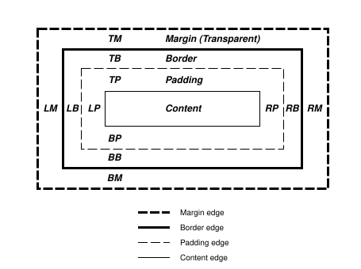

<!--
 * @Author: jiangmengxia jiangmengxia@nnuo.com
 * @Date: 2024-08-28 16:40:08
 * @LastEditors: jiangmengxia jiangmengxia@nnuo.com
 * @LastEditTime: 2024-08-28 18:27:02
 * @FilePath: \jiangmengxia.github.io\css\box-model\box-model.md
 * @Description: Description
-->
# 盒模型（box model）

官网：https://drafts.csswg.org/css2/#box-model

> The CSS box model describes the rectangular boxes that are generated for elements in the document tree and laid out according to the visual formatting model.
  css的盒模型描述DOM tree中为元素生成的矩形box，并且它根据视觉格式模型进行布局。


## 盒子尺寸（Box dimensions）

每个盒子都有：
* 内容区域
* 可选的padding
* 可选的border
* 可选的margin

每个区域的大小由以下属性定义，下图显示了这些区域如何相关以及用于引用margin、border和padding的术语：



margin、border、padding可以分解为上、右、下、左四个部分（例如，在图中，“LM”表示左margin，“RP”表示右padding，“TB”表示上border等）。

content, padding, border, and margin 这四个区域的每个perimeter（边缘）称为edge(边缘)，因此每个box都有四个边缘：

* 内容边缘或者内部边缘

内容边缘围绕由盒子的宽度和高度定义的矩形，这通常取决于元素的渲染内容。四个内容边缘定义了盒子的内容框。

* 填充边缘

填充边缘围绕盒子的填充。如果填充宽度为0，则填充边缘与内容边缘相同。四个填充边缘定义了盒子的填充框。

* 边框边缘

边框边缘围绕盒子的边框。如果边框宽度为0，则边框边缘与填充边缘相同。四个边框边缘定义了盒子的边框框。

* margin边缘

margin边缘围绕盒子的margin。如果margin宽度为0，则margin边缘与border边缘相同。四个margin边缘定义了盒子的margin框。

每个边缘可以被分解为上、右、下、左四个边缘。

盒子的内容区域的大小（dimensions尺寸）——内容宽度和内容高度——取决于几个因素：
* 生成盒子的元素是否设置了宽度和高度属性，
* 盒子是否包含文本或其他盒子
* 盒子是否是表格等。
<!-- 盒子的宽度和高度在视觉格式模型（visual formatting model）细节章节中讨论。 -->

盒子的内容、填充和边框区域的前景样式由生成元素的背景属性指定（border样式由border属性决定）。margin背景总是透明的。

### 折叠的或塌陷的margins（Collapsing margins）

> 在CSS中，两个或多个相邻的盒子（可能是兄弟节点）的margin可以合并成一个单一的margin。以这种方式合并margin被称为折叠，合并后的margin称为折叠的margin。

相邻的`垂直方向`的margins会合并，除了：

* 根元素box的 margins 不重叠
* 如果具有间隙（clearance）的元素的顶部和底部边距相邻，则其边距会与相邻（following）兄弟的边距一起折叠，但由此产生的边距不会与父块的底部边距一起折叠。

`水平方向`的margins从不合并。

当且仅当满足以下条件时，两个元素的margins才会相邻（adjoining）：
1. 两者均属于in-flow 块级盒子，且参与相同的块级格式化上下文
2. 无inline boxes，无间隙，无padding，无border将它们分开（注意，某些零高度的行框（参见9.4.2）在此目的下被忽略。）
3. 两者均属于垂直相邻的盒子边缘，即形成以下pairs之一：
   * 一个盒子的顶部margin `&&` 其第一个in-flow子元素的顶部margin
   * 一个盒子的底部margin `&&` 其下一个in-flow兄弟元素的顶部margin
   * 一个最后一个in-flow子元素的底部margin `&&` 其父元素的底部margin，如果父元素的高度计算为auto
   * 一个没有建立新的BFC（block formatting context），且盒子的min-height计算为0，高度计算为0或者auto，且没有in-flow子元素的盒子，这个盒子的顶部margins `&&`  底部margin

A collapsed margin is considered adjoining to another margin if any of its component margins is adjoining to that margin.

如果折叠边距的任何组成边距与另一个边距相邻，则认为折叠边距与该边距相邻。


### Margin collapsing example

```html
<!DOCTYPE html>
<html>
  <head>
    <style>
      .drawer {
        border: 1px solid #dedede;
      }
      .c-grey {
        color: #545454;
      }
      .bfc {
        overflow: hidden;
      }
      .box {
        width: 100px;
        height: 100px;
        margin: 20px;
        background: #dedede;
      }
      .parent-box {
        margin-top: 40px;
        background: #dedede;
        width: 200px;
        height: 200px;
        /* 通过将父元素设置为BFC可以解决margin重叠问题 */
        /* overflow: hidden; */
      }
      .child-box {
        width: 100px;
        height: 100px;
        margin: 20px;
        background: #fcc;
      }

      .none-bfc {
        margin-top: 20px;
        margin-bottom: 30px;
      }
    </style>
  </head>
  <body>
    <h4>
      案例1：
      垂直相邻div，margin上下都是20，实际渲染出来两者margin距离只有20(按间隙最大的来计算)
    </h4>
    <div class="drawer">
      <div class="box">sss</div>
      <div class="box">222</div>
    </div>
    <h4>
      案例2：两个div中间插入一个无内容（或者实际渲染高度为0）的div，margin仍被折叠
    </h4>
    <p class="c-grey">
      可以通过将中间的div(.middle-box)设置成BFC，可以解决margin重叠问题
    </p>
    <div class="drawer">
      <div class="box">sss</div>
      <div class="middle-box" style="height: 0"></div>
      <div class="box">222</div>
    </div>
    <h4>
      案例3：父子div，父div设置marginTop，子div设置margin，marginTop变成两者之间的较大的值。
    </h4>
    <p class="c-grey">可以通过将父div设置成BFC解决margin重叠问题</p>
    <div class="drawer">
      <div class="parent-box">
        <div class="child-box"></div>
      </div>
    </div>

    <h4>
      案例4：非BFC盒子，
      marginTop和marginBottom会重叠，这里渲染的margin高度等于两者中较大值，也就是整体高度等于两者中较大值
    </h4>
    <p class="c-grey">可以通过将div设置成BFC解决margin重叠问题</p>
    <div class="drawer">
      <div class="none-bfc"></div>
    </div>
  </body>
</html>
```

<a target="_blank" href='./box-model-example.html'>案例效果查看</a>

<iframe src='./box-model-example.html' width='100%' height='100%' style='height:300px;'></iframe>


