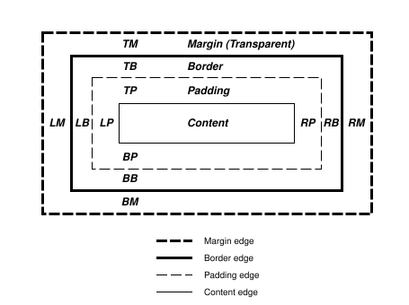
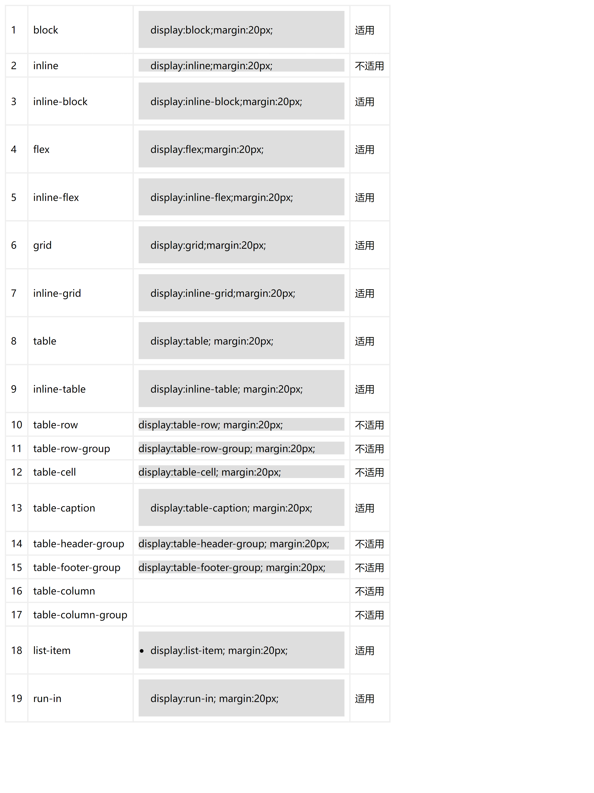
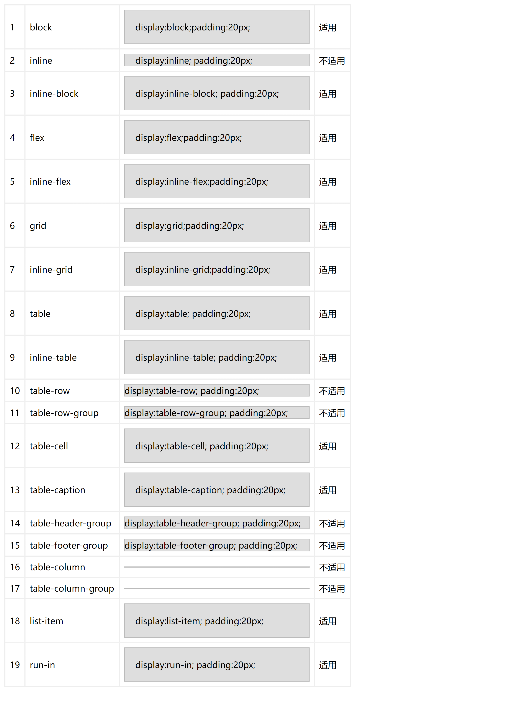

# 盒模型

官网：https://drafts.csswg.org/css2/#box-model

> The CSS box model describes the rectangular boxes that are generated for elements in the document tree and laid out according to the visual formatting model. css的盒模型描述DOM tree中为元素生成的矩形box，并且它根据视觉格式模型进行布局。

## 1. 盒子尺寸（Box dimensions）

每个盒子都有：

* 内容区域
* 可选的padding
* 可选的border
* 可选的margin

每个区域的大小由以下属性定义，下图显示了这些区域如何相关以及用于引用margin、border和padding的术语：



margin、border、padding可以分解为上、右、下、左四个部分（例如，在图中，“LM”表示左margin，“RP”表示右padding，“TB”表示上border等）。

content, padding, border, and margin 这四个区域的每个perimeter（边缘）称为edge(边缘)，因此每个box都有四个边缘：

* 内容边缘或者内部边缘

内容边缘围绕由盒子的宽度和高度定义的矩形，这通常取决于元素的渲染内容。四个内容边缘定义了盒子的内容框。

* 填充边缘

填充边缘围绕盒子的填充。如果填充宽度为0，则填充边缘与内容边缘相同。四个填充边缘定义了盒子的填充框。

* 边框边缘

边框边缘围绕盒子的边框。如果边框宽度为0，则边框边缘与填充边缘相同。四个边框边缘定义了盒子的边框框。

* margin边缘

margin边缘围绕盒子的margin。如果margin宽度为0，则margin边缘与border边缘相同。四个margin边缘定义了盒子的margin框。

每个边缘可以被分解为上、右、下、左四个边缘。

盒子的内容区域的大小（dimensions尺寸）——内容宽度和内容高度——取决于几个因素：

* 生成盒子的元素是否设置了宽度和高度属性，
* 盒子是否包含文本或其他盒子
* 盒子是否是表格等。

盒子的内容、填充和边框区域的前景样式由生成元素的背景属性指定（border样式由border属性决定）。margin背景总是透明的。

## 2. margin

margin 可以设置固定宽度、百分比、auto（See the section on calculating widths and margins for behavior. https://drafts.csswg.org/css2/#Computing\_widths\_and\_margins）。

适用于：

* table格式： 除了table-caption、table、inline-table支持，其他table格式的都不支持
* inline不支持marginTop、marginBottom
* 其他格式均支持



### 2.1 折叠的或塌陷的margins（Collapsing margins）

> 在CSS中，两个或多个相邻的盒子（可能是兄弟节点）的margin可以合并成一个单一的margin。以这种方式合并margin被称为折叠，合并后的margin称为折叠的margin。

> 相邻的`垂直方向`的margins会合并，除了：

* 根元素box的 margins 不重叠
* 如果具有间隙（clearance）的元素的顶部和底部边距相邻，则其边距会与相邻（following）兄弟的边距一起折叠，但由此产生的边距不会与父块的底部边距一起折叠。

> `水平方向`的margins从不合并。

当且仅当满足以下条件时，两个元素的margins才会相邻（adjoining）：

1. 两者均属于in-flow 块级盒子，且参与相同的块级格式化上下文
2. 无inline boxes，无间隙，无padding，无border将它们分开（注意，某些零高度的行框（参见9.4.2）在此目的下被忽略。）
3. 两者均属于垂直相邻的盒子边缘，即形成以下pairs之一：
   * 一个盒子的顶部margin `&&` 其第一个in-flow子元素的顶部margin
   * 一个盒子的底部margin `&&` 其下一个in-flow兄弟元素的顶部margin
   * 一个最后一个in-flow子元素的底部margin `&&` 其父元素的底部margin，如果父元素的高度计算为auto
   * 一个没有建立新的BFC（block formatting context），且盒子的min-height计算为0，高度计算为0或者auto，且没有in-flow子元素的盒子，这个盒子的顶部margins `&&` 底部margin

A collapsed margin is considered adjoining to another margin if any of its component margins is adjoining to that margin.

如果折叠边距的任何组成边距与另一个边距相邻，则认为折叠边距与该边距相邻。

产生折叠的情况：

* 相邻的块级元素：当两个或多个相邻的块级元素之间的外边距相遇时，它们的外边距会折叠。这里的“相邻”是指没有内边距、边框或行内内容将它们分隔开。
* 父子元素：当一个块级元素的顶部外边距和其第一个子元素的顶部外边距相遇时，它们的外边距会折叠。同样，当一个块级元素的底部外边距和其最后一个子元素的底部外边距相遇时，它们的外边距会折叠。这里的“父子元素”是指父元素和其第一个或最后一个子元素。
* 空的块级元素：当一个块级元素为空，并且其顶部外边距和底部外边距相遇时，它们的外边距会折叠。这里的“空的块级元素”是指没有内容、内边距、边框或行内内容的块级元素。
* 外边距合并：外边距合并是指两个或多个相邻的外边距合并为一个外边距，这个外边距的大小是两个外边距中较大的那个。

### 2.2 Margin collapsing example

#### 2.2.1 案例1 垂直相邻块级元素

```html
<!DOCTYPE html>
<html>
  <head>
    <style>
      .box {
        width: 100px;
        height: 100px;
        margin: 20px;
        background: #dedede;
      }
    </style>
  </head>
  <body>
    <div class="drawer">
      <div class="box">sss</div>
      <div class="box">222</div>
    </div>
  </body>
</html>
```

<figure><figcaption></figcaption></figure>

【修正方法】：将box设置为非block-level box，比如inline-block，两者间加一个换行符如下：

```html
    <div class="drawer">
        <div class="box" style='display:inline-block'>box1</div><br/>
        <div class="box" style='display:inline-block'>box2</div>
    </div>
```

<div align="left">

<figure><figcaption></figcaption></figure>

</div>

#### 2.2.2 案例2 两个垂直div，间隔一个或多个空div

```html
<!DOCTYPE html>
<html>
  <head>
    <style>
      .drawer {
        border: 1px solid #dedede;
      }
      .box {
        width: 100px;
        height: 100px;
        margin: 20px;
        background: #dedede;
      }
    </style>
  </head>
  <body>
    <div class="drawer">
      <div class="box">box1</div>
      <div class="middle-box" style="height: 0; margin-top:20px;"></div>
      <div class="middle-box" style="height: 0; margin-top:20px;"></div>
      <div class="box">box2</div>
    </div>
  </body>
</html>
```

<figure><figcaption></figcaption></figure>

修正方法： 将中间层(middle-box)设置为BFC，通过设置overflow: hidden(或其他方式)，box1或者box2设置为inline-block如下

```html
<div class="drawer">
    <div class="box" style='display:inline-block;'>box1</div>
    <div class="middle-box" style="height: 0;margin-top:20px;overflow: hidden;"></div>
    <div class="middle-box" style="height: 0; margin-top:20px;overflow: hidden;"></div>
    <div class="box">box2</div>
</div>
```

<div align="left">

<figure><figcaption></figcaption></figure>

</div>

#### 2.2.3 案例3 父子元素（块级）

```html
<!DOCTYPE html>
<html>
  <head>
    <style>
      .drawer {
        border: 1px solid #dedede;
      }
      .parent-box {
        margin-top: 20px;
        background: #dedede;
        width: 200px;
        height: 200px;
        /* 通过将父元素设置为BFC可以解决margin重叠问题 */
        /* overflow: hidden; */
      }
      .child-box {
        width: 100px;
        height: 100px;
        margin: 40px;
        background: #fcc;
      }
    </style>
  </head>
  <body>
    <div class="drawer">
      <div class="drawer">
      <div class="parent-box">
        <div class="child-box">child</div>
      </div>
    </div>
    </div>
  </body>
</html>
```

<figure><figcaption></figcaption></figure>

```html
 <!-- 办法1 -->
 <div class="drawer">
    <div class="parent-box" style='overflow:hidden;'>
      <div class="child-box">child</div>
    </div>
  </div>
  <!-- 办法2 -->
  <div class="drawer">
    <div class="parent-box" >
      <div class="child-box" style='display:inline-block'>child</div>
    </div>
  </div>
```

<figure><figcaption></figcaption></figure>

#### 2.2.4 案例4 空的块级元素

```html
<style>
.none-bfc {
        margin-top: 20px;
        margin-bottom: 30px;
        background: #fcc;
        width: 100px;
        height: 100px;
      }
</style>
 <div class="drawer">
      <div class="none-bfc"></div>
  </div>
```

<figure><figcaption></figcaption></figure>

修正方法：将盒子设为bfc

```html
<div class="drawer" >
        <div style='position:absolute; margin-left:30px; margin-top:30px;'>120px</div>
        <div class="none-bfc" style='overflow:hidden; height:0;'>
        </div>
</div>
```

效果如下：

<div align="left">

<figure><figcaption></figcaption></figure>

</div>

## 3. padding

padding 可以设置固定宽度。

适用于：

* table格式： 除了table、inline-table、table-cell、table-caption支持，其他table格式的都不支持
* inline不支持paddingTop、paddingBottom
* 其他格式均支持



### padding 奇怪问题

\
\
box
