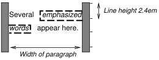
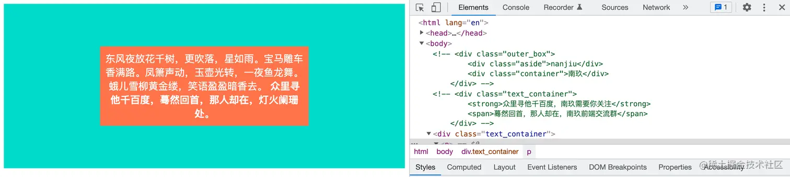

<!--
 * @Author: jiangmengxia jiangmengxia@nnuo.com
 * @Date: 2024-08-28 14:42:42
 * @LastEditors: jiangmengxia jiangmengxia@nnuo.com
 * @LastEditTime: 2024-08-28 16:25:18
 * @FilePath: \jiangmengxia.github.io\css\inline-formatting-contexts.md
 * @Description: Description
-->
# i不知道的 CSS 之 IFC

Inline Formatting Context（IFC，内联格式化上下文）是CSS中的一个概念，它决定了内联元素如何布局和渲染。
IFC是一个独立的渲染区域，它内部的元素会按照水平方向排列，形成一个新的IFC。

```
In an inline formatting context, boxes are laid out horizontally, one after the other, beginning at the top of a containing block. Horizontal margins, borders, and padding are respected between these boxes. The boxes may be aligned vertically in different ways: their bottoms or tops may be aligned, or the baselines of text within them may be aligned. The rectangular area that contains the boxes that form a line is called a line box.

在内联格式上下文中，框从包含块的顶部开始，一个接一个地水平排列。这些框之间会遵守水平边距、边框和填充。这些框可以以不同的方式垂直对齐：它们的底部或顶部可以对齐，或者其中的文本基线可以对齐。包含形成直线的boxes的矩形区域称为行盒（line box）。

The width of a line box is determined by a containing block and the presence of floats. The height of a line box is determined by the rules given in the section on line height calculations.

行盒的宽度由包含块和float的表现决定，高度由行高计算规则决定。

A line box is always tall enough for all of the boxes it contains. However, it may be taller than the tallest box it contains (if, for example, boxes are aligned so that baselines line up). When the height of a box B is less than the height of the line box containing it, the vertical alignment of B within the line box is determined by the vertical-align property. When several inline-level boxes cannot fit horizontally within a single line box, they are distributed among two or more vertically-stacked line boxes. Thus, a paragraph is a vertical stack of line boxes. Line boxes are stacked with no vertical separation (except as specified elsewhere) and they never overlap.


行盒总是足够高，以包含其中的所有框。然而，它可能比它包含的最高框还要高（例如，如果框对齐，使基线对齐）。当框B的高度小于包含它的行盒的高度时，B在行盒中的垂直对齐方式由vertical-align属性决定。当几个内联盒（inline-level boxe）无法水平适应一个行盒时，它们会在两个或更多的垂直堆叠的行盒中分布。因此，一个段落是行盒的垂直堆叠。行盒垂直堆叠，没有垂直分隔（除非在其他地方指定），它们从不重叠。

In general, the left edge of a line box touches the left edge of its containing block and the right edge touches the right edge of its containing block. However, floating boxes may come between the containing block edge and the line box edge. Thus, although line boxes in the same inline formatting context generally have the same width (that of the containing block), they may vary in width if available horizontal space is reduced due to floats. Line boxes in the same inline formatting context generally vary in height (e.g., one line might contain a tall image while the others contain only text).

通常，行盒的左边缘与包含块的左边缘接触，右边缘与包含块的右边缘接触。然而，浮动框可能位于包含块边缘和行盒边缘之间。因此，尽管同一内联格式上下文中的行盒通常具有相同的宽度（即包含块的宽度），但由于浮动，它们的宽度可能有所不同（例如，如果由于浮动，可用水平空间减少）。同一内联格式上下文中的行盒的高度可能不同（例如，一行可能包含一个高图像，而其他行只包含文本）。

When the total width of the inline-level boxes on a line is less than the width of the line box containing them, their horizontal distribution within the line box is determined by the text-align property. If that property has the value justify, the user agent may stretch spaces and words in inline boxes (but not inline-table and inline-block boxes) as well.

当内联盒（inline-level boxe）的总宽度小于包含它们的行盒的宽度时，它们在行盒中的水平分布由text-align属性决定。如果该属性具有值justify，用户代理可能会拉伸内联框（但不拉伸inline-table和inline-block框）中的空格和单词。

When an inline box exceeds the width of a line box, it is split into several boxes and these boxes are distributed across several line boxes. If an inline box cannot be split (e.g., if the inline box contains a single character, or language specific word breaking rules disallow a break within the inline box, or if the inline box is affected by a white-space value of nowrap or pre), then the inline box overflows the line box.

当一个内联框超过行盒的宽度时，它会被分成几个框，这些框分布在几个行盒中。如果一个内联框不能被拆分（例如，如果行盒只包含一个字符，或者语言特定的单词拆分规则不允许在内联框内拆分，或者如果内联框受到white-space值为nowrap或pre的影响），那么内联框会溢出行盒。

When an inline box is split, margins, borders, and padding have no visual effect where the split occurs (or at any split, when there are several).

当一个内联框被拆分时，拆分处（或多个拆分处）的边距、边框和内边距没有视觉效果。

Inline boxes may also be split into several boxes within the same line box due to bidirectional text processing.

由于双向文本处理，内联框也可能在同一行盒中拆分成几个框。

Line boxes are created as needed to hold inline-level content within an inline formatting context. Line boxes that contain no text, no preserved white space, no inline elements with non-zero margins, padding, or borders, and no other in-flow content (such as images, inline blocks or inline tables), and do not end with a preserved newline must be treated as zero-height line boxes for the purposes of determining the positions of any elements inside of them, and must be treated as not existing for any other purpose.

创建行盒是用来容纳内联格式上下文中的内联级内容。不包含文本、不保留空白、margin、padding或border不为零的非内联元素，以及没有其他流动内容（如图像、内联块或内联表格）的行盒，并且不以保留换行符结尾，必须被视为零高度的行盒，以确定它们内部任何元素的位置，并且必须被视为不存在，用于任何其他目的。

```

对于以下HTML片段：

```html
<P>Several <EM>emphasized words</EM> appear
<STRONG>in this</STRONG> sentence, dear.</P>
```

P元素生成一个包含五个内联盒的块盒（block box），其中三个是匿名的：

匿名："Several"
EM："emphasized words"
匿名："appear"
STRONG："in this"
匿名："sentence, dear."

To format the paragraph, the user agent flows the five boxes into line boxes. In this example, the box generated for the P element establishes the containing block for the line boxes. If the containing block is sufficiently wide, all the inline boxes will fit into a single line box:

为了格式化段落，用户代理将这五个框放到行盒中。在这个例子中，为P元素生成了包含块来装行盒。
如果包含块足够宽，所有的内联盒都将都适配（fit into）这一个行盒，like

```html
Several emphasized words appear in this sentence, dear.
```
If not, the inline boxes will be split up and distributed across several line boxes. The previous paragraph might be split as follows:
如果包含块太窄，则五个内联盒将分割并分布在几个行盒中。前面的段落可能被拆分为以下形式（其中一行被视为一个行盒）：

```html
Several emphasized words appear // 一行被视为一个行盒  -- split1
in this sentence, dear. // 一行被视为一个行盒   -- split2
```

上述，split1和split2表示行盒的拆分点。

Margins, borders, padding, or text decorations have no visible effect after split1 or before split2.

拆分点split1之后或split2之前的边距、边框、内边距或文本装饰没有可见效果。


```html
<!DOCTYPE HTML PUBLIC "-//W3C//DTD HTML 4.01//EN">
<HTML>
  <HEAD>
    <TITLE>Example of inline flow on several lines</TITLE>
    <STYLE type="text/css">
      EM {
        padding: 2px;
        margin: 1em;
        border-width: medium;
        border-style: dashed;
        line-height: 2.4em;
      }
    </STYLE>
  </HEAD>
  <BODY>
    <P>Several <EM>emphasized words</EM> appear here.</P>
  </BODY>
</HTML>

```

由于P的宽度，盒子将分布如下：



* 边距在"emphasized"之前和"words"之后插入。
* 内边距在"emphasized"之前、上方和下方以及"words"之后、上方和下方插入。在每种情况下，都渲染了三条边的虚线边框。


<b>如何触发IFC？</b>

1. 一个块级元素（block-level element）包含内联级元素（inline-level elements）。


<b>IFC布局规则</b>

* 在一个IFC内，子元素是水平方向横向排列的，并且垂直方向起点为元素顶部。
* 子元素只会计算横向样式空间，【padding、border、margin】，垂直方向样式空间不会被计算，【padding、border、margin】。
* 在垂直方向上，子元素会以不同形式来对齐（vertical-align）
* 能把在一行上的框都完全包含进去的一个矩形区域，被称为该行的行框（line box）。行框的宽度是由包含块（containing box）和与其中的浮动来决定。
* IFC中的line box一般左右边贴紧其包含块，但float元素会优先排列。
* IFC中的line box高度由 CSS 行高计算规则来确定，同个IFC下的多个line box高度可能会不同。
* 当 inline boxes的总宽度少于包含它们的line box时，其水平渲染规则由 text-align 属性值来决定。
* 当一个inline box超过父元素的宽度时，它会被分割成多个boxes，这些boxes分布在多个line box中。如果子元素未设置强制换行的情况下，inline box将不可被分割，将会溢出父元素。


<b>应用</b>

* 水平居中：当一个块要在包含块中水平居中时，设置其为inline-block，然后设置text-align: center。
* 垂直居中：当一个块要在包含块中垂直居中时，设置其为inline-block，然后设置vertical-align: middle。


创建一个IFC，然后设置其vertical-align:middle，其他行内元素则可以在此父元素下垂直居中。

```html
<style>
.text_container{
  text-align: center;
  line-height: 300px;
  width: 100%;
  height: 300px;
  background-color: turquoise;
  font-size: 0;
  }
  p{
    line-height: normal;
    display: inline-block;
    vertical-align: middle; 
    background-color: coral;
    font-size: 18px;
    padding: 10px;
    width: 360px;
    color: #fff;
  }
</style>
<body>
  <div class="text_container">
    <p>
      东风夜放花千树，更吹落，星如雨。宝马雕车香满路。凤箫声动，玉壶光转，一夜鱼龙舞。蛾儿雪柳黄金缕，笑语盈盈暗香去。
      <strong>众里寻他千百度，蓦然回首，那人却在，灯火阑珊处。</strong>
    </p>
  </div>
</body>
```




