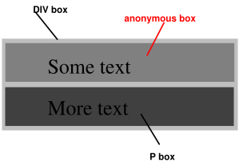
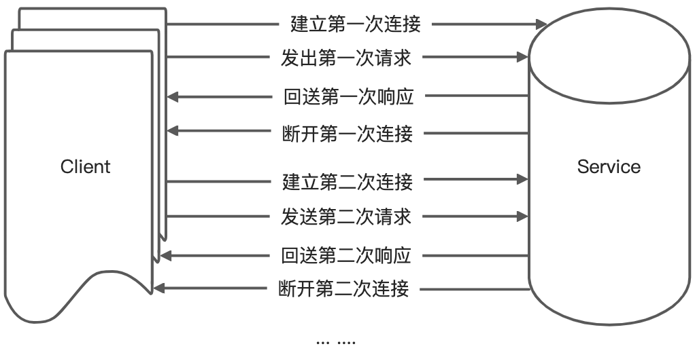

# 视觉格式化模型

## 1. 概述

用户代理如何处理视觉[媒体](https://drafts.csswg.org/css2/#media)的文档树

在视觉格式模型中，文档树中的每个元素根据盒模型生成零个或多个盒子。这些盒子的布局受以下因素控制：

* 盒子的尺寸和类型
* 定位方案（normal flow, float, and absolute positioning）
* 文档树中元素之间的关系
* 外部信息（例如，视口大小、图像的内在尺寸等） 本章和下一章中定义的属性适用于连续媒体和分页媒体。但是，当应用于分页媒体时，边距属性的含义会有所不同（有关详细信息，请参阅页面模型）。 视觉格式化模型没有指定格式化的所有方面（例如，它没有指定字母间距算法）。对于本规范未涵盖的格式问题，合格（confirming）的用户代理可能会有不同的行为。

### 1.1 视口（viewport）

[连续媒体](https://drafts.csswg.org/css2/#continuous-media-group)的用户代理通常为用户提供一个视口（屏幕上的窗口或其他查看区域），用户可以通过该视口查看文档。当调整视口大小时，用户代理可能会更改文档的布局（请参阅[初始包含块](https://drafts.csswg.org/css2/#containing-block-details)）。 当视口小于渲染文档的画布区域时，用户代理应提供滚动机制。 每个[画布](https://drafts.csswg.org/css2/#canvas)最多有一个视口，但用户代理可以渲染到多个画布（即，提供同一文档的不同视图）。

### 1.2 包含块（Containing blocks）

在css2中，许多盒子的位置和大小都是相对于称为包含块的矩形框的边缘计算的。一般把生成的盒子作为后代盒子的包含块，我们称它为其后代“建立”了包含块。短语“一个盒子的包含块”指的是“盒子所在的包含块”，而不是它生成的包含块。

每个盒子在其包含块中给出一个位置，但它没有被这个包含块限制；它可能会溢出。

关于如何计算包含块尺寸的[细节](http://www.ayqy.net/doc/css2-1/visudet.html#containing-block-details)见[下一章](http://www.ayqy.net/doc/css2-1/visudet.html)

## 2. 控制盒子的生成（Controlling box generation）

下面的小节描述了可能在css中生成的盒子的类型。一个盒子的类型会影响它视觉格式模型中的行为。下面的display属性描述了盒子的类型。

### 2.1. 块级元素和块盒（Block-level elements and block boxes）

块级元素是在源文档中被格式化为块的元素（如段落）。块级类型的display属性值为：block、list-item、table。

块级盒子参与[块级格式上下文](http://www.ayqy.net/doc/css2-1/visuren.html#block-formatting)中。每个块级元素生成一个`主块级盒子`（ principal block-level box），该盒子包括后代盒子及生产内容，并且任何定位方案都与该盒子有关。

有些块级元素可能会生成除主盒外的额外的盒：'list-item'元素。这些额外的盒根据主盒来放置。

`block-level box`：块级元素生成的盒子 `block container box`: 块容器盒，是指一个块级元素，它包含其他块级元素或内联元素 `block box`: 块盒，是指一个块级元素生成的盒子。块盒子会占用父元素的全部可用宽度，并可以设置高度和宽度。 `table box`: 表盒，是指一个表格元素生成的盒子。表格盒子可以包含行、列和单元格，并可以设置表格的布局和样式。

除了稍后章节中描述的`表框`(`table boxes`)和`替换的元素`(`replaced elements`)外，块级框也是`块容器盒`(`block container box`)。 块容器框有两种：

* 一种是：只包含`block box`
* 另一种是：建立`inline formatting context`(内联格式上下文)，因此只包含`内联级盒`(inline-level boxes)

因此并非所有`block container boxes`都是`block-level boxes`，比如未替换的内联块和未替换的表单元格（`table cells`）是`block container boxes`，但不是`block-level boxes`。作为`Block-level boxes`的`block containers`称为`block boxes`。

“块级盒（block-level box）”，“块容器盒（block container box）”和“块盒（block box）”这三个术语在没有歧义的时候就简称为“块（block）”

#### 2.1.1 匿名块盒（Anonymous block boxes）

```html
<DIV>
  Some text
  <P>More text
</DIV>
```

例子中，DIV和P元素都是display:block，DIV包括inline content和block content。为了格式简便，我们假设有一个`anonymous block box`（匿名块盒）包裹着文本“Some text”，如图：



也就是说，如果一个block container box（如上面的DIV）内部有一个block-level box（如上面的P），那么我们强制它只包含block-level boxes。

当`inline box`包含`in-flow block-level box`时，该内联框（及其同一行框内的内联祖先）会围绕块级框（以及任何连续的或仅由可折叠空格和/或流外元素分隔的块级兄弟）被拆分，将内联框分为两个框（即使任一侧为空），块级框的每侧各一个。中断之前和中断之后的行框被封闭在匿名块框中，块级框成为这些匿名框的兄弟。当这种内联框受到相对定位的影响时，任何由此产生的平移也会影响内联框中包含的块级框。

> 在 CSS 中，流（Flow）是指元素在文档中的布局和排列方式。元素可以处于流中（in-flow）或脱离流（out-of-flow）。
>
> in-flow：处于流中的元素会按照其在 HTML 中的顺序进行布局和排列。它们会占据其父元素的全部可用空间，并与其他元素共享同一行。常见的 in-flow 元素包括块级元素和内联元素。
>
> out-of-flow：脱离流的元素不会按照其在 HTML 中的顺序进行布局和排列。它们会脱离其父元素，并可以设置绝对位置或浮动。常见的 out-of-flow 元素包括定位元素（positioned elements）和浮动元素（floating elements）。

```html
<style>
p    { display: inline }
span { display: block }
</style>
<BODY>
<P>
This is anonymous text before the SPAN.
<SPAN>This is the content of SPAN.</SPAN>
This is anonymous text after the SPAN.
</P>
</BODY>
```

P 包含

* 一个匿名块包裹内容 “This is anonymous text before the SPAN.”
* 一个SPAN block，包裹内容“This is the content of SPAN.”
* 一个匿名块包裹内容 “This is anonymous text after the SPAN.”

BODY 包含：

* 一个匿名块， 在P之前，包裹一个空格
* 一个P block， 包含三个匿名块和SPAN block
* 一个匿名块， 在P之后，包裹一个空格

### 2.2 内联元素和内联盒（Inline-level elements and inline boxes）

内联级元素是指源文档中不构成新内容块的元素；内容按行分布（例如，段落中的强调文本、内联图像等）。display属性的以下值构成内联级别的元素：`inline`, `inline-table`, and `inline-block`。

内联级别元素生成内联级别框，这些框参与内联格式上下文。

内联框是一种内联级别的框，其内容参与其包含的内联格式上下文。显示值为inline的未替换元素会生成一个inline框。非内联框的内联级别框（如替换的 `inline-level` elements, `inline-block` elements, and `inline-table` elements）称为原子内联级别框，因为它们作为单个不透明框参与其内联格式上下文。

#### 2.2.1 匿名内联盒（Anonymous inline boxes）

任何直接包含在块容器元素（而不是内联元素）中的文本都必须被视为匿名内联元素。

```html
<p>Some <em>emphasized</em> text</p>
```

P生成一个块级盒子，包含多个内联盒子：

* 一个匿名内联盒子，包裹内容 “Some ”
* 一个EM内联盒子，包裹内容 “emphasized”
* 一个匿名内联盒子，包裹内容 “ text”

### 2.3 Run-in boxes

`display:run in`现在在CSS3中定义（请参阅CSS基本框模型）。 在 CSS 中，运行内盒子（Run-in Box）是一种特殊的块级盒子，它可以在流中或脱离流。运行内盒子通常用于定义标题和内容的关系。

### 2.4 display属性

* block：生成一个块级盒子
* inline-block:生成一个`inline-level block`级别的盒子，其内部被格式化为`block box`，元素本身被格式化为原子内联级别框。
* inline: 为元素生成一个或多个`inline boxes`。
* list-item：为元素生成一个`principal block box`和一个`marker box`，更多详见[list](https://drafts.csswg.org/css2/#lists)章节。
* none:不生成盒子及内容，对布局无影响
* table, inline-table, table-row-group, table-column, table-column-group, table-header-group, table-footer-group, table-row, table-cell, and table-caption：都是表格相关的display。

## 3. 定位模式（position schemes）

在CSS 2中，一个盒子可以根据三种定位模式进行布局：

* Normal flow : 包含块级盒子的块级格式、内联盒子的内联格式、块级&内联盒子的相对位置
* Floats: 在浮动模型中，首先根据`Normal flow`布置一个盒子，然后从流量中取出，并尽可能向左或向右移动。内容可能会沿着浮子(`float`)的侧面流动。
* Absolute positioning: 在绝对定位模型中，一个长方体被完全从`Normal flow`中删除（它对后面的兄弟对象没有影响），并被分配了相对于包含块的位置。

当一个元素被浮动、绝对定位或为根元素时，它被称为脱离流（`out-of-flow`）。否则，它被称为 `in-flow` 。元素A的flow是A和所有`in-flow`元素的集合，这些`in-flow`元素的最近一个`out-of-flow`祖先是A。


### 3.1 选择定位模式：position属性

['position'](http://www.ayqy.net/doc/css2-1/visuren.html#propdef-position)和['float'](http://www.ayqy.net/doc/css2-1/visuren.html#propdef-float)属性决定了用哪种CSS 2.1定位算法来计算盒的位置

* **static**

&#x20;      盒是个常规盒，根据[常规流](http://www.ayqy.net/doc/css2-1/visuren.html#normal-flow)布局。['top'](http://www.ayqy.net/doc/css2-1/visuren.html#propdef-top)，['right'](http://www.ayqy.net/doc/css2-1/visuren.html#propdef-right)，['bottom'](http://www.ayqy.net/doc/css2-1/visuren.html#propdef-bottom)和['left'](http://www.ayqy.net/doc/css2-1/visuren.html#propdef-left)属性失效

* **relative**

&#x20;      盒的位置是根据[常规流](http://www.ayqy.net/doc/css2-1/visuren.html#normal-flow)计算的（被称为常规流中的位置），然后盒[相对于](http://www.ayqy.net/doc/css2-1/visuren.html#relative-positioning)其常规位置偏移。当盒B为相对定位时，后面的盒的位置仍按照B没有偏移量来计算。table-row-group，table-header-group，table-footer-group，table-row，table-column-group，table-column，table-cell和table-caption元素上'position:relative'的效果是未定义的

* **absolute**

&#x20;       盒的位置（及可能的大小）由['top'](http://www.ayqy.net/doc/css2-1/visuren.html#propdef-top)，['right'](http://www.ayqy.net/doc/css2-1/visuren.html#propdef-right)，['bottom'](http://www.ayqy.net/doc/css2-1/visuren.html#propdef-bottom)和['left'](http://www.ayqy.net/doc/css2-1/visuren.html#propdef-left)属性指定，这些属性指定了相对于盒的[包含块](http://www.ayqy.net/doc/css2-1/visuren.html#containing-block)的偏移量。绝对定位的盒脱离了常规流，意味着它们不会影响后面兄弟元素的布局，而且，虽然[绝对定位的](http://www.ayqy.net/doc/css2-1/visuren.html#absolutely-positioned)盒有外边距，但它们不会与任何其它外边距[合并](http://www.ayqy.net/doc/css2-1/box.html#collapsing-margins)

* **fixed**

&#x20;       除了盒相对于某些参照（reference）是[固定的（fixed）](http://www.ayqy.net/doc/css2-1/visuren.html#fixed-positioning)之外，盒的位置根据'absolute'模型来计算。如同'absolute'模型一样，盒的外边距不会与任何其它外边距合并。媒体类型为handheld，projection，screen，tty和tv的情况下，该盒相对于[视口](http://www.ayqy.net/doc/css2-1/visuren.html#viewport)固定，并且滚动时不会移动。媒体类型为print时，该盒在每一页都会呈现，并且相对于页盒（page box）固定，即使页面是通过一个[视口](http://www.ayqy.net/doc/css2-1/visuren.html#viewport)看到的（例如，打印预览时）。对于其它媒体类型，表现是未定义的。编写者可能希望以一种依赖媒体（media-dependent）的方式指定'fixed'。例如，一个编写者可能想让一个盒保持在屏幕[视口](http://www.ayqy.net/doc/css2-1/visuren.html#viewport)顶部，但不出现在每一个打印页的顶部。可以用[@media规则](http://www.ayqy.net/doc/css2-1/media.html#at-media-rule)把它们分开，例如：

```css
   
@media screen { 
  h1#first { position: fixed } 
}
@media print { 
  h1#first { position: static }
}
```

UA不能对fixed盒的内容分页。注意，UA可能会以其它方式打印不可见的内容，见第13章[“页盒外的内容”](http://www.ayqy.net/doc/css2-1/page.html#outside-page-box)

UA可以把根元素的position视为'static'

### 盒偏移

如果元素的['position'](http://www.ayqy.net/doc/css2-1/visuren.html#propdef-position)属性有一个除'static'外的值，就说它是定位元素（positioned）。定位的元素生成定位的盒（positioned boxes），根据以下4个属性布局：

* top

&#x20;      该属性指定了一个[绝对定位的](http://www.ayqy.net/doc/css2-1/visuren.html#absolutely-positioned)盒的上外边距边界离盒的[包含块](http://www.ayqy.net/doc/css2-1/visuren.html#containing-block)的上边界有多远。对于相对定位的盒，偏移量参照该盒自身的上边界（例如，该盒在常规流中给定了一个位置，然后根据这些属性从原位置偏移）

* **right**

&#x20;      与'top'类似，只是指定了一个盒的右外边距边界离该盒[包含块](http://www.ayqy.net/doc/css2-1/visuren.html#containing-block)的右边界有多远。对于相对定位的盒，偏移量参照该盒自身的右边界

* **bottom**

&#x20;      与'top'类型，只是指定了一个盒的下外边距边界离该盒[包含块](http://www.ayqy.net/doc/css2-1/visuren.html#containing-block)的下边界有多远。对于相对定位的盒，偏移量参照该盒自身的下边界

* **left**

&#x20;      与'top'类似，只是指定了一个盒的左外边距边界离该盒[包含块](http://www.ayqy.net/doc/css2-1/visuren.html#containing-block)的左边界有多远。对于相对定位的盒，偏移量参照该盒自身的左边界

这4个属性的值含义如下：

* [**\<length>**](http://www.ayqy.net/doc/css2-1/syndata.html#value-def-length)偏移量是到参照边的固定距离。允许负值
* [**\<percentage>**](http://www.ayqy.net/doc/css2-1/syndata.html#value-def-percentage)偏移量是包含块宽度（对于['left'](http://www.ayqy.net/doc/css2-1/visuren.html#propdef-left)或['right'](http://www.ayqy.net/doc/css2-1/visuren.html#propdef-right)）或高度（对于['top'](http://www.ayqy.net/doc/css2-1/visuren.html#propdef-top)和['bottom'](http://www.ayqy.net/doc/css2-1/visuren.html#propdef-bottom)）的百分比。允许负值
* **auto**对于非替换元素，该值的效果取决于那些相关的值也是'auto'的属性。非替换元素的详细情况，见[绝对定位](http://www.ayqy.net/doc/css2-1/visuren.html#absolutely-positioned)的[width](http://www.ayqy.net/doc/css2-1/visudet.html#abs-non-replaced-width)和[height](http://www.ayqy.net/doc/css2-1/visudet.html#abs-non-replaced-height)章节。对于替换元素，该值的影响只取决于替换内容的固有尺寸。替换元素的详细情况，见绝对定位的[width](http://www.ayqy.net/doc/css2-1/visudet.html#abs-replaced-width)和[height](http://www.ayqy.net/doc/css2-1/visudet.html#abs-replaced-height)章节

## 4. 常规流（Normal flow）

常规流（Normal flow）中的盒属于一个格式化上下文，可能是块或是行内（格式化上下文），但不能两者都是。块级盒参与块格式化上下文。行内级盒参与行内格式化上下文

### 4.1 块格式化上下文（Block formatting contexts）

浮动元素（float:left|right）、绝对定位元素、如inline-blocks、table-cells、table-captions的非块级盒子的block容器，以及overflow属性不等于visible的block盒子（除了那些值已传播到视口的）会为其内容建立新的块级格式化上下文。

在一个块格式化上下文中，盒在垂直方向一个接一个地放置，从包含块的顶部开始。两个兄弟盒之间的垂直距离由'margin'属性决定。同一个块格式化上下文中的相邻块级盒之间的垂直外边距会合并

在一个块格式化上下文中，每个盒的左外边界（left outer edge）挨着包含块的左外边界（对于从右向左的格式化，右外边界挨着）。即使存在浮动（尽管一个盒的行框可能会因为浮动而收缩 译注：环绕浮动元素放置的行框比正常的行短一些），这也成立。除非该盒建立了一个新的块格式化上下文（这种情况下，该盒自身可能会因为浮动变窄）

更多参考[你不知道的BFC](block-formatting-context.md)

### 4.2 行内格式化上下文（Inline formatting contexts）

在行内格式化上下文中，盒是从包含块的顶部开始一个挨一个水平放置的。这些盒之间的水平外边距，边框和内边距都有效。盒可能会以不同的方式垂直对齐：以它们的底部或者顶部对齐，或者以它们里面的文本的基线对齐。包含来自同一行的盒的矩形区域叫做行框(inline-box)

更多参考[你不知道的IFC](inline-formatting-contexts.md)

### 4.3 相对定位（Relative positioning）

当一个盒根据[常规流](http://www.ayqy.net/doc/css2-1/visuren.html#normal-flow)或者浮动摆放好后，它可能会相对于该位置移动，称之为相对定位。用这种方式偏移盒(B1)的位置不影响盒(B2)，遵循：给定B2位置时就当B1没有偏移，并且B2在B1应用偏移之后没有重新定位（re-positioned）。这表明相对定位可能会导致盒重叠。然而，如果相对定位导致具有'overflow:auto'或'overflow:scroll'的盒溢出了的话，UA必须让用户能够访问这部分内容（在其偏移位置），此时，滚动条的创建可能会影响布局

相对定位的盒保持它在常规流中的大小，包括换行和空格都会原样保留。[包含块](http://www.ayqy.net/doc/css2-1/visuren.html#containing-block)小节解释了一个相对布局盒会在什么时候建立一个新的包含块

对于相对定位的元素，'left'和'right'水平移动盒，不会改变其大小。'left'把盒向右移，而'right'把盒向左移动。因为盒没有被分割或者拉伸，所以'left'或'right'的应用值总是（满足）：left = -right

如果'left'和'right'都是'auto'（各自的初始值），应用值为'0'（即盒待在原位置）

如果'left'是'auto'，其应用值为负的'right'值（即盒向左移动'right'值）

如果'right'被指定为'auto'，其应用值为负的'left'值

如果'left'和'right'都不是'auto'，位置就被过度约束（over-constrained）了，它们（'left'和'right'）其中有一个会被忽略。如果包含块的'direction'属性是'ltr'，那么'left'有效，'right'变成-'left'（负的'left'）。如果包含块的'direction'属性是'rtl'，那么'right'有效，'left'被忽略

**示例** 下列3条规则是等价的：

```css
div.a8 { position: relative; direction: ltr; left: -1em; right: auto }
div.a8 { position: relative; direction: ltr; left: auto; right: 1em }
div.a8 { position: relative; direction: ltr; left: -1em; right: 5em }
```

'top'和'bottom'属性会上下移动相对定位的元素，不会改变其大小。'top'把盒向下移，'bottom'向上移。因为盒没有被分割或者拉伸，所以'top'或'bottom'的应用值总是（满足）：top = -bottom。如果都是'auto'，它们的应用值就都是'0'。如果其中一个是'auto'，它会变成另一个的相反数。如果都不是'auto'，就忽略'bottom'（即'bottom'的应用值将是负的'top'值）

注意 脚本环境中，相对定位盒的动态移动能产生动画效果（另见['visibility'](http://www.ayqy.net/doc/css2-1/visufx.html#propdef-visibility)属性）。尽管相对定位可以用作上标和下标的形式，但行高不会因为其定位而自动调整。更多信息请查看[行高的计算](http://www.ayqy.net/doc/css2-1/visudet.html#line-height)中的说明

[比较常规流，浮动与绝对定位](http://www.ayqy.net/doc/css2-1/visuren.html#comparison)小节提供了相对定位的示例

## 5. 浮动

浮动（盒）就是一个在当前行向左或向右移动的盒。浮动盒最有意思的特性是其它内容会沿着它的一侧排列（可以通过['clear'](http://www.ayqy.net/doc/css2-1/visuren.html#propdef-clear)属性禁止这种行为）。内容从左浮动框的右侧向下流动，从右浮动框的左侧向下流动。下面是浮动定位及其内容流（flow）的介绍，控制浮动行为的准确[规则](http://www.ayqy.net/doc/css2-1/visuren.html#float-rules)见['float'](http://www.ayqy.net/doc/css2-1/visuren.html#propdef-float)属性中的说明

浮动框向左或向右移动，直到其外边缘接触到包含块的边缘或另一个浮动框的外边缘。如果有一个行框（line box），浮动框的外顶部将与当前行框的顶部对齐。

如果没有足够的水平空间来浮动，它会向下移动，直到空间合适或者再没出现其它浮动。

因为浮动（盒）不在（常规）流内，在浮动盒之前或者之后创建的非定位（non-positioned）块盒会垂直排列，就像浮动不存在一样。但是，在浮动（盒）旁边创建的当前和后续行框，如有必要的话，会被缩短，目的是为浮动（盒）的边距框腾出空间。

当存在满足以下四个条件的垂直位置，则行盒会挨着浮动框：

(a) 位于行框的顶端或顶端下方

(b) 位于行框底端或底端上方

(c) 在浮动（盒）上外边距边界下方

(d) 在浮动（盒）下外边距边界上方

> 注意：也就是说0外高度（outer height）或者负外高度（盒）的浮动不会缩短行框

如果缩短的行框太小而无法包含任何内容，则行框会向下移动（并重新计算其宽度），直到适合某些内容或没有更多浮动。当前行里浮动盒之前的所有内容都会在浮动方向另一侧的相同行重新排列（reflow）。换句话说，如果 内联级盒（inline box）被放在同一行中的左浮动元素之前，并且适应剩余的行框空间，左浮动（盒）就放在该行，与行框的顶端对齐，然后，相应地，该行中已经放好的这个内联级盒会被移动到浮动盒右边（右边是左浮动的另一侧），对于rtl和右浮动，反之亦然

表格，块级替换元素或常规流中建立了新的[块格式化上下文](http://www.ayqy.net/doc/css2-1/visuren.html#block-formatting)的元素（例如一个'overflow'不为'visible'的元素）不能和与元素自身处于同一块格式化上下文中的任何浮动（盒）的外边距框重叠。如果必要的话，实现应该把它放在所有之前出现的浮动（盒）下方，以清除（clear）该元素（受到的浮动影响），如果空间充足的话，可以放得与浮动（盒）相邻。它们甚至会让该元素的边框框比[10.3.3小节](http://www.ayqy.net/doc/css2-1/visudet.html#blockwidth)中定义的更窄。CSS2没有定义UA什么情况下可以把该元素挨着浮动（盒）放以及该元素可以变得多窄

**示例** 下面这段文档中，包含块窄到无法容纳与浮动（盒）挨着的内容了，所以内容被移动到了浮动（盒）下方，在行框中按照text-align属性对齐的位置

```markup
p { width: 10em; border: solid aqua; }
span { float: left; width: 5em; height: 5em; border: solid blue; }


...


<p>
  <span> </span>
  Supercalifragilisticexpialidocious
</p>
```

效果可能像这样：

<figure><figcaption></figcaption></figure>

几个浮动（盒）可能相邻，并且该模型也适用于同一行里的相邻浮动（盒）

```markup
<style>
        .inner-box{
            margin: 2em;
            height: 100px;
            padding: 20px;
            border: 1px dashed #dedede;
        }
        .image{
            width:100px; 
            height:100px;
            float:left; 
            background-color: orange;
        }
    </style>
    <div style="width:360px; border:1px solid #dedede;">
         <p class='inner-box'>
            
            Some sample text that has no other Some sample text that has no other Some sample text that has no other
        </p>
    </div>
    <br/>
    <div style="width:360px; border:1px solid #dedede;">
         <p class='inner-box'>
            Some sample text 
           
           that has no other Some sample text that has no other Some sample text that has no other
        </p>
    </div>
```

IMG盒向左浮动，后面跟着的内容被格式化到浮动（盒）的右边，从浮动（盒）的同一行开始。浮动（盒）右边的行框因为浮动出现而被缩短了，但恢复了浮动（盒）后面的（盒的）“正常”宽度（P元素建立的包含块的宽度）。该文档可能会被格式化成：

<figure><figcaption></figcaption></figure>

如果文档是下面这样，格式化将完全相同（exactly the same）：

```markup
<BODY>
  <P>Some sample text 
  
           that has no other...
</BODY>
```

因为浮动（盒）左边的内容被浮动（盒）取代了，所以（内容）会沿着浮动盒右侧重新排列（reflow）

如[8.3.1小节](http://www.ayqy.net/doc/css2-1/box.html#collapsing-margins)所述, 浮动盒的外边距不会与相邻盒的外边距[合并](http://www.ayqy.net/doc/css2-1/box.html#collapsing-margins)。因此，之前的示例中，P盒与浮动的IMG盒之间的垂直外边距不会[合并](http://www.ayqy.net/doc/css2-1/box.html#collapsing-margins)

浮动（盒）的内容会堆叠起来，就像浮动（盒）生成了新的堆叠上下文（stacking contexts）一样，除了所有定位的元素和实际创建了新的堆叠上下文并参与了浮动（盒）的父级堆叠上下文的元素。浮动（盒）可以与常规流中的其它盒重叠（例如，当常规流盒挨着具有负外边距的浮动（盒）时），出现这种情况时，浮动（盒）会被渲染在非定位（non-positioned）流内块之前，流内行内（盒）之后

另一幅图展示了当一个浮动（盒）与常规流中元素的边框重叠时的情况

```markup

<style>
        .inner-box{
            margin: 2em;
            padding: 20px;
            border: 1px dashed #dedede;
        }
        .image{
            width:100px; 
            height:100px;
            float:left; 
            background-color: orange;
            margin:10px
        }
</style>
  
 <div style="width:420px; border:1px solid #dedede;">
         <p class='inner-box' style="height:70px">
            Some sample text that has no other Some sample 
           
           that has no other Some sample text that has no other 
        </p>
        <p class='inner-box' style="height:auto">
            Some sample text that has no other Some sample  
            that has no other Some sample text that has no other 
            Some sample text that has no other Some sample  
            that has no other Some sample text that has no other 
        </p>
</div>


```

<figure><figcaption><p>浮动的图片盖住了它重叠的块盒的border</p></figcaption></figure>

下例描述了用['clear'](http://www.ayqy.net/doc/css2-1/visuren.html#propdef-clear)属性来阻止内容挨着浮动（盒）排列

当设置

```
p { clear: left }
```

格式化后可能像这样：

<figure><figcaption><p>（两个）段落都被设置了'clear: left'，让第二个段落被“推下去”到了浮动（盒）下方的位置—为了完成这种效果（见<a href="http://www.ayqy.net/doc/css2-1/visuren.html#propdef-clear">'clear'</a>属性），在它的上外边距上面插入了“空隙（clearance）”</p></figcaption></figure>

### 5.1 浮动定位: ['float'](http://www.ayqy.net/doc/css2-1/visuren.html#propdef-float)属性

**float：left|right|none|**[inherit](http://www.ayqy.net/doc/css2-1/cascade.html#value-def-inherit)

该属性指定了一个盒应该向左浮动，向右浮动还是不浮动。可以给任何元素设置，但只会应用于生成了非[绝对定位](http://www.ayqy.net/doc/css2-1/visuren.html#absolutely-positioned)盒（的元素）。属性值的含义如下：

有几条准确的规则，用来控制浮动的行为：

1. 左浮动盒的左[外边界](http://www.ayqy.net/doc/css2-1/box.html#outer-edge)在其[包含块](http://www.ayqy.net/doc/css2-1/visuren.html#containing-block)的左边界的左边。类似的规则也适用于右浮动元素。
2. 如果当前盒是向左浮动的，并且在这之前源文档中还有元素生成了左浮动盒，那么对于每一个之前的盒，要么当前盒的左[外边界](http://www.ayqy.net/doc/css2-1/box.html#outer-edge)在之前的盒的右[外边界](http://www.ayqy.net/doc/css2-1/box.html#outer-edge)的右边，要么其顶部要低于之前盒的底部。右浮动盒也有类似的规则
3. 左浮动盒的右外边缘不能位于挨着它的任意右浮动盒的左[外边界](http://www.ayqy.net/doc/css2-1/box.html#outer-edge)的右边。右浮动盒也有类似的规则
4. 浮动盒的[外顶端（outer top）](http://www.ayqy.net/doc/css2-1/box.html#outer-edge)不能高于其[包含块](http://www.ayqy.net/doc/css2-1/visuren.html#containing-block)的顶部。当浮动（盒）出现在两个折叠外边距（collapsing margins）之间时，浮动（盒）的定位就像它有个空的[匿名块父级](http://www.ayqy.net/doc/css2-1/visuren.html#anonymous-block-level)存在于（当前）流一样。这个父级的位置通过外边距合并章节中的[规则](http://www.ayqy.net/doc/css2-1/box.html#collapsed-through)来定义
5. 浮动盒的[外顶端](http://www.ayqy.net/doc/css2-1/box.html#outer-edge)不能高于源文档中任何在该元素之前的元素生成的[块盒](http://www.ayqy.net/doc/css2-1/visuren.html#block-boxes)或者[浮动盒](http://www.ayqy.net/doc/css2-1/visuren.html#floats)的外顶端
6. 元素的浮动盒的[外顶端](http://www.ayqy.net/doc/css2-1/box.html#outer-edge)不能高于任何含有源文档中在该元素之前的元素生成的盒的行框的顶端
7. 左边存在另一个左浮动盒的左浮动盒的right外边不能位于其包含块的右边界的右边（不严谨的：左浮动盒不能超出右边界，除非它已经尽量向左（紧挨着包含块的左边界）了）。右浮动元素也有类似的规则
8. 浮动盒必须尽量往高处放
9. 左浮动盒必须尽量往左放，右浮动盒尽量往右放。更高的位置要比更左/右的位置优先

但在CSS 2.1中，如果块格式化上下文里有一个流内负垂直外边距，导致浮动（盒）的位置在原位置（假设该负外边距被设置为0）的上方，浮动（盒）的位置是未定义的

这些规则里涉及的其它元素仅仅是指与浮动（盒）处于同一个[块格式化上下文](http://www.ayqy.net/doc/css2-1/visuren.html#block-formatting)的其它元素

这段HTML会让b向右浮动

```
<P>a<SPAN style="float: right">b</SPAN></P>
```

如果P元素的宽度足够，a和b将各在一边，就像这样：

<figure><figcaption></figcaption></figure>

### 5.2 控制浮动后的流:['clear'](http://www.ayqy.net/doc/css2-1/visuren.html#propdef-clear)属性

clear:none | left | right | both | [inherit](http://www.ayqy.net/doc/css2-1/cascade.html#value-def-inherit)

* **left：**要求该盒的上边框边界位于源文档中在此之前的元素形成的所有左浮动盒的下外边界下方
* **right：**要求该盒的上边框边界位于源文档中在此之前的元素形成的所有右浮动盒的下外边界下方
* **both：**要求该盒的上边框边界位于源文档中在该元素之前的元素形成的所有左浮动盒和右浮动盒的下外边界下方
* **none：**对该盒相对于浮动（盒）的位置没有约束

值不为'none'就隐含了要引入空隙（clearance）。空隙会阻止外边距合并，并作为元素margin-top上方的空间。用来在垂直方向上把元素推离浮动（元素）（It is used to push the element vertically past the float）

计算设置了'clear'的元素的空隙，先要确定该元素的上边框边界的假定位置。该位置是当元素的'clear'属性为'none'时其上边框边界实际所在的位置

如果该元素的上边框边界的假定位置没有越过（past）相关的浮动（盒），那么就得引入空隙，并根据8.3.1中的规则合并外边距

然后，空隙的高度（amount）被设置为下面两者的较大值：

1. 把块的边框边界放在最低的将被clear的浮动（盒）的下外边界，所必需的高度
2. 把块的上边框边界放在其假定位置（clear为'none'时的位置），所必需的高度

或者，空隙被精确地设置为把块的border边放在最低的将被clear的浮动（盒）的下外边界，所必需的高度

_<mark style="color:red;">**注意：**</mark><mark style="color:red;">两种行为都允许用现有的Web内容评估其兼容性，将来的CSS规范将规定其一</mark>_

<mark style="color:green;">注意：空隙可以为负或者为0</mark>

<mark style="color:orange;">例1 假设（简单起见），我们有3个盒，顺序为：块B1的marginBottom=20px（B1没有子级也没有内边距和边框），浮动块F的高度为H，块B2的marginTop=60px（没有内边距和边框也没有子级），B2的'clear'为'both'。我们同样假设B2非空</mark>

```markup

<style>
        .border{
            border: 1px solid #dedede;
        }
    </style>
    <div class="border" style="width:300px; padding:20px;">
        <div class="border" style="height:150px; margin-bottom: 20px;">
            <div style="position: absolute; margin-top:120px;">B1</div>
        </div>
        <div class="border" style="height: 100px;width:100px; float: left;background-color: #ddd;">
            <div style="position: absolute; margin-top:70px;">F</div>
        </div>
        <div class="border" style="height:150px;margin-top: 60px;">
            <div style="position: absolute; margin-top:120px;">B2</div>
        </div>
    </div>
```

<mark style="color:orange;">不考虑B2的'clear'属性，情况如下图所示，B1和B2的外边距合并了（也就是40px），看上去F垂直方向上虽然有高度>0，但看上去未影响B2的位置，看上去像</mark><mark style="color:orange;">`绝对定位`</mark><mark style="color:orange;">。</mark>

<figure><figcaption></figcaption></figure>

<mark style="color:purple;">当B2设置</mark> <mark style="color:purple;"></mark><mark style="color:purple;">`clear:both`</mark> <mark style="color:purple;"></mark><mark style="color:purple;">清除了浮动后，代码如下</mark>：

```markup
<div class="border" style="width:300px; padding:20px;">
        <div class="border" style="height:150px; margin-bottom: 20px;">
            <div style="position: absolute; margin-top:120px;">B1</div>
        </div>
        <div class="border" style="height: 100px;width:100px; float: left;background-color: #ddd;">
            <div style="position: absolute; margin-top:70px;">F</div>
        </div>
        <div class="border clear" style="height:150px; margin-top: 60px;">
            <div style="position: absolute; margin-top:120px;">B2</div>
        </div>
    </div>
```

<figure><figcaption></figcaption></figure>

这时候，这时候B1和B2之间的边距 = Max( B2的marginTop, B1的marginBottom+F的高度），也就是说当B2的marginTop>120px，B2的上边缘与F的底边缘之间才会有空隙。由于代码中B2的marginTop=60px<120px，因此看上去B2的marginTop不生效（塌陷了）。


当该属性（clear）被设置在浮动元素上时，会改变浮动定位的[规则](http://www.ayqy.net/doc/css2-1/visuren.html#float-rules)。需要加上额外的约束(#10)：

* 浮动（盒）的上 [外边界](http://www.ayqy.net/doc/css2-1/box.html#outer-edge) 必须处于所有在此之前的左浮动盒（'clear: left'的情况），或者所有在此之前的右浮动盒（'clear: right'的情况）的下外边界下方，或者两者都要满足（'clear: both'的情况）

_<mark style="color:red;">**注意**</mark> <mark style="color:red;"></mark><mark style="color:red;">该属性</mark>_[_<mark style="color:red;">适用于CSS1中的所有元素</mark>_](http://www.w3.org/TR/REC-CSS1#clear)_<mark style="color:red;">，实现可能因此已经支持该属性用在所有元素上了。CSS2和CSS 2.1中，'clear'属性只适用于块级元素。因此，编写者应该只把该属性用在块级元素上。如果一个实现支持行内元素上的clear，而不像上面解释的那样设置一个空隙，该实现应该强制打断（break）并有效地插入一个或多个空行框（或者把新的行框按</mark>_[_<mark style="color:red;">9.5节</mark>_](http://www.ayqy.net/doc/css2-1/visuren.html#floats)_<mark style="color:red;">中描述的那样向下移动），来把带clear的行内元素的行框的顶端移到对应的浮动盒下方</mark>_

## 6. Fixed定位

略

## 7. display|position|float间的关系

这3个属性影响盒的生成及布局—['display'](http://www.ayqy.net/doc/css2-1/visuren.html#propdef-display)，['position'](http://www.ayqy.net/doc/css2-1/visuren.html#propdef-position)和['float'](http://www.ayqy.net/doc/css2-1/visuren.html#propdef-float) —间的相互影响如下：

1. 如果['display'](http://www.ayqy.net/doc/css2-1/visuren.html#propdef-display)值为'none'，那么['position'](http://www.ayqy.net/doc/css2-1/visuren.html#propdef-position)和['float'](http://www.ayqy.net/doc/css2-1/visuren.html#propdef-float)不会生效。此时，元素不生成盒
2. 否则，如果['position'](http://www.ayqy.net/doc/css2-1/visuren.html#propdef-position)值为'absolute'或者'fixed'，盒就是绝对定位的。['float'](http://www.ayqy.net/doc/css2-1/visuren.html#propdef-float)的计算值置为'none'。并且display根据下表来设置。盒的位置将由['top'](http://www.ayqy.net/doc/css2-1/visuren.html#propdef-top)，['right'](http://www.ayqy.net/doc/css2-1/visuren.html#propdef-right)，['bottom'](http://www.ayqy.net/doc/css2-1/visuren.html#propdef-bottom)和['left'](http://www.ayqy.net/doc/css2-1/visuren.html#propdef-left)属性以及盒的包含块决定
3. 否则，如果'float'值不为'none'，那么盒是浮动的，'display'根据下表来设置
4. 否则，如果该元素是根元素，'display'根据下表来设置，但指定值'list-item'应该变成计算值'block'还是'list-item'，在CSS 2.1中是未定义的
5. 否则，其它['display'](http://www.ayqy.net/doc/css2-1/visuren.html#propdef-display)属性值（计算值）就用指定值

| Specified value（指定值）                                                                                                                                  | Computed value(计算值） |
| ----------------------------------------------------------------------------------------------------------------------------------------------------- | ------------------- |
| inline-table                                                                                                                                          | table               |
| inline, table-row-group, table-column, table-column-group, table-header-group, table-footer-group, table-row, table-cell, table-caption, inline-block | block               |
| 其它                                                                                                                                                    | 与指定值相同              |

也就是说，一旦盒子变成了'absolute'或者'fixed'、float、或者元素是根元素，则display属性根据上表来计算得到计算值。

关于指定值、计算值、使用值、实际值的关系，参考[分配属性值、层叠和继承](../fen-pei-shu-xing-zhi-ceng-die-he-ji-cheng/index.md)

## 8. 比较常规流，浮动与绝对定位

为了阐述常规流，相对定位，浮动与绝对定位之间的区别，我们在如下HTML的基础上提供了一系列示例：

```markup

  <style>
  body { display: block; font-size:12px; line-height: 200%; 
         width: 400px; height: 400px }
  p    { display: block }
  span { display: inline }
  /** 不影响流 **/
  #outer,#inner { color: red }
  </style>
  <BODY>
    <P>Beginning of body contents.
      <SPAN id="outer"> Start of outer contents.
      <SPAN id="inner"> Inner contents.</SPAN>
      End of outer contents.</SPAN>
      End of body contents.
    </P>
  </BODY>
```

_outer_和_inner_生成的盒的最终位置在每个示例中都不一样。以下每幅插图中，插图左边的数字表明了[常规流](http://www.ayqy.net/doc/css2-1/visuren.html#normal-flow)中双倍行距的（清晰起见）行的位置

<mark style="color:green;">注意，本节的插图都是说明性的（illustrative）并且没按比例（绘制）。用来强调CSS 2.1中各种定位方案之间的差异，而不是为了给出示例供参考的呈现效果</mark>

### 8.1 常规流

基于上面的代码，P中包括：

* 匿名盒，包裹内容‘Beginning of body contents. ’ （匿名盒尾部会增加一个空格，下面略）
* \#outer盒，包含
  * 匿名盒，包裹内容“ Start of outer contents. ”
  * 匿名盒，包裹内容“ End of outer contents. ” （由于换行，前面也需要增加一个空格）\*
* 匿名盒，包裹内容“ End of body contents. ” （由于换行，前面也需要增加一个空格）\*

结果如下：

<figure><figcaption></figcaption></figure>


### 8.2 相对位置

为了看到[相对定位](http://www.ayqy.net/doc/css2-1/visuren.html#relative-positioning)的效果，我们指定：

```css
#outer { position: relative; top: -12px; color: red }
#inner { position: relative; top: 12px; color: blue }
```

文本常规排列，直到_outer_元素。_outer_文本保持其常规流位置和尺寸，位于在第1行末尾。然后，含有文本（分布在3行里）的行内盒被整体（as a unit）移动了'-12px'（向上）

_inner_的内容，作为_outer_的子元素，常规地将紧跟着单词"of outer contents"排列（在1.5行）。然而，_inner_内容自身相对于_outer_内容偏移了'12px'（向下），回到它们在第2行的原位置

注意，_outer_后面跟着的内容没有受到_outer_相对定位的影响

<figure><figcaption></figcaption></figure>

<mark style="color:red;">注意，如果</mark>_<mark style="color:red;">outer</mark>_<mark style="color:red;">的偏移量是'-24px'，</mark>_<mark style="color:red;">outer</mark>_<mark style="color:red;">的文本和body文本将会重叠</mark>

### 8.3 浮动盒

现在考虑[浮动](http://www.ayqy.net/doc/css2-1/visuren.html#floats)的效果，通过下列规则让_inner_元素的文本向右：

<pre><code><strong>#outer { color: red }
</strong>#inner { float: right; width: 130px; color: blue }
</code></pre>

文本常规排列，直到_inner_盒，从常规流脱离，并浮动到右边缘（它的['width'](http://www.ayqy.net/doc/css2-1/visudet.html#propdef-width)已经显式赋值了），浮动（盒）左边的行框被缩短了，文档的剩余文本排列在它们里面

<figure><figcaption></figcaption></figure>

为了展示['clear'](http://www.ayqy.net/doc/css2-1/visuren.html#propdef-clear)属性的效果，我们给示例添了一个_sibling_元素，并设置清除right float，如下

```markup

  <HEAD>
    <TITLE>Comparison of positioning schemes II</TITLE>
    <style>
    body { display: block; font-size:12px; line-height: 200%; 
         width: 400px; height: 400px }
    p    { display: block }
    span { display: inline }
    #inner { float: right; width: 130px; color: blue }
    #sibling { color: red }
    </style>
  </HEAD>
  <BODY>
    <P>Beginning of body contents.
      <SPAN id=outer> Start of outer contents.
      <SPAN id=inner> Inner contents.</SPAN>
       <!-- div生效，span不生效   -->
      <div id=sibling> Sibling contents.</div >
      End of outer contents.</SPAN>
      End of body contents.
    </P>
  </BODY>

```

<mark style="color:red;">sibling必须为div才生效，这里不知道为啥？</mark>

如果_sibling_元素上的['clear'](http://www.ayqy.net/doc/css2-1/visuren.html#propdef-clear)属性被设置为'right'（即，生成的_sibling_盒将不会接受一个右侧挨着浮动盒的位置），_sibling_（元素的）内容从浮动（盒）下面开始排列：

<figure><figcaption></figcaption></figure>

#### 8.4 绝对定位

最后，我们考虑[绝对定位](http://www.ayqy.net/doc/css2-1/visuren.html#absolute-positioning)的效果。考虑下面对_outer_和_inner_的CSS声明：

```css
#outer { 
    position: absolute; 
    top: 200px; left: 200px; 
    width: 200px; 
    color: red;
}
#inner { color: blue }
```

会让_outer_盒的顶端相对于其包含块定位。定位元素（positioned）盒的包含块由最近的定位的祖先（或者，如果不存在，就用[初始包含块](http://www.ayqy.net/doc/css2-1/visudet.html#containing-block-details)，正如我们的示例）。_outer_盒的顶端在包含块顶端的下方'200px'处，并且左边离（包含块的）左边为'200px'。_outer_的子级盒相对于其父级常规排列：

<figure><figcaption></figcaption></figure>

## 9. 分层展示

### 9.1 指定堆叠层级：['z-index'](http://www.ayqy.net/doc/css2-1/visuren.html#propdef-z-index)属性

对于定位的盒，['z-index'](http://www.ayqy.net/doc/css2-1/visuren.html#propdef-z-index)属性指定了：

1. 当前堆叠上下文（stacking context）中，该盒的堆叠层级（stack level）
2. 该盒是否（应该）建立一个堆叠上下文

属性值：

* [**\<integer>**](http://www.ayqy.net/doc/css2-1/syndata.html#value-def-integer)该整数是生成盒在当前堆叠上下文中的堆叠层级，该盒还会建立一个新的堆叠上下文
* **auto**生成盒在当前堆叠上下文中的堆叠层级为0。该盒不会建立新的堆叠上下文，除非它是根元素

CSS 2.1中，每个盒都具有一个用3个维度表示的位置。除了它们的水平和垂直位置，盒还会沿着“Z轴”排列，被格式化成一个叠在另一个上面。当盒在视觉上重叠时，Z轴位置尤为重要。本节讨论了盒可能会怎样沿着Z轴定位

渲染树绘制到画布上的顺序是根据堆叠上下文来定的，堆叠上下文可以包含堆叠上下文。从其父级堆叠上下文的角度来看，堆叠上下文是原子的（atomic），其它堆叠上下文中的盒不可能出现在它的任意盒里

每个盒都属于一个堆叠上下文。给定堆叠上下文中每个定位（positioned）盒都有一个整型堆叠层级，表示它在同一堆叠上下文中相对于其它堆叠层级的Z轴上的位置。堆叠层级更大的总被格式化在堆叠层级低的前面，盒可以有负的堆叠层级。同一个堆叠上下文中堆叠层级相同的盒按照文档树顺序从后向前堆叠

根元素形成根堆叠上下文。其它堆叠上下文由任意'z-index'的计算值不为'auto'的定位（positioned）元素（包括相对定位元素）生成，堆叠上下文不一定与包含块有关。在将来的CSS版本中，其它属性可能会引入堆叠上下文，例如，'[opacity](http://www.w3.org/TR/css3-color/#transparency)' [\[CSS3COLOR\]](http://www.ayqy.net/doc/css2-1/refs.html#ref-CSS3COLOR).

在每个堆叠上下文中，下列层按从后向前的顺序绘制

1. 元素的background和border生成的堆叠上下文
2. 堆叠层级为负数的子级堆叠上下文（最负的优先）
3. 流内（in-flow）的，非行内级，非定位（non-positioned ）后代
4. 非定位浮动（元素）
5. 流内的，行内级，非定位后代，包括inline table和inline block
6. 堆叠层级为0的子级堆叠上下文，以及堆叠层级为0的定位的后代
7. 堆叠层级为正数的子级堆叠上下文（最小的优先）

每个堆叠上下文中，都会绘制堆叠层级为0的定位的元素（在第6层），非定位浮动（元素）（在第4层），inline block（在第5层）和inline table（在第5层），就像这些元素自身生成了新的堆叠上下文一样，除了它们的定位的后代和将要（would-be）加入当前堆叠上下文的子级堆叠上下文。

该绘制顺序被递归应用于每个堆叠上下文，这里对堆叠上下文绘制顺序的描述是对[附录 E](http://www.ayqy.net/doc/css2-1/zindex.html)中详细规范定义的概述


## 10. 文本方向：['direction'](http://www.ayqy.net/doc/css2-1/visuren.html#propdef-direction)和['unicode-bidi'](http://www.ayqy.net/doc/css2-1/visuren.html#propdef-unicode-bidi)属性

略


【参考】

&#x20;[http://www.ayqy.net/doc/css2-1/visuren.html#float](http://www.ayqy.net/doc/css2-1/visuren.html#float)
