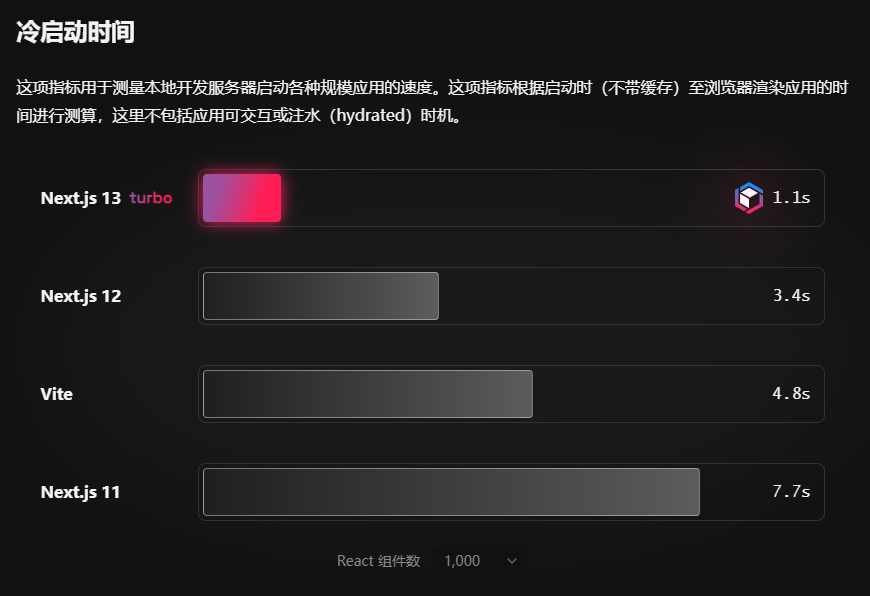
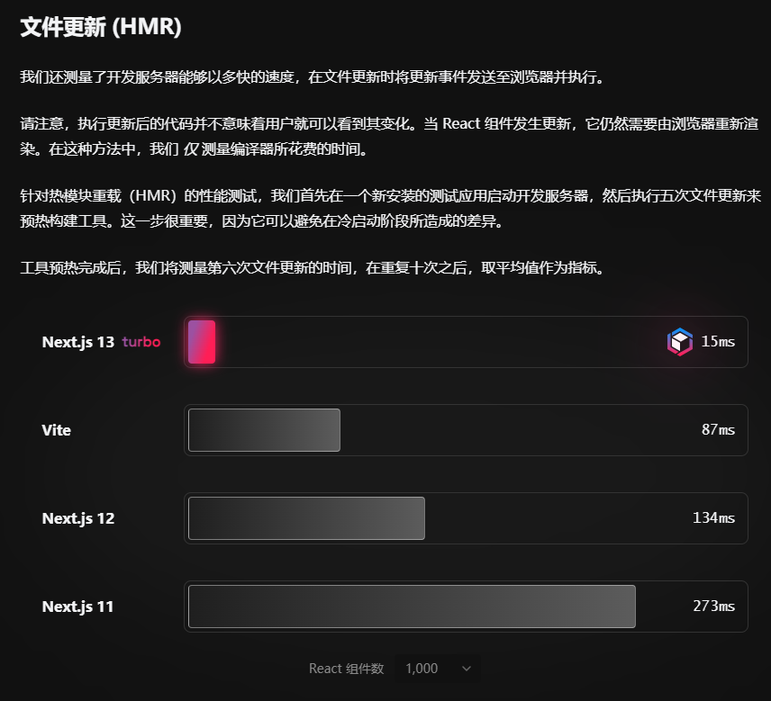

# Turbopack

我们在开发构建工具时，需要考量功能要如何开发：

* **内置功能**: 开箱即用，无需配置
* **通过插件**: 通常从包管理器安装，并经过了配置
* **不支持**: 完全不支持此功能

**Turbopack 处于 **<mark style="color:red;">**alpha 阶段**</mark>，所以只有极少的功能确定了开发方案。就目前来说, **Turbopack 还不能够进行配置**，因此还不支持插件.

目前Turbopack 开箱即用的功能、及提供的插件：

<table data-view="cards"><thead><tr><th></th><th></th><th></th><th data-hidden data-card-target data-type="content-ref"></th></tr></thead><tbody><tr><td><mark style="color:purple;"><strong>JS</strong></mark></td><td>支持 ESNext 所有功能、Browserslist 和 top-level await。</td><td></td><td><a href="https://turbo.hector.im/pack/docs/features/javascript">https://turbo.hector.im/pack/docs/features/javascript</a></td></tr><tr><td><mark style="color:purple;"><strong>TS</strong></mark></td><td>TypeScript 开箱即用，包括 paths and baseUrl 解析。</td><td></td><td><a href="https://turbo.hector.im/pack/docs/features/typescript">https://turbo.hector.im/pack/docs/features/typescript</a></td></tr><tr><td><mark style="color:purple;"><strong>模块导入</strong></mark></td><td>支持 require(CommonJS)、import(ESModule)、动态导入等。</td><td></td><td><a href="https://turbo.hector.im/pack/docs/features/imports">https://turbo.hector.im/pack/docs/features/imports</a></td></tr><tr><td><mark style="color:purple;"><strong>开发环境服务器</strong></mark></td><td>热重载（HMR）、快速刷新</td><td></td><td><a href="https://turbo.hector.im/pack/docs/features/dev-server">https://turbo.hector.im/pack/docs/features/dev-server</a></td></tr><tr><td><mark style="color:purple;"><strong>CSS</strong></mark></td><td>支持全局 CSS,、CSS Modules、@import，并内置了 PostCSS。</td><td></td><td><a href="https://turbo.hector.im/pack/docs/features/css">https://turbo.hector.im/pack/docs/features/css</a></td></tr><tr><td><mark style="color:purple;"><strong>支持多种前端框架</strong></mark></td><td>了解关于 Next.js、 Svelte、Vue 和 React 服务端组件相关支持。</td><td></td><td><a href="https://turbo.hector.im/pack/docs/features/frameworks">https://turbo.hector.im/pack/docs/features/frameworks</a></td></tr><tr><td><mark style="color:purple;"><strong>静态资源</strong></mark></td><td>支持 /public 目录、JSON 导入，以及使用 ESM 导入静态资源。</td><td></td><td><a href="https://turbo.hector.im/pack/docs/features/static-assets">https://turbo.hector.im/pack/docs/features/static-assets</a></td></tr><tr><td><mark style="color:purple;"><strong>环境变量</strong></mark></td><td>支持通过 .env、.env.local 等配置环境变量。</td><td></td><td><a href="https://turbo.hector.im/pack/docs/features/environment-variables">https://turbo.hector.im/pack/docs/features/environment-variables</a></td></tr></tbody></table>

## 性能测试结果



<figure><figcaption></figcaption></figure>

<figure><figcaption></figcaption></figure>
