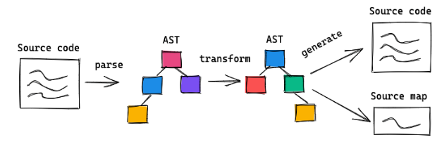

# SourceMap

简单来说，source map 就是储存了<mark style="background-color:purple;">原始码与编译后程式码的对应关系</mark>的档案，当你在开发Devtool时，可以让浏览器通过source map机制帮助定位到原始代码的位置，方便debug问题。

<figure><figcaption></figcaption></figure>

## enable source map

目前，暂时只有Chrome浏览器支持这个功能。在Developer Tools的Setting设置中，确认选中"Enable source maps"。开启请参考：

[https://developer.chrome.com/docs/devtools/javascript/source-maps#enable\_source\_maps\_in\_settings](https://developer.chrome.com/docs/devtools/javascript/source-maps#enable\_source\_maps\_in\_settings)

在开发者工具面板的“develop Resources”中可以看到source map的解析状态。

<figure><figcaption></figcaption></figure>

## 基于Source map 调试

[https://developer.chrome.com/docs/devtools/javascript/source-maps#debugging\_with\_source\_maps](https://developer.chrome.com/docs/devtools/javascript/source-maps#debugging\_with\_source\_maps)

## 启用source map

只要在转换后的代码尾部，加上一行就可以了。

```javascript
　//@ sourceMappingURL=/path/to/file.js.map
```

map文件可以放在网络上，也可以放在本地文件系统。

## 如何生成

最常用的方法是使用Google的[Closure编译器](https://developers.google.com/closure/compiler/)。

生成命令的格式如下：

> 　　java -jar compiler.jar \\\
> \--js script.js \\\
> \--create\_source\_map ./script-min.js.map \\\
> \--source\_map\_format=V3 \\\
> \--js\_output\_file script-min.js

各个参数的意义如下：

> 　　- js： 转换前的代码文件\
> \- create\_source\_map： 生成的source map文件\
> \- source\_map\_format：source map的版本，目前一律采用V3。\
> \- js\_output\_file： 转换后的代码文件。

其他的生成方法可以参考[这篇文章](http://net.tutsplus.com/tutorials/tools-and-tips/source-maps-101/)。

## Source map的格式

打开Source map文件，它大概是这个样子：

> 　　{\
> version : 3,\
> file: "out.js",\
> sourceRoot : "",\
> sources: \["foo.js", "bar.js"],\
> names: \["src", "maps", "are", "fun"],\
> mappings: "AAgBC,SAAQ,CAAEA"\
> }

整个文件就是一个JavaScript对象，可以被解释器读取。它主要有以下几个属性：

> 　　- version：Source map的版本，目前为3。
>
> 　　- file：转换后的文件名。
>
> 　　- sourceRoot：转换前的文件所在的目录。如果与转换前的文件在同一目录，该项为空。
>
> 　　- sources：转换前的文件。该项是一个数组，表示可能存在多个文件合并。
>
> 　　- names：转换前的所有变量名和属性名。
>
> 　　- mappings：记录位置信息的字符串，下文详细介绍。

## 文件格式转化技术：AST（抽象语法树）

<figure><figcaption></figcaption></figure>

格式A文件转化通过AST转化为格式B文件的同时，生成两种格式之间的映射关系（map）文件。

【参考】

[https://ruanyifeng.com/blog/2013/01/javascript\_source\_map.html](https://ruanyifeng.com/blog/2013/01/javascript\_source\_map.html)
