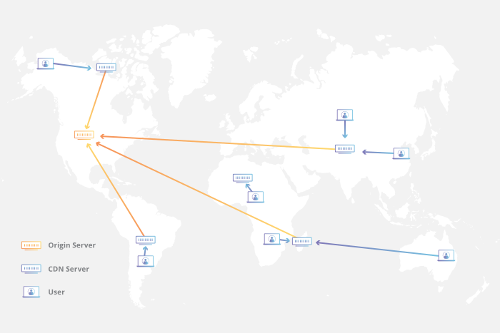

# CDN

浏览器已经有了本地缓存的功能，为什么还需要CDN呢？CDN的意义又是什么呢？

<figure><figcaption></figcaption></figure>

## 1. 为什么需要CND？

由于浏览器的本地存储的方案（Local Storage、Session Storage、IndexedDB等）及缓存策略（强缓存、弱缓存等），都是需要首次获取到资源后才能将资源存储起来的，对于后续的资源获取会有很大的性能提升；而对于首次获取资源的性能并未有任何作用。而CDN却可以做到。

## 2. 什么是CDN？

内容分发网络（Content Delivery Network，CDN）是指一组分布在不同地理位置的服务器，协同工作以提供互联网内容的快速交付。CDN的主要优势还有以下几点：

（1）快速响应

CDN能大大减少网站资源获取的时间，也就能缩短网站加载的时间。主要有以下几个原因：

● 【减少延迟】也就是说CDN是多台服务器继承的网络，客户端可以通过请求CDN来获取原始服务器（origin Server）上数据。当客户端请求CDN时，会自动匹配到最近的一台Server来提供服务，距离优势也减少了网络传输延迟。

● 【高速互联】一般CDN Server都放置在称作“[互联网交换点（IXP）](https://www.cloudflare.com/learning/cdn/glossary/internet-exchange-point-ixp/)”的地方，提供高速且高度互联的通信，因此保证高速互联，减少传输时间。

● 【软、硬件优化】保证CDN Server具有高速计算能力和快速响应能力

● 【文件压缩技术】CDN 可以使用[最小化](https://www.cloudflare.com/learning/performance/why-minify-javascript-code/)和文件压缩之类的策略来减小文件大小，从而减少传输的数据量。较小的文件意味着更快的加载时间。

● 【其他优化方式】CDN 还可以通过优化连接重用和启用 TLS 假启动来加速使用 [TLS](https://www.cloudflare.com/learning/security/glossary/transport-layer-security-tls/)/[SSL](https://www.cloudflare.com/learning/security/glossary/what-is-ssl/) 的站点。

（2）分布式、可靠性、负载均衡

由于CDN有分布式的特点，因此数据会被分在各个CDN Server端上，当一个节点出故障了，可以从另一个相邻的节点获取资源，因此具有更高的可靠性。

此外，分布式带来的另一个好处就是负载均衡，假设本来100万条请求直接发送到Server端，负载很大，但如果有了CDN，可以将这些请求分散到N多个服务器上，就大大减少对源Server的负担。

## 3. CDN两个核心能力

CDN有的核心能力有两个，一个是缓存，一个是回源。

### 3.1 缓存

缓存有两种，一种是缓存静态内容，一种是缓存动态内容。

#### 【静态内容】

静态内容是存储在服务器中的任何文件，并且每次交付给用户时都是相同的。HTML文件和图像就是此类内容的示例。

CDN能在一定的时间内缓存静态资源，在这段时间内Client从CDN请求得到的数据都是缓存好的静态资源。

#### 【动态内容】

动态内容是根据用户特定的因素（例如访问时间，位置和设备）而变化的内容。一个动态的网页对于每个人来说看起来都不一样，并且可以随着用户与之交互而改变，这使网页更加个性化和更具交互性。

动态内容由更改页面内容的脚本生成（该脚本CDN也会缓存）。在 CDN 缓存中（而不是在远程原始服务器中）会运行脚本生成动态内容，并从缓存中传递动态内容（动态更改缓存内容）。因此，动态内容本质上被"缓存了" ，不必从源服务器提供，减少了对客户端请求的响应时间，并加快了动态网页的速度。

比如以下的案例，不同区域的CDN所在的经纬度是不一样的，所以不同地区用户从各自的CDN上获取的页面数据中，关于经纬度的展示也是不一样的。

<figure><figcaption></figcaption></figure>

还想到了一个案例，各种外卖app，定位到省、市、区能这么精准，就是从最近的CDN Server上读取到了对应的动态数据。

### 3.2 回源

回源字面意思就是回到源头（源Server），也就是说从源Server获取数据。一般来说，当CDN缓存的数据过期的时候，会主动向Origin Server端获取最新数据，缓存起来并重新设置过期时间。这个机制跟浏览器缓存机制还是比较相似的。

## 4. CDN使用反向代理技术

Proxy方案一般有正向代理和反向代理两种，CDN就使用了反向代理技术。

首先了解下，什么是代理服务器？一般的代理服务器，就可以理解为正向代理器。

### 4.1 正向代理（forward Proxy）

正向代理，通常称为代理、代理服务器或web代理，是位于一组Clients前面的服务器。当这些Clients向Internet上的站点和服务发出请求时，代理服务器会拦截这些请求，然后代表这些客户端与web服务器进行通信，就像中间人一样。

比如下面的案例，有三个用户设备（user device，也就是client），要从其中的Origin ServerC获取资源，但他不会直接将请求到达C，而是请求先到了Proxy B，B再讲请求发送给Internet，最后转接到C，C返回数据时，先经过Internet，再传到B，B再传给用户设备。

也就是说，client请求的地址就是源Origin Server的地址，很明显，正向代理并不会将origin Server的内容进行缓存，目的也不是为了提高响应速度，proxy也貌似只是起到了拦截、转接的作用。那好好的为什么要Proxy进行转接呢？不仅麻烦，还浪费带宽和影响响应速度。

Proxy的存在必然有它的意义：

● 避免有些机构不能获取到限制外的网站 （To avoid state or institutional browsing restrictions ）

● 我们很快就能想到的翻墙，就是使用了代理技术。只要是在Proxy代理的域名，都可以随意的浏览；

● 阻止对某些内容的访问（To block access to certain content ）

● 既然可以让用户访问限制外的网站，也可以阻止一组用户访问某些站点。

● 例如，学校网络可能被配置为通过代理连接到网络，代理启用内容过滤规则，拒绝转发来自Facebook和其他社交媒体网站的回复。

● 保护他们在网上的身份（To protect their identity online）

● 通过代理传输内容，对于origin Server来说，用户是匿名的，无法拿到用户的ip等信息。

<figure><figcaption></figcaption></figure>

由此可见，正向代理的最大受益者是用户端（Client），因此一般是用户付费。

### 4.2 反向代理（Reverse Proxy）

反向代理是位于web服务器（Origin Server）前面的服务器，它将客户端（例如web浏览器）请求转发给这些web服务器。反向代理通常用于帮助提高安全性、性能和可靠性。

仔细观察反向代理流程图和正向代理流程图，发现区别不是很大，仅仅交换了proxy和Internet的位置。但是仅仅这么个区别，也给反向代理带来很重要的差异性。

上面说到正向代理最大的受益者是Client，而反向代理，我认为最大的受益者是服务端（OriginServer），因此一般是OriginServer端付费。

为什么说服务端是获益呢？

● 安全性

● 避免网络攻击，前面说到正向代理，隐匿了Client的ip，而反向代理隐匿了origin Server的ip和域名。由此可见，Origin Server可以避免恶意的网络攻击。

● 负载均衡，一个每天拥有数百万用户的热门网站可能无法用一台源服务器处理所有传入的网站流量。相反，该站点可以分布在不同服务器的池中，所有服务器都处理对同一站点的请求。在这种情况下，反向代理可以提供负载平衡解决方案，将传入的流量均匀地分布在不同的服务器之间，以防止任何单个服务器过载。如果一台服务器完全出现故障，其他服务器可以加紧处理流量。

● 提高用户体验，提高性能

● 缓存技术，反向代理可以缓存技术（如CDN），帮助Origin Server缓存资源，这样不用频繁地与Origin Server交互，不但减少带宽，而且用户能快速得到响应。

● SSL加密——对每个客户端的SSL（或TLS）通信进行加密和解密，对于Origin Server来说，计算成本可能会很高。可以将反向代理配置为解密所有传入请求并加密所有传出响应，从而释放Origin Server上的宝贵资源

【参考】

1\. 什么是CDN [https://www.cloudflare.com/zh-cn/learning/cdn/what-is-a-cdn/](https://www.cloudflare.com/zh-cn/learning/cdn/what-is-a-cdn/)

2\. 关于静态缓存和动态缓存的区别 [https://www.cloudflare.com/zh-cn/learning/cdn/caching-static-and-dynamic-content/](https://www.cloudflare.com/zh-cn/learning/cdn/caching-static-and-dynamic-content/)

3\. 反向代理 [https://www.cloudflare.com/zh-cn/learning/cdn/glossary/reverse-proxy/](https://www.cloudflare.com/zh-cn/learning/cdn/glossary/reverse-proxy/)
