# 浏览器渲染原理

## 渲染时间点


## 渲染流水线


### 解析HTML(parse HTML)


* 解析DOM树，生成Document Object Model。

Document Object Model（DOM，文档对象模型）是HTML和XML文档的编程接口。它提供了文档的结构化表示，允许程序和脚本动态地访问和更新文档的内容、结构和样式

* 解析css，生成CSS Object Model。

CSS Object Model（CSSOM，CSS对象模型）是CSS文档的编程接口。它提供了CSS规则和样式的结构化表示，允许程序和脚本动态地访问和更新CSS样式。

```js
// 获取所有样式表
const styleSheetList = document.styleSheets;
// 还可以修改、新增、删除样式表中的规则
const styleSheet = styleSheetList[0]

// 获取样式规则
const rule = styleSheet.cssRules[0];

// 修改样式规则
rule.style.color = 'red';

// 创建样式规则
const newRule = styleSheet.insertRule('.my-class { color: blue; }', 0);

// 删除样式规则
styleSheet.deleteRule(0);

```

#### HTML解析时遇到CSS代码怎么办？

为了提高解析效率，浏览器会启动一个预解析线程率先下载CSS和解析CSS。解析完了后，将结果返回给主线程，主线程生成CSSOM。


#### HTML解析时遇到JS代码怎么办？

渲染主线程遇到JS时，必须暂停一切行为，等待下载执行完成后，才能继续，预解析线程可以分担一些下载JS的任务。

由于JS代码的执行过程可能会修改当前DOM树，所以DOM树的生产必须暂停。这就是JS会阻塞HTML解析的根本原因。


### 样式计算（Recalculate Style）

得到每个节点计算后的样式，会将预设值变成绝对单位，比如em会变成px，red会变成rgb(255,0,0)。


### 布局（Layout）

* 主线程计算每个节点在页面上的布局信息（或称几何信息），即大小（宽高）和位置（相对的包含块的位置），从而生成布局树（Layout Tree）。
* 布局树中的每个节点都对应一个矩形区域，称为盒模型（Box Model）。盒模型描述了元素的大小、位置和边框等信息。
* 布局树中的节点按照从上到下、从左到右的顺序排列，形成了一个二维的布局结构。
* DOM树和Layout树并不是一一对应的。
* 行盒&块盒



### 分层

浏览器考虑到用户操作，比如滚动页面、缩放页面、旋转页面等，都会导致页面的重绘和重排，如果每次响应都需要重新绘制整个页面，那么性能会非常差。

所以浏览器会为页面生成多个图层，每个图层对应一个图形上下文，每个图形上下文对应一个绘制列表。

如果只改动了一个或部分分层中的内容，那么则只需要重新绘制这些分层，而不需要重新绘制整个页面。

分层的层次不会分的太多，因为分层次过多，会导致浏览器需要花费更多的时间来维护这些分层，从而影响性能。

补充：

* 跟堆叠上下文有关的属性，会影响分层。如z-index、opacity、transform等。
* 需要裁剪（clip）的元素，会生成一个图层。
* 有3D或透视效果的元素，会生成一个图层。
* video元素，会生成一个图层。
* canvas元素，会生成一个图层。
* iframe元素，会生成一个图层。
* 滚动条单独分了一层。
* will-change属性设置为transform，可以告诉浏览器该元素可能会经常发生变化，从而让浏览器自行决策单独生成一个图层。


### 绘制（Paint）

* 主线程遍历图层树，调用每个图层的绘制指令（类似canvas指令），生成绘制列表（Paint Records），用于描述该层如何绘制。

渲染主线程的工作到此为止，剩余的步骤交给其他线程完成。


### 分块（Tiling）

合成线程 将每个图层划分成多个小区域，称为图块（Tile），每个图块的大小通常是256x256或512x512像素。

分块的原因是，如果图层太大，那么在绘制时，需要花费更多的时间来处理，从而影响性能。分块后，可以将每个图块单独处理，从而提高绘制效率。

* 合成线程也是渲染主线程创建的，但是合成线程是独立于渲染主线程的，它负责处理图块的分块、合成和绘制等工作。
* 合成线程会启动更多的线程，如分块线程、绘制线程等，来并行处理图块。
* 分块的过程是并行的，可以同时处理多个图块，从而提高绘制效率。
* 优先级，先画视口位置的


### 光栅化（Raster）

光栅化是将每个块变成位图，由<mark style="background-color:purple;">GPU进程（有的地方说是合成线程，待确认）</mark>完成光栅化。 优先处理靠近视口的块。 此过程会用到GPU加速。


### 画（draw）

合成线程计算出每个位图在屏幕上的位置，交给GPU进行最终呈现。

* quad(指引信息)：标识出每个位图应该画到屏幕上的位置，以及会考虑旋转、缩放等变形。
* transform变形属性，将位图进行矩阵变换，最后生成变形后的quad信息。
* 变形发生在合成线程，与渲染主线程无关，这就是transform不会引起重排的原因，也是效率高的原因。
* 合成线程将quad信息交给GPU进程，GPU进程产生系统调用，将quad信息发送给GPU硬件，GPU根据quad信息将位图绘制到屏幕上。


### 完整流程


## 面试题

```
面试题： 浏览器是如何渲染页面的？

当浏览器的网络线程收到 html 文档后，会产生一个渲染任务，并将其加入到渲染主线程的消息队列。
在事件循环机制的作用下，渲染主线程取出消息队列中的渲染任务，开启渲染流程。

整个渲染流程分为多个阶段，分别是：HTML解析、样式计算、布局、分层、绘制、分块、光栅化、绘制。
每个阶段都有明确的输入输出，上一个阶段的输出会成为下一个阶段的输入。

这样，整个渲染流程就形成了一套组织严密的生产流水线。


*** 第一步解析HTML ***

解析过程中遇到CSS解析CSS，遇到JS解析JS并执行JS，为了提高解析效率，浏览器在开始解析之前，会启动一个预解析线程，率先下载HTMK中外部CSS文件和外部JS文件。

如果主线程解析到Link位置，此时外部的css文件还没有下载解析好，主线程不会等待，继续解析后续的HTML。这是因为下载和解析css的工作在预解析线程中进行。这就是CSS不会阻塞HTML解析的根本原因。

如果主线程解析到script位置，会停止解析HTML，转而等待JS文件下载好，并将全局代码解析执行完成后，才能继续解析HTML。这是因为JS代码的执行过程可能会修改当前DOM树，所以DOM树的生产必须暂停。这就是JS会阻塞HTML解析的根本原因。

第一步完成后，得到DOM树和CSSOM树，浏览器的默认样式、内部样式、外部样式、行内样式都会包含在CSSOM树中。


*** 第二步样式计算，得到带有样式的DOM树 ***

主线程会遍历得到的DOM树，依次为树中的每个节点计算出它的最终样式，称为ComputedStyle.

在这个过程中，很多预设值会变成绝对值，比如red会变成rgb(255,0,0)；相对单位会变成绝对单位，比如em会变成px。


*** 第三步布局， 布局后得到布局树 ***

主线程会遍历得到的DOM树，依次为树中的每个节点计算出它的布局信息（也称几何信息），例如节点的高宽、相对包含块的位置。

这个过程中，会得到一个布局树（Layout Tree）。

大部分的时候，DOM树和布局树并非一一对应。
比如display：none的元素没有布局信息，所以不会出现在布局树中。又比如使用了伪元素选择器，虽然DOM树中不存在这些伪元素节点，但它们拥有布局信息，所以会生成到布局树中。还有匿名行盒、匿名块盒等等，都会导致DOM树和布局树无法一一对应。

*** 第四步分层 ***

主线程会使用一套复杂的策略对整个布局树进行分层。
每个图层都由一个图形上下文（Graphics Context）来维护，这个上下文包含了绘制这个图层所需的全部信息。
分层的好处在于，将来某个图层改变后，仅对该层进行后续处理，从而提升效率。

滚动条、堆叠上下文、tansform、opacity等样式都会或多或少影响分层结果，也可以通过will-change属性更大程度的影响分层结果。

分层操作完成后，会得到一个图层树（Layer Tree）。

*** 第五步绘制 ***

主线程会为每个层单独产生绘制指令集（类似canvas的指令），用于描述这一层的内容如何画出来。
完成绘制后，主线程将每个图层的绘制信息提交给【合成线程】，剩余工作交给合成线程完成。

*** 第六步分块 ***

合成线程首先对每个图层进行分块，将其划分成更多的小区域。
它会从线程池中拿取多个线程来完成分块工作。

*** 第七步 光栅化阶段 ***
分块完成后，进入光栅化阶段。
合成线程会将块信息交给 GPU进程，以极高的速度完成光栅化。
GPU进程会启动多个线程来完成光栅化，并且优先处理靠近视口区域的快。
光栅化的结果，就是一块一块的位图。

*** 最后一步 画 ***

光栅化完成后，合成线程拿到每个层、每个块的位图后，生成一个个【指引】信息。
指引会标识出每个位图应该画到屏幕的那个位置，以及会考虑到旋转、缩放等变形。

变形发生在合成线程，与渲染主线程无关，这就是transform不会引起回流、效率高的本质原因。

最后，合成线程会通过IPC（进程间通信）将指引信息提交给GPU进程，由GPU进程产生系统调用，提交给GPU硬件，最终完成整个屏幕成像。

至此，整个渲染流程结束。
```

```
面试题：什么是重排（reflow）？
重绘本质是重新计算<b>layout</b>树。
当进行了会影响布局树的操作后，需要重新计算布局树，引发layout。

为了避免连续多次操作导致布局树反复计算，浏览器会合并这些操作，当js代码全部完成后，在进行一次统一计算，所以改动属性造成的reflow是异步完成的。

也同样因为如此，当js获取布局属性时，就可能造成无法获取到最新的布局信息。

浏览器在权衡利弊下，最终决定获取属性立即reflow，也就是产生了同步任务。
```


```
面试题：什么是重绘（repaint）？

重绘的本质就是重新根据分层信息计算<b>绘制指令</b>。

当改动了可见样式后，也就需要重新计算，会引发重绘。

由于元素的布局信息也属于可见样式，因此重排一定会引起重绘。
```

```
面试题：为什么transform效率高？

因为transform 既不会影响布局，也不会影响绘制指令，它只影响渲染流程的最后一个【draw】阶段。

由于draw阶段在合成线程中，所以transform的变化几乎不会影响渲染主线程。反之，渲染主线程无论如何忙碌，也不会影响transform的变化。
```
