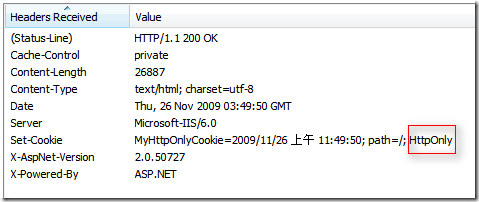

# XSS 跨站脚本攻击

XSS 攻击是指黑客往 HTML 文件中或者 DOM 中注入恶意脚本，从而在用户浏览页面时利用注入的恶意脚本对用户实施攻击的一种手段。这种攻击可以（1）窃取客户端数据（本地存储）、静态资源中有效信息等（2）模拟用户行为、盗取私密信息（3）攻击数据库、窃取数据库数据等

## 1.  常见攻击场景

### 1.1 可以窃取 Cookie 信息

可以通过“document.cookie”获取 Cookie 信息，然后通过 XMLHttpRequest 或者 Fetch 加上 CORS 功能将数据发送给恶意服务器；恶意服务器拿到用户的 Cookie 信息之后，就可以在其他电脑上模拟用户的登录，然后进行转账等操作。

### 1.2 可以监听用户行为

恶意 JavaScript 可以使用“addEventListener”接口来监听键盘事件，比如可以获取用户输入的信用卡等信息，将其发送到恶意服务器。黑客掌握了这些信息之后，又可以做很多违法的事情。

### 1.3 伪造登录窗口，窃取用户信息

可以通过修改 DOM 伪造假的登录窗口，用来欺骗用户输入用户名和密码等信息。

### 1.4 恶意浮窗广告

略。


## 2.  XSS攻击类型

### 2.1 存储型 XSS 攻击

也叫持久性XSS攻击，​主要是将XSS代码发送到服务器（不管是数据库、内存还是文件系统等），然后在下次请求页面的时候就不用带上XSS代码了。最典型的就是留言板XSS。用户提交了一条包含XSS代码的留言到数据库。当目标用户查询留言时，那些留言的内容会从服务器解析之后加载出来。浏览器发现有XSS代码，就当做正常的HTML和JS解析执行，XSS攻击就发生了。

<figure><figcaption><p>存储型XSS攻击</p></figcaption></figure>


攻击过程：

● 首先黑客利用站点漏洞将一段恶意 JavaScript 代码提交到网站的数据库中，如上图Message会当作正常文本存进数据库

● ​然后用户向网站下次请求接口获取了包含了恶意 JavaScript 脚本的页面，如上图get\_cookies.js恶意脚本加载后会被执行


### 2.2 反射型 XSS 攻击

也称非持久性XSS攻击，反射型XSS将用户输入的内容作为代码让浏览器执行达到攻击目的，一般需要让用户访问攻击者构造的URL。这种类型的攻击只发生在客户端上，并且需要从带有恶意脚本参数的特定URL进入，所以也称为非持久型XSS。

● 场景1：在URL中注入JavaScript代码

```
https://example.com/search?query=<script>alert(‘XSS攻击’)</script>
```

当用户点击这个url时，网站会将参数中的脚本嵌入到html页面中，导致弹窗执行恶意脚本。

● 场景2：在URL中注入事件

```
https://example.com/search?query=
```

攻击者在url中注入一个图像源，并当图像错误时执行onError事件，执行恶意脚本

● 场景3：利用HTML属性注入

```
https://example.com/search?query=<a%20href=javascript:alert(‘XSS攻击’)>点击这里</a>
```

攻击者在URL中注入了一個包含恶意JavaScript代码的超链接，当用户点击节点时，将执行恶意脚本。

### 2.3 基于 DOM 的 XSS 攻击

​ 这种是更高级的漏洞，它存在于客户端代码中的，而不是在服务器代码中。黑客通过各种手段将恶意脚本注入用户的页面中，比如通过网络劫持在页面传输过程中修改 HTML 页面的内容，Web 应用程序读取恶意代码并将其作为 DOM 的一部分在浏览器中执行，这更难检测，因为它不通过服务器传递。

比如往页面中植入恶意的表单，诱导用户输入个人私密信息，盗取用户信息。

## 3.  解决策略

那如何阻止这个xss的攻击呢？下面我们就看看主要的策略有哪些：

● 服务器对输入文本、脚本进行过滤或转码，防止恶意HTML或JS脚本（存储型、反射型）

● 前端、服务端对用户进行有效性校验，如限制长度、类型等（存储型、反射型）

● 充分利用 CSP（Content Security Policy (CSP)，限制网站上可执行脚本的来源

[内容安全策略（Content Security Policy ，CSP)](https://docs.qq.com/doc/DTXhwUkpQU2NLWnRT)

● 全天候的安全网络托管，防止任何不需要的登录或网络钓鱼攻击（DOM攻击）

● 禁止使用flash，安全漏洞太多（DOM攻击）

● 使用 HttpOnly 属性（基于Cookie的攻击）

由于很多 XSS 攻击都是来盗用 Cookie 的，因此还可以通过使用 <mark style="background-color:purple;">HttpOnly</mark> 属性来保护我们 Cookie 的安全。通常服务器可以将某些 Cookie 设置为 HttpOnly 标志，HttpOnly 是服务器通过 HTTP 响应头来设置的，<mark style="background-color:purple;">无法被js代码获取到</mark>。but这个也不能完全避免cookie被拿到，因为可以手动拿到cookie的 。

<figure><figcaption></figcaption></figure>
