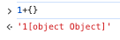
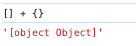

# 奇怪表达式

```js
// 计算
([][[]] + [])[+!![]] + ([] + {})[+!![] + +!![]]

[][[]] = [][[].toString)]
       =[]['']
       = undefined

([][[]] + []) =  undefined + []
              = undefined + ''
              = 'undefined'


[+!![]] = [+1] = [1]

([] + {}) = '' + '[object Object]' = '[object Object]'

[+!![] + +!![]] = [+1 + +1]
                = [2]


([][[]] + [])[+!![]] + ([] + {})[+!![] + +!![]]
= ('undefined')[1] + ('[object Object]')[2]
= 'n'+'b'
='nb'
```



原始类型+对象类型，姜对象类型转化成原始类型，

* {} 转化成原始类型为“\[Object Object]”
* \[] 转化成原始类型为""



```js
(![] + [])[+!![] + !![] +!![]] + ([]+{})[+!![] + +!![]]
=(false + [])[1+true+true]  + (''+'[object Object]')[1+1]
='false'[3] + '[object Object]'[2]
= 's' + 'b'
= 'sb'
```
