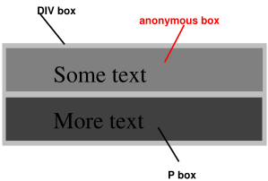

# 你不知道的 CSS 之 BFC

## 什么是 BFC

官方描述：https://drafts.csswg.org/css2/#block-formatting

```
Floats, absolutely positioned elements, block containers (such as inline-blocks, table-cells, and table-captions) that are not block boxes, and block boxes with overflow other than visible (except when that value has been propagated to the viewport) establish new block formatting contexts for their contents.

In a block formatting context, boxes are laid out one after the other, vertically, beginning at the top of a containing block. The vertical distance between two sibling boxes is determined by the margin properties. Vertical margins between adjacent block-level boxes in a block formatting context collapse.

In a block formatting context, each box’s left outer edge touches the left edge of the containing block (for right-to-left formatting, right edges touch). This is true even in the presence of floats (although a box’s line boxes may shrink due to the floats), unless the box establishes a new block formatting context (in which case the box itself may become narrower due to the floats).

```

浮动元素（float:left|right）、绝对定位元素、如inline-blocks、table-cells、table-captions的非块级盒子的block容器，以及overflow属性不等于visible的block盒子（除了那些值已传播到视口的）会为其内容建立新的块级格式化上下文。

在BFC上下文中，盒子会从包含块的顶部开始，一个接一个地垂直放置。两个兄弟盒子之间的垂直间距由margin属性决定。在一个BFC内部，相邻块级盒子之间的垂直边距会折叠（或称称合并，也就是出现margin塌陷问题）。

在BFC上下文中，每个盒子的左外边界会与包含块的左外边界接触（对于从右到左的格式化，右外边界会挨着）。即使存在浮动，这也是正确的（尽管盒子的行框可能会因为浮动而收缩），除非盒子本身建立了一个新的BFC（在这种情况下，盒子本身可能会[因为浮动而变窄](http://www.ayqy.net/doc/css2-1/visuren.html#bfc-next-to-float)）。

BFC（Block Formatting Context，块级格式化上下文）是CSS中的一个概念，它决定了元素如何布局和渲染。BFC是一个独立的渲染区域，它内部的元素不会影响到外部的元素，反之亦然。

以下是一些常见的BFC触发条件：

* 根元素（html）：根元素是一个特殊的BFC。
* 浮动元素（float）：浮动元素是一个BFC。
* 绝对定位元素（position: absolute / fixed）：绝对定位元素是一个BFC。
* 行内块元素（display: inline-block）：行内块元素是一个BFC。
* 表格单元格（display: table-cell）：表格单元格是一个BFC。
* 表格标题（display: table-caption）：表格标题是一个BFC。
* 具有overflow属性的元素：具有overflow: hidden、overflow: auto、overflow: scroll属性的元素是一个BFC。
* Flex项（display: flex / inline-flex）：Flex项是一个BFC。
* Grid项（display: grid / inline-grid）：Grid项是一个BFC。

## BFC 的特性

1. 内部的元素会在垂直方向上一个接一个地放置，相邻的两个元素之间的垂直间距由 `margin` 属性决定。在一个 BFC 内部，两个相邻元素的 `margin` 会发生重叠。
2. 内部的元素不会影响到外部元素的布局。例如，一个浮动元素在一个 BFC 内部，它不会影响到外部元素的布局。
3. 内部的浮动元素不会影响到外部：BFC内部的浮动元素不会影响到外部，外部元素的布局不会受到浮动元素的影响。
4. 内部的元素不会与外部的浮动元素重叠：BFC内部的元素不会与外部的浮动元素重叠。
5. 内部的元素会按照BFC的宽度进行布局：BFC内部的元素会按照BFC的宽度进行布局，而不是按照父元素的宽度进行布局。

## BFC 的应用

1. 清除浮动：在父元素上创建一个新的 BFC，可以清除子元素的浮动。
2. 防止 margin 重叠：在相邻的两个元素上创建一个新的 BFC，可以防止它们的 `margin` 发生重叠。

```html
<html lang="en">
<head>
    <meta charset="UTF-8">
    <meta name="viewport" content="width=device-width, initial-scale=1.0">
    <title>Document</title>
    <style>
        *{
            margin: 0;
            padding: 0;
        }
        .wrap{
            width: 100%;
            height: 400px;
            background: red;  //红色
            margin-top: 100px;
        }
        .box{
            width: 100%;
            height: 300px;
            background: #62d3e0;  //蓝色
            margin-top: 50px;
        }
    </style>
</head>
<body>
    <div class="wrap">
        <div class="box"></div>
    </div>
</body>
</html>
```

预期展示是：wrap背景红色，box背景蓝色，box距离wrap顶部50px。 

修改：将wrap设置为BFC，如设置overflow:hidden，就会纠正。


3. 创建新的布局上下文：在需要创建新的布局上下文的地方，可以创建一个新的 BFC。
4. 防止元素溢出：使用BFC可以防止元素溢出，使元素不会超出父元素的边界。

## BFC 的实现

1. 根元素（html）：根元素是一个特殊的 BFC。
2. 浮动元素（float）：浮动元素是一个 BFC。
