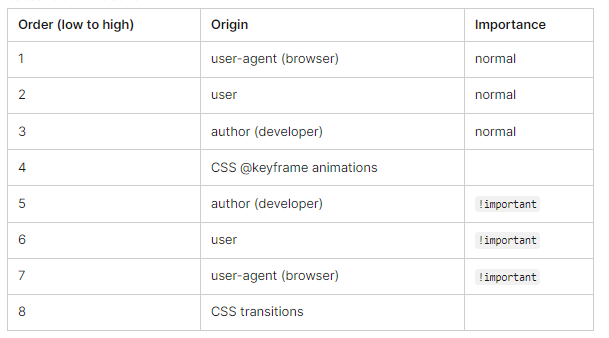

# 分配属性值、层叠和继承

## 1. 规定值、计算值和实际值（Specified, computed, and actual values）

> Once a User agent has parsed a document and constructed a document tree, it must assign, for every element in the tree, a value to every property that applies to the target media type.\
> The final value of a property is the result of a four-step calculation: the value is determined through specification (the "specified value"), then resolved into a value that is used for inheritance (the "computed value"), then converted into an absolute value if necessary (the "used value"), and finally transformed according to the limitations of the local environment (the "actual value").

一旦 UA 解析了文档并构建了文档树，它必须为树中的每个元素的每个属性分配一个值，这些属性都是应用于目标媒体类型的。

属性的最终值是经过四个步骤计算得出的：通过规范确定值（`specified value`），然后将其解析为用于继承的值（`computed value`），然后如果需要，将其转换为绝对值（`used value`），最后根据本地环境的限制进行转换（`actual value`）。

### 1.1 指定值 - Specified value

> User agents must first assign a specified value to each property based on the following mechanisms (in order of precedence):\
> 1.If the cascade results in a value, use it. Except that, if the value is inherit, the specified value is defined in § 6.2.1 The inherit value below.\
> 2.Otherwise, if the property is inherited and the element is not the root of the document tree, use the computed value of the parent element.\
> 3.Otherwise use the property’s initial value. The initial value of each property is indicated in the property’s definition.

UI 必须基于以下机制（按先后顺序），为每个属性赋予指定值：

* 如果层叠（cascade）结果为一个值，则使用它。此外，如果这个值是继承的，则它的值遵循继承规则（§ 6.2.1 The inherit value）。
* 否则，如果属性是继承的，并且元素不是文档树的根节点，则使用父元素的 `computed value`。
* 否则使用属性的初始值。每个属性的初始值在其定义中明确。

### 1.2 计算值 - Computed value

> Specified values are resolved to computed values during the cascade; for example URIs are made absolute and em and ex units are computed to pixel or absolute lengths. Computing a value never requires the User agent to render the document.\
> The computed value of URIs that the UA cannot resolve to absolute URIs is the specified value.\
> The computed value of a property is determined as specified by the Computed Value line in the definition of the property. See the section on inheritance for the definition of computed values when the specified value is inherit.\
> The computed value exists even when the property does not apply, as defined by the 'Applies To' line. However, some properties may define the computed value of a property for an element to depend on whether the property applies to that element.

`Specified value` 在 `层叠` 过程中被解析为 `Computed value`。例如，URI 被转换为绝对 URI，em 和 ex 单位被计算为像素或绝对长度。计算值永远不会要求 UA 渲染文档。

当 UA 无法将URL解析为 绝对URI时，URI的 `Computed value` 就等于其`Specified value` 。

属性的 `Computed value` 由属性定义中的`Computed value 行`指定。当 `Specified value` 为 `inherit` 时，`Computed value`的定义参见继承部分。

即使属性不适用于某个元素，`Computed value`仍然存在，如`Applies To 行` 所定义。然而，某些属性可能会定义元素的属性`Computed value`，这取决于该属性是否适用于该元素（猜测意思是，某些属性是否有计算值，取决于这个属性是否适用于这个元素）

【术语】 `Applies To行`用于指定该属性可以应用于哪些 HTML 元素

### 1.3 使用值（Used value）

> Computed values are processed as far as possible without formatting the document. Some values, however, can only be determined when the document is being laid out. For example, if the width of an element is set to be a certain percentage of its containing block, the width cannot be determined until the width of the containing block has been determined. The used value is the result of taking the computed value and resolving any remaining dependencies into an absolute value.

`Computed value` 可以在不格式化文档的情况下尽可能地进行处理。然而，有些值只有在文档布局时才能确定。例如，如果元素的宽度被设置为包含块的某个百分比，则只有在确定了包含块的宽度后，才能确定元素的宽度。`Used value` 是将 `Computed value` 解析为绝对值的结果。

### 1.4 实际值（Actual value）

> A used value is in principle the value used for rendering, but a User agent may not be able to make use of the value in a given environment. For example, a User agent may only be able to render borders with integer pixel widths and may therefore have to approximate the computed width, or the User agent may be forced to use only black and white shades instead of full color. The actual value is the used value after any approximations have been applied.

`Used value` 是用于渲染的值，但 UA 可能无法在给定的环境中使用该值。例如，UA 可能只能使用整数像素宽度的边框，因此可能必须近似计算宽度，或者 UA 可能被迫只能使用黑白阴影而不是全彩色。`Actual value` 是应用了任何近似后的 `Used value`。

## 2. 继承 Inheritance

在DOM树中个，某些属性值会被元素的子元素继承。每个属性都定义了它是否是继承的。

> 假设H1元素中包含一个EM元素
>
> > ```
> > <H1>The headline <EM>is</EM> important!</H1>
> > ```
>
> 如果EM没有指定颜色，则EM内的"is"将继承父元素H1的颜色，因此如果H1颜色是蓝色，则EM元素也是蓝色。

当继承发生，元素就会继承计算属性值。父元素的`computed value`既是子元素的`specified value`也是子元素的`computed value`。

> 还是针对上面的H1和EM元素，对于下面样式
>
> > ```
> > body { font-size: 10pt } 
> > h1 { font-size: 130% }
> > ```
>
> H1 font-size属性将有`computed value`，等于13pt，即父元素的字体大小的1.3倍。由于font-size属性时继承的，EM的font-size的计算值也是13pt。如果这个 UA 没有13pt的字体大小可用，则 UA 会选择最近似的字体值来设置给H1和EM，作为二者的`actual value`，比如12pt。

### 2.1 关于 inherit value

> Each property may also have a cascaded value of inherit, which means that, for a given element, the property takes as specified value the computed value of the element’s parent. The inherit value can be used to enforce inheritance of values, and it can also be used on properties that are not normally inherited.

每个属性也有继承的`cascaded value`（层叠值），这意味着，对于一个给定元素，该属性将父元素的`computed value`作为其`specified value`。`inherit value` 可以用来强制继承值，也可以用于通常情况下不继承的属性，举例：

> > ```css
> > body {
> >    font-size: 10pt;
> >    color: blue;
> > }
> > h1 {
> >    font-size: 130%;
> >    color: inherit;
> > }
> > ```
>
> 这里 H1 通过为属性font-size，color设置值为inherit，继承了body的这两个属性值。

## 3. The @import rule

> The @import rule allows users to import style rules from other style sheets. In CSS 2, any @import rules must precede all other rules (except the @charset rule, if present). See the section on parsing for when User agents must ignore @import rules. The @import keyword must be followed by the URI of the style sheet to include. A string is also allowed; it will be interpreted as if it had url(...) around it.

这个规则允许用户从其他样式表（style sheets）中导入样式规则。在CSS2中，任何@import规则必须位于所有其他规则之前（如果存在`@charset`规则，则除外）。有关 UA 必须忽略 `@import`规则的情况，请参见解析部分（参考地址：https://drafts.csswg.org/css2/#at-rules ）。@import关键字后面必须跟要包含的样式表的URI。也可以使用字符串，它会把它当作和包含url()一样的方式进行解析。

> > ```
> > @import "mystyle.css";
> > @import url("mystyle.css");
> > ```
>
> 这里 `@import "mystyle.css"` 会被当作 `@import url("mystyle.css")` 来解析。

So that User agents can avoid retrieving resources for unsupported media types, authors may specify media-dependent @import rules. These conditional imports specify comma-separated media types after the URI.

因此 UA 可以避免为不支持的媒体类型检索资源，作者可以指定`media-dependent`（媒体依赖）的`@import`规则，方法是在URI后面使用逗号分隔来指定样式表需支持的媒体类型，对于不在指定范围内的媒体，就不会解析该样式表。

> > ```
> > @import url("mystyle.css") screen, projection;
> > ```
>
> 上述css样式，表示 mystyle.css 只在 screen 和 projection 媒体类型下被导入。

在没有指定任何媒体类型的情况下，导入是无条件的。与设置媒体类型为`all`效果是一样的。只有当目标媒体与媒体列表匹配时，导入才会生效。

当目标媒体是媒体中的一项，或者媒体列表中有`all`，表示目标媒体与媒体列表匹配成功

***

#### 忽略`@import规则`的情况

@import 规则用于在 CSS 文件中导入其他 CSS 文件。然而，有一些情况，用户代理（User Agent）必须忽略 @import 规则。

* @import 规则位于 CSS 文件的开头。
* @import 规则位于 CSS 文件的 @charset 规则之后。
* @import 规则位于 CSS 文件的 @namespace 规则之后。
* @import 规则位于 CSS 文件的 @supports 规则之后。
* @import 规则位于 CSS 文件的 @document 规则之后。
* @import 规则位于 CSS 文件的 @font-face 规则之后。
* @import 规则位于 CSS 文件的 @page 规则之后。
* @import 规则位于 CSS 文件的 @counter-style 规则之后。
* @import 规则位于 CSS 文件的 @keyframes 规则之后。
* @import 规则位于 CSS 文件的 @layer 规则之后。

***

#### @import引入样式的优缺点

优点：

* 模块化：@import 规则可以帮助开发者将 CSS 代码组织成多个文件，每个文件包含一组相关的样式规则。这可以提高代码的可维护性和可重用性。
* 可重用性：通过 @import 规则导入的 CSS 文件可以在多个地方重用，减少了代码的重复。
* 条件加载：@import 规则可以用于根据浏览器的特性或用户的偏好加载不同的 CSS 文件。这可以提高网页的性能和用户体验。

缺点：

* 性能问题：@import 规则会导致额外的 HTTP 请求，这可能会影响网页的加载速度。每个 @import 规则都会导致一个新的 HTTP 请求，如果导入的 CSS 文件很大，那么这可能会增加加载时间。
* 样式层叠顺序：@import 规则导入的 CSS 文件的样式层叠顺序可能会变得难以控制。如果多个 @import 规则导入的 CSS 文件包含相同的样式规则，那么后导入的文件可能会覆盖先导入的文件。
* 浏览器兼容性：虽然大多数现代浏览器都支持 @import 规则，但一些旧版本的浏览器可能不支持。因此，在使用 @import 规则时，需要考虑浏览器的兼容性。

## 4. cascade - 层叠

### 4.1 样式表的源文件类型 - Style sheet source type

> Style sheets may have three different origins: Author, User, and User agent.
>
> Author. The Author specifies style sheets for a source document according to the conventions of the document language. For instance, in HTML, style sheets may be included in the document or linked externally.
>
> User: The User may be able to specify style information for a particular document. For example, the User may specify a file that contains a style sheet or the User agent may provide an interface that generates a User style sheet (or behaves as if it did).
>
> User agent: Conforming User agents must apply a default style sheet (or behave as if they did). A User agent’s default style sheet should present the elements of the document language in ways that satisfy general presentation expectations for the document language (e.g., for visual browsers, the EM element in HTML is presented using an italic font). See A sample style sheet for HTML for a recommended default style sheet for HTML documents.

样式表可能有三种不同的来源：作者，用户，和用户代理。

#### 4.1.1 作者样式表（Author）

作者根据文档语言的约定（conventions of the document language）为源文档（source document）指定样式表。例如，在HTML中，样式表可以包含在文档中或从外部链接

```html
<!-- link引入的样式，也属于Author类型的样式表源 -->
<link rel="stylesheet" href="mystyle.css">
<!-- 在html中写的样式 也属于Author类型的样式表源 -->
<style>
  p {
    color: red;
  }
</style>
```

#### 4.1.2 用户样式表（User）

User可以为特定文档指定样式信息。例如，用户可以指定包含样式表的文件，或者 UA 必须提供接口生成一个用户样式表（或表现得像它做了）。

这是用户通过浏览器设置或用户样式表（User Stylesheet）来自定义网页样式的用户。用户样式表是一种特殊的 CSS 文件，它允许用户覆盖网页作者提供的样式，以适应他们的个人偏好。

MDN上这么说 https://www.thoughtco.com/User-style-sheet-3469931

> 然而，现在用户样式表并不常见。谷歌Chrome浏览器不允许使用它们，Firefox正在逐步淘汰它们。对于Chrome，您需要一个扩展程序来创建用户样式表。Firefox要求您通过开发人员页面启用该选项。用户样式表消失了，因为网页设计更好。
>
> 如果你仍然想尝试用户样式表，你可以，但不建议这样做。你更有可能破坏你访问的页面，或者让它们变得非常丑陋。
>
> 用户样式表的配置可参考配置 https://www.thoughtco.com/User-style-sheet-3469931 google使用`Stylish`插件可以自定义用户样式表

```css
  /* 用户样式表 ， google使用Stylish插件可以自定义用户样式表 */
  p {
  color: blue;
  }
```

在这个示例中，用户样式表将所有

元素的文本颜色设置为蓝色。然而，如果网页作者也定义了一个将

元素的文本颜色设置为红色的样式规则，那么用户样式表的优先级较低，因此

元素的文本颜色仍然是红色。

#### 4.1.3 用户代理样式表（User agent or UA ）

UA 必须应用默认样式表（或表现得像他们做了）。UA 的默认样式表应该以满足文档语言的通用呈现期望的方式来呈现文档元素（例如，对于视觉浏览器，HTML 中的 EM 元素使用斜体字体呈现）。有关 HTML 文档的推荐默认样式表，请参见 HTML 的示例样式表（https://drafts.csswg.org/css2/#html-stylesheet）。

> Note that the User may modify system settings (e.g., system colors) that affect the default style sheet. However, some User agent implementations make it impossible to change the values in the default style sheet. 注意：用户可以修改系统设置（如系统颜色），从而影响默认样式表。然而，一些 UA 的实现使得用户无法修改默认样式表。

### 4.2 层叠

https://developer.mozilla.org/en-US/docs/Web/CSS/Cascade#cascade\_layers

层叠是一种算法，它定义了 UA 如何组合来自不同来源的样式，来计算最终的属性值。层叠定义了当`多个源`、`Cascade layer`或`@scope`块中的存在元素样式的声明时，如何根据优先级确定最终的样式属性。

#### 层叠顺序

层叠算法决定如何找出要应用到每个文档元素的每个属性上的值，具体算法如下：

1. 确定与元素相关的规则：它首先过滤来自不同源的全部规则，并保留要应用到指定元素上的那些规则。这意味着这些规则的选择器匹配指定元素，同时也是一个合适的 @规则（at-rule）的一部分。
2.  比较源&重要性：它依据源重要性对这些规则进行排序。 默认情况下，Author > User > User agent。然而，对于“！important”规则，优先级是相反的，即 Author < User < User agent。

    因此综合考虑 `源` & `!important` ，暂时不考虑layer，优先级排序如下：

    
3. 比较Specificity：在与源相同的情况下，基于`Specificity`（https://developer.mozilla.org/en-US/docs/Web/CSS/Specificity）规则来确定选择的结果，即比较选择器的`Specificity`，具有最高`Specificity`的声明获胜。
4. 比较scoping proximity（作用域优先级）：当具有优先级的源层中的两个选择器具有相同的`Specificity`时，作用域规则内的属性值在DOM层次结构中向上跳到作用域根的次数最少，则获胜（也就是css嵌套层级越少优先级越高）。有关更多详细信息和示例，请参阅如何解决@scope冲突（https://developer.mozilla.org/en-US/docs/Web/CSS/@scope#how\_scope\_conflicts\_are\_resolved）。
5. 显示顺序：在具有优先级的源中，某个节点的`Specificity`和`scoping proximity`均相同，最后一招就是根据样式申明的先后顺序确认优先级。

#### !important规则

css试图在 `User`、`Author`之间保持平衡，默认情况下 `Author` > `User`。然而，`Author` 有时需要覆盖 `User` 样式表，或者 `User` 需要覆盖 Autor样式表。为此，CSS 提供了`“!important”`规则。当`“!important”`规则应用于样式表时，它将覆盖 `Author` 和 `User` 中的任何其他规则。

```css
    /* Author */
    p {
    color: blue;
    }
    /* User */
    p {
    color: red !important;
    }
```

在这个示例中，`User` 样式表中的`“!important”`规则将覆盖 `Author` 样式表中的规则，因此 `<p>` 元素的文本颜色将是红色。

#### 计算选择器的specificity

也就是选择器的优先级，参考官网定义的计算规则如下：

> 1. !important：10000 （自己增加的）
> 2. 内联样式：1000 // style = ''
> 3. ID选择器：100 // #id{}
> 4. 类选择器、属性选择器和伪类：10 // .class{}, attr{}, :hover{}
> 5. 元素选择器和伪元素：1 // p{}, ::before{}

同一个规则下，满足条件的有多个，则数值累加

***

上述计算规则也可以理解成以下计算方法：

```
规则1：!important > 内联样式 > 非内联样式
规则2：非内联样式的优先级判断，定义{x,y,z}

x:id选择器的数量
y:类、伪类、属性的数量
z:元素选择器、伪元素选择器的数量

{x1,y1,z1} 与 {x2,y2,z2} 比较方法
（1）当x1>x2，则前者大于后者，当x1 < x2，则前者小于后者，否则下一步
（2）当y1>y2，则前者大于后者，当y1 < y2，则前者小于后者，否则下一步
（3）当z1>z2，则前者大于后者，当z1 < z2，则前者小于后者，否则下一步
（4）如果两个选择器的特殊性相同（x1 === x2,y1 === y2,z1 === z2），
     后定义的规则将会覆盖先定义的规则（如果同时出现在CSS文件中）
```

#### Precedence of non-CSS presentational hints

略

### 4.3 层叠层（cascading layers）

> The cascade order is based on origin type. The cascade within each origin type is based on the declaration order of cascade layers within that type. For all origins - User-agent, Author, or User - styles can be declared within or outside of named or anonymous layers. When declared using layer, layer() or @layer, styles are placed into the specified named layer, or into an anonymous layer if no name is provided. Styles declared outside of a layer are treated as being part of an anonymous last declared layer.

层叠顺序基于文档源类型（也就是上面所说的样式表的源文件类型）。每个源类型中的层叠基于该类型中层叠层的声明顺序。对于所有来源（Author、User、User-agent），可以在命名层或匿名层的层内或层外声明样式。当使用[layer](https://developer.mozilla.org/en-US/docs/Web/CSS/@import)、[layer（）](https://developer.mozilla.org/en-US/docs/Web/CSS/@import)或[@layer](https://developer.mozilla.org/en-US/docs/Web/CSS/@layer)声明时，样式将放置在指定的命名层中，如果没有提供名称，则放置在匿名层中。在层外声明的样式被视为匿名最后声明层的一部分。

#### 4.3.1 layer诞生

【参考】https://www.zhangxinxu.com/wordpress/2022/05/css-layer-rule/

我们在实际开发的时候，经常会使用第三方组件。

但是这些组件虽然功能是我们需要的，但是 UI 样式却和产品的风格不一致，我们需要对这些组件的 UI 进行重置，换个肤，变个色什么的。

如何重置呢？

很简单，使用优先级更高的选择器进行覆盖即可.

例如：

```css
.container .some-button {}
```

覆盖的时候，就再增加一点权重。

```css
body .container .some-button {}
```

就可以了！这样的代码在项目中其实是屡见不鲜的。然而，这样的代码又臭又长。在没有layer的时候，各种样式覆盖，糅合在一起，出现很多样式问题，比如样式污染。

对于上述问题，同一个 CSS 上下文中，有些 CSS 声明需要设置低优先级，且这种优先级不受选择器权重的影响，layer 规则就是解决上面这种场景应运而生的。`layer 可以让 自身的 CSS 声明的优先级下降一整个层叠级别`。

#### 4.3.2 @layer 规则

@layer 这个 CSS at-rule（AT规则）的语法如下：

```css
/* 单名称&定义语法 */
@layer layer-name {rules};
/* 单名称语法, 用来设置优先级*/
@layer layer-name;
/* 多名称语法，用来设置优先级 */
@layer layer-name, layer-name, layer-name;
/* 匿名&定义语法 */
@layer {rules};
```

**单名称定义@layer语法**

对于`@layer layer-name {rules}`语法，优先级是按照`layer-name`的顺序来的，后定义的`layer-name`优先级高于先定义的`layer-name`。

**匿名定义@layer语法**

对于匿名`@layer {rules}`语法，优先级是按照`rules`的顺序来的，后定义的`rules`优先级高于先定义的`rules`。

**单名称@layer语法**

其中`@layer layer-name`语法，用来设置多个规则的优先级。 例如，有一个层叠层，名为 peacock， 希望这个层叠层级别最低，但是，相关的 CSS 代码位置却无法控制，有可能在天边，也可能在眼前，此时，`@layer layer-name`这个语法就可以大放光彩了。

```css
/* 位置越前的，优先级越高, peacock1 > peacock2  */
@layer peacock1;
@layer peacock2;
/* ……CSS大军…… */
@layer peacock2 {
  .blttom-layer {
      coontent: 'css'
  }
}
/* 虽然我在后方，但我优先级最前 */
@layer peacock1 {
  .blttom-layer {
      coontent: 'java'
  }
}
```

**多名称@layer语法**

`@layer layer-name, layer-name, layer-name` 的语法作用也是类似的，可以根据自己的需求调整 @layer 规则的整体优先级。

在默认情况下，@layer 规则内 CSS 声明的优先级是按照前后顺序来的，默认情况下，后定义的layer优先级高于先定义的，如下，rule2 > rule1。

```css
@layer rule1 {
  button {
    padding: 10px;
  }
}
@layer rule2 {
  button {
    padding: 20px;
  }
}
```

但是当我们采用多名称语法，可以设置规则的优先级。在多名称语法中，名字置后的规则的优先级更高。若我们要把上面的规则改成rulw1 > rule2，可以这样改：

```css
/* `@layer rule2, rule1` 规定了 rule1>rule2 */
@layer rule2, rule1; 
@layer rule1 {
  button {
    padding: 10px;
  }
}
@layer rule2 {
  button {
    padding: 20px;
  }
}
```

**@layer 规则的嵌套**

```css
@layer outer {
    button {
        width: 100px;
        height: 30px;    
    }
    @layer inner {
        button {
            height: 40px;
            width: 160px;
        }    
    }
}
```

对于嵌套的@layer规则，优先级按照`外层>内层，下层>上层`的顺序来决定。 例如，上面的例子中，优先级是outer > inner。

上述的嵌套写法，也可以转化成平铺的写法，也就是`点.层叠写法`:

```css
@layer outer {
    button {
        width: 100px;
        height: 30px;    
    }
}
@layer outer.inner {
    button {
        height: 40px;
        width: 160px;
    }    
}
```

对于多层嵌套优先级，

```css
@layer 甲 {
  p { color: red; }
  @layer 乙 {
    p { color: green; }
  }
}
@layer 丙 {
  p { color: orange; }
  @layer 丁 {
    p { color: blue; }
  }
}
```

优先级是：丙 > 丙.丁 > 甲 > 甲.乙

#### 4.3.3 @import引入layer

对于第三方的 CSS 文件，尤其是那些走 CDN 的绝对地址 CSS，我们是没办法修改相关的代码的，但是借助于`@import`或`link`可以让这部分 CSS 变成低优先级的层叠。

**@import引入layer**

CSS 原生支持 @import 导入其他 CSS 文件，很多文章都说不推荐使用 @import 语法，这个要辩证看。

@import问题在于请求阻塞，以及重复请求。

* 请求阻塞并不是 @import 的问题，而是 CSS 本身的问题，页面渲染的性质要求样式必须提前加载完毕，且要保证顺序。
* 至于重复请求，对于同一个页面，只要不存在 N 个 CSS 指向同一个 CSS 模块的场景，@import 就不会有这个的问题。

相反，作为几乎唯一的浏览器原生支持的 CSS 模块加载方法，@import 的使用是利大于弊的（在非框架支持的场景下）。

如果希望导入其他 CSS 文件的优先级低于常规样式，可以这么设置：

```css
@import './zxx.lib.css' layer(lib);
```

关于@import layer的方式，有很多种，如下：

```css
/* 引入匿名layer */
@import url layer; 
/* 单名称layer ， 用于定义优先级，越置前的，优先级越高*/
@import url layer(layer-name);

/* 定义layer优先级的， 后者优先级高于前者 */
layer layername1 , layername2 ,... ;
```

在默认情况下，layer 规则内 CSS 声明的优先级是按照前后顺序来的，后者优先级高于前者。

另外还允许设置支持的环境，如下：

```css
/* 设置支持环境的 */
@import url layer(layer-name) supports(supports-condition);
/* 设置支持环境及媒体类型的 */
@import url layer(layer-name) supports(supports-condition) list-of-media-queries;
/* 设置媒体类型的 */
@import url layer(layer-name) list-of-media-queries;
```

**link引入layer**

```html
<!-- zxx-lib.css的样式属于名为 lib 的层叠层 -->
<link rel="stylesheet" href="zxx-lib.css" layer="lib">

<!-- 样式引入到一个匿名层叠层中 -->
<link rel="stylesheet" href="zxx-lib.css" layer>
```

注意，`<link>` 元素支持自定义的 layer 属性的语法目前处于打算开发的阶段，`并没有正式支持`。

以及，还有可能会对 support 函数进行扩展，使支持 media 媒体查询使用：

```html
<link rel="stylesheet" href="zxx.lib.css" layer="zhangxinxu" media="supports(at-rule(@layer))">
```
