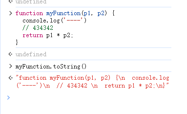

# ECMAScript 2019

### ES2019 中的新特性：

* [String.trimStart()](https://www.w3school.com.cn/js/js\_2019.asp#mark\_trim\_start)
* [String.trimEnd()](https://www.w3school.com.cn/js/js\_2019.asp#mark\_trim\_end)
* [Object.fromEntries](https://www.w3school.com.cn/js/js\_2019.asp#mark\_from\_entries)
* [可选的 catch 绑定](https://www.w3school.com.cn/js/js\_2019.asp#mark\_omit\_catch)
* [Array.flat()](https://www.w3school.com.cn/js/js\_2019.asp#mark\_array\_flat)
* [Array.flatMap()](https://www.w3school.com.cn/js/js\_2019.asp#mark\_array\_flatmap)
* [重新修订的 Array.Sort()](https://www.w3school.com.cn/js/js\_2019.asp#mark\_array\_sort)
* [重新修订的 JSON.stringify()](https://www.w3school.com.cn/js/js\_2019.asp#mark\_json\_stringify)
* [字符串文字中允许的分隔符](https://www.w3school.com.cn/js/js\_2019.asp#mark\_separator\_symbols)
* [重新修订的 Function.toString()](https://www.w3school.com.cn/js/js\_2019.asp#mark\_function\_tostring)

### JavaScript 字符串方法(trimStart\trimEnd) <a href="#mark_trim_start" id="mark_trim_start"></a>

```javascript
let text1 = "     Hello World!     ";
let text2 = text1.trimStart(); // 输出“Hello World!     ”


let text1 = "     Hello World!     ";
let text2 = text1.trimEnd();  // 输出“     Hello World!”
```

### JavaScript 对象方法 fromEntries()

`fromEntries()` 方法从可迭代的键/值对创建对象。

```javascript
const fruits = [
["apples", 300],
["pears", 900],
["bananas", 500]
];

const myObj = Object.fromEntries(fruits); // 输出对象 {"苹果":300,"梨":900,"香蕉":500}
```

### 可选的 catch 绑定

2019年以前的catch

```javascript
try {
// code
} catch (err) {
// code
}
```

2019年后的catch

```javascript
try {
// code
} catch {
// code
}
```

### JavaScript 数组方法 flat()

`flat()` 方法通过展平嵌套数组来创建新数组， flat后的数组本身不变的。

```javascript
const myArr = [[1,2],[3,4],[5,6]];
const newArr = myArr.flat();
// newArr = [1,2,3,4,5,6]

let arr2 = [[1,2,[7,[8]]],[3,4],[5,6]]
arr2 = arr2.flat()  // [1,2, [7,[8]], 3,4,5,6]
arr2 = arr2.flat()  // [1,2, 7,[8], 3,4,5,6]
arr2 = arr2.flat()  // [1,2, 7, 8,3,4,5,6]
```

### JavaScript 数组方法 flatMap()

`flatMap()` 方法首先映射数组的所有元素，然后通过展平数组来创建新数组。

```javascript
const myArr = [1, 2, 3, 4, 5, 6];
const newArr = myArr.flatMap((x) => x * 2);
```

### 稳定的数组方法 sort()

在 2019 年之前，规范允许不稳定的排序算法，例如 QuickSort。

在 ES2019 之后，浏览器必须使用稳定的排序算法：

当根据一个值对元素进行排序时，这些元素必须保持它们与具有相同值的其他元素的相对位置。

### 重新修订的 JSON.stringify()

在 2019 年之前，JSON 无法对使用 \ 编码的字符进行字符串化。

```javascript
let text = JSON.stringify("\u26D4");  // '"⛔"'
```

### 重新修订的 Function toString()

toString() 方法返回表示函数源代码的字符串。

从 2019 年开始，toString() 必须返回函数的源代码，包括注释、空格和语法细节。

在 2019 年之前，不同的浏览器返回了不同的函数变体（比如没有注释和空格）。从 2019 年开始，该函数应该完全按照编写的方式返回。

<figure><figcaption></figcaption></figure>
