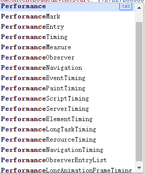

# Performance API

## 前言

性能时间戳`web-vitals`库获取的用户体验数据可以满足我们量化用户体验的部分需求，但是如果我们有更特殊、更<mark style="color:red;">个性化</mark>的数据收集需求，Performance API 就是我们不可或缺的好帮手。

Performance API 是一组用于衡量web应用程序性能的标准。

<figure><figcaption></figcaption></figure>


### 概念及用法

衡量和分析各种性能指标对于确保 web 应用的速度非常重要。`Performance API` 提供了重要的**内置指标**，并<mark style="color:red;">能够将你自己的测量结果添加到浏览器的性能时间线（performance timeline）中</mark>。性能时间线使用高精度的时间戳，且可以在开发者工具中显示。你还可以将相关数据发送到用于分析的端点，以根据时间记录性能指标。

每一个性能指标都使用一个性能条目（[`PerformanceEntry`](https://developer.mozilla.org/zh-CN/docs/Web/API/PerformanceEntry)）表示。性能条目有名称（`name`）、持续时间（`duration`）、开始时间（`startTime`）和类型（`type`）。<mark style="color:red;">每一个性能指标都继承了</mark> <mark style="color:red;"></mark><mark style="color:red;">`PerformanceEntry`</mark> <mark style="color:red;"></mark><mark style="color:red;">接口</mark>，并对其进行限定。

大部分性能条目都在不需要任何额外操作的情况下进行记录，并可以通过 [`Performance.getEntries()`](https://developer.mozilla.org/zh-CN/docs/Web/API/Performance/getEntries) 或（最好）通过 [`PerformanceObserver`](https://developer.mozilla.org/zh-CN/docs/Web/API/PerformanceObserver) 访问。例如，[`PerformanceEventTiming`](https://developer.mozilla.org/en-US/docs/Web/API/PerformanceEventTiming) 条目用于记录花费的时间超过设定阈值的事件。而 Performance API 也允许你使用 [`PerformanceMark`](https://developer.mozilla.org/en-US/docs/Web/API/PerformanceMark) 和 [`PerformanceMeasure`](https://developer.mozilla.org/en-US/docs/Web/API/PerformanceMeasure) 接口定义和记录自定义事件。

[`Performance`](https://developer.mozilla.org/zh-CN/docs/Web/API/Performance) 主接口在 [`Window`](https://developer.mozilla.org/zh-CN/docs/Web/API/Window/performance) 和 [`Worker`](https://developer.mozilla.org/zh-CN/docs/Web/API/WorkerGlobalScope/performance) 全局作用域下都可用，并允许你增加自定义性能条目、清除性能条目，以及查询性能条目。

[`PerformanceObserver`](https://developer.mozilla.org/zh-CN/docs/Web/API/PerformanceObserver) 接口允许你监听记录的不同类型的性能条目。

<figure><figcaption></figcaption></figure>

以下是一些常见的 `Performance API` 接口和属性：

1. **Performance**：`Performance` 接口提供了与页面性能相关的信息。它是一个全局对象，可以通过 `window.performance` 访问。
2. **PerformanceTiming**：`PerformanceTiming` 接口提供了与页面加载过程相关的时间戳。它是一个 `Performance` 对象的属性，可以通过 `performance.timing` 访问。
3. **PerformanceNavigationTiming**：`PerformanceNavigationTiming` 接口提供了与页面导航相关的时间戳。它是一个 `Performance` 对象的属性，可以通过 `performance.getEntriesByType('navigation')` 访问。
4. **PerformancePaintTiming**：`PerformancePaintTiming` 接口提供了与页面绘制相关的时间戳。它是一个 `Performance` 对象的属性，可以通过 `performance.getEntriesByType('paint')` 访问。
5. **PerformanceResourceTiming**：`PerformanceResourceTiming` 接口提供了与页面加载过程中各个资源相关的时间戳。它是一个 `Performance` 对象的属性，可以通过 `performance.getEntriesByType('resource')` 访问。
6. **PerformanceObserver**：`PerformanceObserver` 接口用于观察性能条目（performance entries）。它是一个全局对象，可以通过 `window.PerformanceObserver` 访问。
7. **PerformanceEntry**：`PerformanceEntry` 接口表示一个性能条目。它是一个 `PerformanceObserver` 的回调函数的参数。

这些接口和属性可以帮助开发者了解网页加载的性能，从而进行优化。例如，如果某个资源的 `responseEnd` 和 `responseStart` 之间的时间差很大，可能意味着这个资源需要很长时间才能加载完成，可以尝试优化这个资源的加载。


## 1. 关于性能数据(Performance Data)

Performance API 度量性能、并暴露性能数据，这些数据可以被收集作为web应用程序的性能指标。它提供了方法来观察应用程序性能的各个方面。但是它不提供性能数据分析或可视化。然而，Performance API与浏览器中的开发工具集成良好，其数据通常被发送到分析端点（`analytics end points`）和库(`analytics  libraries`)，以记录性能指标(`record performance metrics`)，帮助进行数据评估（分析），从而找出影响用户的<mark style="background-color:purple;">**性能瓶颈**</mark>。 本页概述了存在哪些类型的Performance API数据、如何收集这些数据以及如何访问这些数据。

本页概述了存在哪些类型的Performance API数据、如何收集这些数据以及如何访问这些数据。

### 1.1 数据搜集

大多数浏览器都会自动搜集性能指标，并且提供Performance APIs将这些指标暴露给用户，用户无需做额外的工作去搜集它们。

你只要告诉浏览器，你需要用到哪些类型的指标：

* the [Element Timing](https://developer.mozilla.org/en-US/docs/Web/API/Performance\_API/Element\_timing) metric： 度量DOM元素加载时间、渲染时间。这个指标是可选的，你可以通过为元素加上`elementtiming` 属性，来告诉浏览器你关注这个元素的Timing情况，则浏览器会去监听（Observe）该元素的情况。
* the [User Timing](https://developer.mozilla.org/en-US/docs/Web/API/Performance\_API/User\_timing) metric：允许你在程序中的任一两个时间点之间度量时间。这可能映射到程旭自定义操作（如用户登录）。要收集这些指标，您需要在相关点添加Performance API调用。
* the [Server Timing](https://developer.mozilla.org/en-US/docs/Web/API/Performance\_API/Server\_timing) metric ：能够测量应用程序定义的服务器端操作所花费的时间。要收集这些指标，您的服务器必须发送server Timing HTTP标头。

### 1.2 性能数据结构

使用Performance API，您可以在[`Window`](https://developer.mozilla.org/en-US/docs/Web/API/Window/performance) 和 [`Worker`](https://developer.mozilla.org/en-US/docs/Web/API/WorkerGlobalScope/performance)全局上下文中收集性能数据。如果您正在收集多个上下文的性能指标，请查看[`performance.timeOrigin`](https://developer.mozilla.org/en-US/docs/Web/API/Performance/timeOrigin)以同步上下文之间的时间原点。

在这些上下文中，性能指标将由 performance entries 呈现，也就是[Preformance Enrty](performanceentry-dui-xiang.md)对象。

### 1.3 [Performance entries](https://developer.mozilla.org/en-US/docs/Web/API/Performance\_API/Performance\_data#performance\_entries) <a href="#performance_entries" id="performance_entries"></a>

#### 参考章节 [Preformance Enrty](performanceentry-dui-xiang.md) ，这里不再叙述 <a href="#performance_entries" id="performance_entries"></a>

### 1.4 [Performance entry subclasses](https://developer.mozilla.org/en-US/docs/Web/API/Performance\_API/Performance\_data#performance\_entry\_subclasses) <a href="#performance_entry_subclasses" id="performance_entry_subclasses"></a>

特定的entry types通常包括额外的指定类型数据，比如`"resource"` 类型捕获DNS查找开始于结束时间。

被subclasses所表示的 entries是从基础接口`PerformanceEntry` 扩展而来。

比如一个`"resource"` entry由扩展自`PerformanceEntry`的 [`PerformanceResourceTiming`](https://developer.mozilla.org/en-US/docs/Web/API/PerformanceResourceTiming) 接口表示，并在在基础`PerformanceEntry`属性的基础上增加记录DNS查找的相关时间戳。

PerformanceEntry的子类还定义了属于PerformanceEntry本身的属性的语义：例如，PerformanceEntry有一个name属性，其含义取决于子类。

### 1.5 数据获取

您可以通过以下两种方式之一访问性能指标。

* 首选方法是使用PerformanceObserver接口，该接口由一个回调函数构造，在记录特定性能条目时调用。然后调用其observation方法，传入要观察的类型，并使用buffered选项检索观察之前出现的条目。

```javascript
function logEventDuration(entries) {
  const events = entries.getEntriesByType("event");
  for (const event of events) {
    console.log(
      `Event handler took: ${
        event.processingEnd - event.processingStart
      } milliseconds`,
    );
  }
}

const observer = new PerformanceObserver(logEventDuration);
observer.observe({ type: "event", buffered: true });

```

* 此外，您可以使用`Performance.getEntries()`、`Performance.getEntriesByName()`和`Performance.getEntreesByType()` 方法检索页面的所有性能条目，或与给定名称或类型匹配的条目。

```javascript
const events = performance.getEntriesByType("event");

for (const event of events) {
  console.log(
    `Event handler took: ${
      event.processingEnd - event.processingStart
    } milliseconds`,
  );
}

```

### 1.6 管理缓冲区大小([Managing buffer sizes](https://developer.mozilla.org/en-US/docs/Web/API/Performance\_API/Performance\_data#managing\_buffer\_sizes))

每个全局对象的性能entry都有缓冲区限制。它确保浏览器在保存性能数据时不会消耗无限内存。特别是当您的网站或应用程序获取大量资源时（例如使用轮询时），您可能需要查看缓冲区的限制：

| [`entryType`](https://developer.mozilla.org/en-US/docs/Web/API/PerformanceEntry/entryType) identifier | Interface                                                                                                     | Maximum number of buffer entries |
| ----------------------------------------------------------------------------------------------------- | ------------------------------------------------------------------------------------------------------------- | -------------------------------- |
| `"mark"`                                                                                              | [`PerformanceMark`](https://developer.mozilla.org/en-US/docs/Web/API/PerformanceMark)                         | Infinite                         |
| `"measure"`                                                                                           | [`PerformanceMeasure`](https://developer.mozilla.org/en-US/docs/Web/API/PerformanceMeasure)                   | Infinite                         |
| `"navigation"`                                                                                        | [`PerformanceNavigationTiming`](https://developer.mozilla.org/en-US/docs/Web/API/PerformanceNavigationTiming) | Infinite                         |
| `"resource"`                                                                                          | [`PerformanceResourceTiming`](https://developer.mozilla.org/en-US/docs/Web/API/PerformanceResourceTiming)     | 250 (adjustable, see below)      |
| `"longtask"`                                                                                          | [`PerformanceLongTaskTiming`](https://developer.mozilla.org/en-US/docs/Web/API/PerformanceLongTaskTiming)     | 200                              |
| `"paint"`                                                                                             | [`PerformancePaintTiming`](https://developer.mozilla.org/en-US/docs/Web/API/PerformancePaintTiming)           | 2 (there won't be more)          |
| `"element"`                                                                                           | [`PerformanceElementTiming`](https://developer.mozilla.org/en-US/docs/Web/API/PerformanceElementTiming)       | 150                              |
| `"event"`                                                                                             | [`PerformanceEventTiming`](https://developer.mozilla.org/en-US/docs/Web/API/PerformanceEventTiming)           | 150                              |
| `"first-input"`                                                                                       | [`PerformanceEventTiming`](https://developer.mozilla.org/en-US/docs/Web/API/PerformanceEventTiming)           | 1 (there won't be more)          |
| `"layout-shift"`                                                                                      | [`LayoutShift`](https://developer.mozilla.org/en-US/docs/Web/API/LayoutShift)                                 | 150                              |
| `"largest-contentful-paint"`                                                                          | [`LargestContentfulPaint`](https://developer.mozilla.org/en-US/docs/Web/API/LargestContentfulPaint)           | 150                              |
| `"visibility-state"`                                                                                  | [`VisibilityStateEntry`](https://developer.mozilla.org/en-US/docs/Web/API/VisibilityStateEntry)               | 50                               |

&#x20;[performance observer callback](https://developer.mozilla.org/en-US/docs/Web/API/PerformanceObserver/PerformanceObserver) 包含一个可选的droppedEntriesCount参数，该参数告诉由于缓冲区存储已满而丢失了多少个entry。

```javascript
function perfObserver(list, observer, droppedEntriesCount) {
  list.getEntries().forEach((entry) => {
    // do something with the entries
  });
  if (droppedEntriesCount > 0) {
    console.warn(
      `${droppedEntriesCount} entries were dropped because the buffer was full.`,
    );
  }
}
const observer = new PerformanceObserver(perfObserver);
observer.observe({ type: "resource", buffered: true });
```


另一个有用的方法  [`PerformanceObserver.takeRecords()`](https://developer.mozilla.org/en-US/docs/Web/API/PerformanceObserver/takeRecords) ，它返回存储在性能观察器中的当前性能条目列表，同时将其清空。

### 1.7 [JSON data](https://developer.mozilla.org/en-US/docs/Web/API/Performance\_API/Performance\_data#json\_data) <a href="#json_data" id="json_data"></a>

每个Performance Entry可以调用 `toJSON()`序列化（ [serializer](https://developer.mozilla.org/en-US/docs/Glossary/Serialization)），返回一个JSON对象，表示这个entry对象。这样你可以获取所有可用数据或者保存它。

```javascript
const observer = new PerformanceObserver((list) => {
  list.getEntries().forEach((entry) => {
    console.log(entry.toJSON());
  });
});

observer.observe({ type: "event", buffered: true });
```

输出的JSON数据展示如下：

```javascript
{
  "name": "dragover",
  "entryType": "event",
  "startTime": 67090751.599999905,
  "duration": 128,
  "processingStart": 67090751.70000005,
  "processingEnd": 67090751.900000095,
  "cancelable": true
}
```


## 2. 性能数据的时间类型

参考小节 [Performance Timing 数据类型](performance-timing-shu-ju-lei-xing/)

参考

[https://developer.mozilla.org/en-US/docs/Web/API/Performance\_API](https://developer.mozilla.org/en-US/docs/Web/API/Performance\_API)

&#x20;[https://developer.mozilla.org/en-US/docs/Web/API/Performance\_API/Performance\_data](https://developer.mozilla.org/en-US/docs/Web/API/Performance\_API/Performance\_data)
