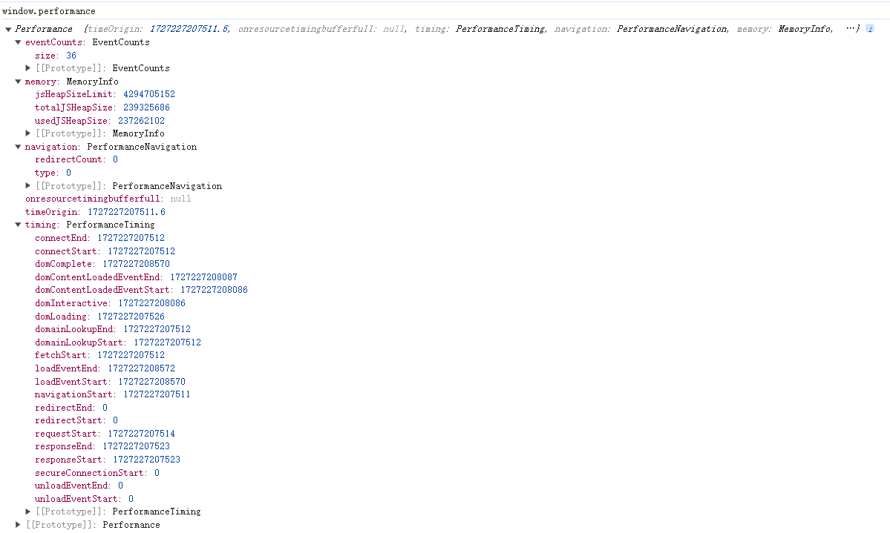

# Performance对象

**`Performance`** 接口可用于获取当前页面中与性能相关的信息。

性能条目特定于执行上下文。你可以通过 [`Window.performance`](https://developer.mozilla.org/zh-CN/docs/Web/API/Window/performance) 访问窗口中运行的代码的性能信息，通过 [`WorkerGlobalScope.performance`](https://developer.mozilla.org/zh-CN/docs/Web/API/WorkerGlobalScope/performance) 访问 worker 中运行的代码的性能信息。

<figure><figcaption></figcaption></figure>

## 实例属性

_`Performance` 接口没有继承任何属性。_

### `Performance.navigation` 只读

映射到[`PerformanceNavigation`](https://developer.mozilla.org/zh-CN/docs/Web/API/PerformanceNavigation) 对象。

[`PerformanceNavigation`](https://developer.mozilla.org/zh-CN/docs/Web/API/PerformanceNavigation) 对象提供了在指定的时间段里发生的操作相关信息，包括页面是加载还是刷新、发生了多少次重定向等等。Not available in workers.

## [`Performance.timing`](https://developer.mozilla.org/zh-CN/docs/Web/API/Performance/timing) （弃用）

映射到 [`PerformanceTiming`](https://developer.mozilla.org/zh-CN/docs/Web/API/PerformanceTiming) 对象

[`PerformanceTiming`](https://developer.mozilla.org/zh-CN/docs/Web/API/PerformanceTiming) 对象包含延迟相关的性能信息。Not available in workers.

## [`performance.memory`](https://developer.mozilla.org/zh-CN/docs/Web/API/Performance/memory)（非标准）

它是 Chrome 添加的一个<mark style="color:red;">非标准扩展</mark>，这个属性提供了一个可以获取到基本内存使用情况的对象。**不应该**使用这个非标准的 API。

## [`Performance.timeOrigin`](https://developer.mozilla.org/zh-CN/docs/Web/API/Performance/timeOrigin)`（非标准）`

只读，非标准。返回性能测量开始时的时间的高精度时间戳。

## eventCounts

只读performance.eventCounts属性是一个eventCounts映射，其中包含每种事件类型已调度的事件数。

