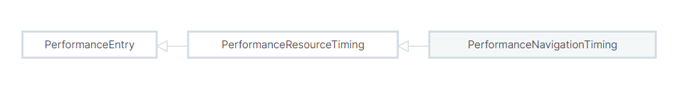
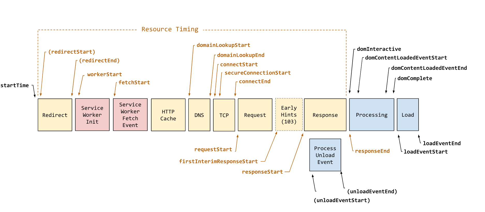

# Navigation timing

Navigation Timing是Performance API的一部分，它提供了与从一个页面导航到另一个页面相关的指标。例如，您可以确定加载或卸载文档所需的时间，或者记录DOM构建完成并且可以与DOM交互所需的的时间。

&#x20;仅包含当前文档，因此通常只有一个[`PerformanceNavigationTiming`](https://developer.mozilla.org/en-US/docs/Web/API/PerformanceNavigationTiming) 对象可供观察。它同样也是扩展了PerformanceEntry接口，将entryType设为“navigation”，同时它也继承了[`PerformanceResourceTiming`](https://developer.mozilla.org/en-US/docs/Web/API/PerformanceResourceTiming)，因此获取文档过程中的所有时间戳都是可用的。

<figure><figcaption></figcaption></figure>

资源时间线同样适用于这里，如下

<figure><figcaption></figcaption></figure>


&#x20;navigation timestamps 的指标(除了 [Resource Timing](https://developer.mozilla.org/en-US/docs/Web/API/Performance\_API/Resource\_timing) 外) 包括:

* startTime：始终为0。
* &#x20;unloadEventStart：（如果有前一个文档）当前文档的卸载事件处理程序启动前的时间戳。&#x20;
* unloadEventEnd：（如果有前一个文档）当前文档的卸载事件处理程序完成后的时间戳。&#x20;
* domInteractive：DOM构造完成的时间戳，可以从JavaScript与DOM进行交互。&#x20;
* domContentLoadedEventStart：当前文档的DOMContentLoaded事件处理程序启动前的时间戳。&#x20;
* domContentLoadedEventEnd：当前文档的DOMContentLoaded事件处理程序完成后的时间戳。&#x20;
* domComplete：文档和所有子资源完成加载的时间戳。 loadEventStart：当前文档的加载事件处理程序启动前的时间戳。&#x20;
* loadEventEnd：当前文档的加载事件处理程序完成后的时间戳。


&#x20;`domContentLoadedEventEnd` and `domContentLoadedEventStart`时间戳可用于测量处理DOMContentLoaded事件处理程序所需的时间。&#x20;

此示例使用PerformanceObserver，当新的导航性能entry记录在浏览器的性能时间线中时，它会通知调用者。该示例使用缓冲选项访问在创建观察者之前记录的entry。

```javascript
const observer = new PerformanceObserver((list) => {
  list.getEntries().forEach((entry) => {
    const domContentLoadedTime =
      entry.domContentLoadedEventEnd - entry.domContentLoadedEventStart;
    console.log(
      `${entry.name}: DOMContentLoaded processing time: ${domContentLoadedTime}ms`,
    );
  });
});

observer.observe({ type: "navigation", buffered: true });

```

For more examples, see the property pages in the [`PerformanceNavigationTiming`](https://developer.mozilla.org/en-US/docs/Web/API/PerformanceNavigationTiming) reference documentation.

