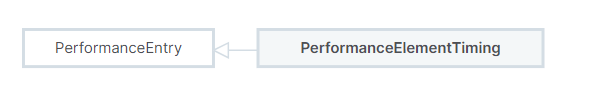

# PerformanceElementTiming对象

> **Experimental:** **This is an** [**experimental technology**](https://developer.mozilla.org/en-US/docs/MDN/Writing\_guidelines/Experimental\_deprecated\_obsolete#experimental)\
> Check the [Browser compatibility table](https://developer.mozilla.org/en-US/docs/Web/API/PerformanceElementTiming#browser\_compatibility) carefully before using this in production.
>
> 实验性：这是一种实验性技术 。在生产中使用之前，请仔细检查浏览器兼容性表。

`PerformanceElementTiming`接口包含开发人员用[`elementtiming`](https://developer.mozilla.org/en-US/docs/Web/HTML/Attributes/elementtiming) 属性注释的图像和文本节点元素的渲染定时信息，以供观察。


## 概述

`Element Timing API` 的目的：是让web开发人员或分析工具能够测量页面上关键元素的渲染时间戳。该API支持以下信息：

* [``](https://developer.mozilla.org/en-US/docs/Web/HTML/Element/img) elements,
* [`<image>`](https://developer.mozilla.org/en-US/docs/Web/SVG/Element/image) elements inside an [`<svg>`](https://developer.mozilla.org/en-US/docs/Web/SVG/Element/svg),
* [poster](https://developer.mozilla.org/en-US/docs/Web/HTML/Element/video#poster) images of [`<video>`](https://developer.mozilla.org/en-US/docs/Web/HTML/Element/video) elements,
* elements which have a [`background-image`](https://developer.mozilla.org/en-US/docs/Web/CSS/background-image), and
* groups of text nodes, such as a [`<p>`](https://developer.mozilla.org/en-US/docs/Web/HTML/Element/p).

`PerformanceElementTiming` inherits from [`PerformanceEntry`](https://developer.mozilla.org/en-US/docs/Web/API/PerformanceEntry).

<figure><figcaption></figcaption></figure>

## 使用方法

用户可以通过在元素上添加 [`elementtiming`](https://developer.mozilla.org/en-US/docs/Web/HTML/Attributes/elementtiming)属性来标记要观察的元素。

```html

<p elementtiming="text" id="text-id">text here</p>
```

```javascript
const observer = new PerformanceObserver((list) => {
  list.getEntries().forEach((entry) => {
    console.log(entry);
  });
});
observer.observe({ type: "element", buffered: true });
```

## 属性

除[`PerformanceEntry`](https://developer.mozilla.org/en-US/docs/Web/API/PerformanceEntry)自有属性外，还扩展了以下属性：

### id 只读

表示元素的id

### [`identifier`](https://developer.mozilla.org/en-US/docs/Web/API/PerformanceElementTiming/identifier) 只读

是元素上elementtiming属性的值

### [`intersectionRect`](https://developer.mozilla.org/en-US/docs/Web/API/PerformanceElementTiming/intersectionRect)只读

它是视口中元素的矩形（ [`DOMRectReadOnly`](https://developer.mozilla.org/en-US/docs/Web/API/DOMRectReadOnly)）。

### [`loadTime`](https://developer.mozilla.org/en-US/docs/Web/API/PerformanceElementTiming/loadTime)只读

A [`DOMHighResTimeStamp`](https://developer.mozilla.org/en-US/docs/Web/API/DOMHighResTimeStamp) with the loadTime of the element.

### [`naturalHeight`](https://developer.mozilla.org/en-US/docs/Web/API/PerformanceElementTiming/naturalHeight)只读

一个无符号的32位整数（无符号长），如果将其应用于图像，则表示图像的固有高度，文本为0。

### [`naturalWidth`](https://developer.mozilla.org/en-US/docs/Web/API/PerformanceElementTiming/naturalWidth)只读

一个无符号的32位整数（无符号长），如果将其应用于图像，则表示图像的固有宽度，文本为0。

### [`renderTime`](https://developer.mozilla.org/en-US/docs/Web/API/PerformanceElementTiming/renderTime)只读

A [`DOMHighResTimeStamp`](https://developer.mozilla.org/en-US/docs/Web/API/DOMHighResTimeStamp) with the renderTime of the element.

### [`url`](https://developer.mozilla.org/en-US/docs/Web/API/PerformanceElementTiming/url)

对于图片请求，是资源的初始URL，对于Text，值为0


## 实例方法

[`PerformanceElementTiming.toJSON()`](https://developer.mozilla.org/en-US/docs/Web/API/PerformanceElementTiming/toJSON) Experimental

Returns a JSON representation of the `PerformanceElementTiming` object.

