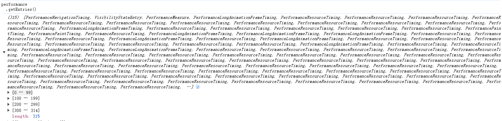

# PerformanceEntry对象

performance API中的每一个性能条目（performance Item），都对应了一个`PerformanceEntry`对象。

**`PerformanceEntry`** 对象代表了 performance 时间列表中的单个 指标（metric） 数据。

每一个 _performance entry 都可以在应用运行过程中通过手动构建_ [_`mark`_](https://developer.mozilla.org/en-US/docs/Web/API/PerformanceMark) 或者 [_`measure`_](https://developer.mozilla.org/en-US/docs/Web/API/PerformanceMeasure) (例如调用 [`mark()`](https://developer.mozilla.org/zh-CN/docs/Web/API/Performance/mark) 方法) 生成。此外，Performance entries 在资源加载的时候，也会被动生成（例如图片、script、css 等资源加载）

Note: Performance 对象暴露给了 [`Window`](https://developer.mozilla.org/zh-CN/docs/Web/API/Window) 和 [`Worker`](https://developer.mozilla.org/zh-CN/docs/Web/API/Worker). 同时该对象扩展了几个其他对象的属性，包括 [`PerformanceMark`](https://developer.mozilla.org/en-US/docs/Web/API/PerformanceMark), [`PerformanceMeasure`](https://developer.mozilla.org/en-US/docs/Web/API/PerformanceMeasure), `PerformanceFrameTiming`, [`PerformanceNavigationTiming`](https://developer.mozilla.org/zh-CN/docs/Web/API/PerformanceNavigationTiming) 以及 [`PerformanceResourceTiming`](https://developer.mozilla.org/zh-CN/docs/Web/API/PerformanceResourceTiming).


可以通过`performance .getEntries()` 获得所有的PerformanceEntry对象。

<figure><figcaption></figcaption></figure>

可以通过window.performance.getEntriesByType('resource')获得指定类型（event type）的PerformanceEntry对象。

```javascript
if ('performance' in window) {
  const resourceTiming = window.performance.getEntriesByType('resource');
  resourceTiming.forEach((resource) => {
    console.log('Resource:', resource.name);
    console.log('Start Time:', resource.startTime);
    console.log('Duration:', resource.duration);
    console.log('Redirect Start:', resource.redirectStart);
    console.log('Redirect End:', resource.redirectEnd);
    console.log('Fetch Start:', resource.fetchStart);
    console.log('Domain Lookup Start:', resource.domainLookupStart);
    console.log('Domain Lookup End:', resource.domainLookupEnd);
    console.log('Connect Start:', resource.connectStart);
    console.log('Connect End:', resource.connectEnd);
    console.log('Secure Connection Start:', resource.secureConnectionStart);
    console.log('Request Start:', resource.requestStart);
    console.log('Response Start:', resource.responseStart);
    console.log('Response End:', resource.responseEnd);
  });
}
```


## 属性

### name 只读

该 performance entry 的名字

### entryType 只读

代表所上报的 performance metric 的 entryType 类型，例如被 performance.mark("begin") 所创建的 entry 的 entryType 就是 "`mark`". 此属性只读。

<pre class="language-javascript"><code class="lang-javascript">// 创建一个mark类型的performance Entry对象，
// 对象是一个PerformanceMark实例, 则对象的entryType都是mark
// 每次.mark都会新建一个PerformanceMark实例。
<strong>performance.mark("begin"); 
</strong><strong>// 根据名称获取所有的performance Entry
</strong>const beginEntryList = performance.getEntriesByName("begin");
// 获取所有的entryType
const entryTypeList = beginEntryList.map(entry=>entry.entryType)
// 输出结果： [mark]
</code></pre>

#### [返回值](https://developer.mozilla.org/zh-CN/docs/Web/API/PerformanceEntry/entryType#%E8%BF%94%E5%9B%9E%E5%80%BC) <a href="#fan-hui-zhi" id="fan-hui-zhi"></a>

下面枚举了系统中常见的entryType。 entryType的返回值取决于 `PerformanceEntry` 对象的 subtype(子类型），也就是是取决于创建entry的构造器。

下表中的创建entry的对象，如 [`PerformanceElementTiming`](https://developer.mozilla.org/en-US/docs/Web/API/PerformanceElementTiming)属于所谓的subtype。

<table><thead><tr><th width="301">entryType</th><th width="333">描述</th></tr></thead><tbody><tr><td><a href="https://developer.mozilla.org/en-US/docs/Web/API/PerformanceEntry/entryType#element"><code>element</code></a></td><td>报告元素的加载时间。是一个 <a href="https://developer.mozilla.org/en-US/docs/Web/API/PerformanceElementTiming"><code>PerformanceElementTiming</code></a></td></tr><tr><td><a href="https://developer.mozilla.org/en-US/docs/Web/API/PerformanceEntry/entryType#event"><code>event</code></a></td><td>报告时间延迟。是一个 <a href="https://developer.mozilla.org/en-US/docs/Web/API/PerformanceEventTiming"><code>PerformanceEventTiming</code></a>  对象</td></tr><tr><td><a href="https://developer.mozilla.org/en-US/docs/Web/API/PerformanceEntry/entryType#first-input"><code>first-input</code></a></td><td>报告首次输入延迟 <a href="https://developer.mozilla.org/en-US/docs/Glossary/First_input_delay">first input delay</a> (FID)。是一个 <a href="https://developer.mozilla.org/en-US/docs/Web/API/PerformanceEventTiming"><code>PerformanceEventTiming</code></a></td></tr><tr><td><a href="https://developer.mozilla.org/en-US/docs/Web/API/PerformanceEntry/entryType#largest-contentful-paint"><code>largest-contentful-paint</code></a></td><td>报告屏幕可见区域内最大的内容元素的渲染。 是一个<a href="https://developer.mozilla.org/en-US/docs/Web/API/LargestContentfulPaint"><code>LargestContentfulPaint</code></a></td></tr><tr><td><a href="https://developer.mozilla.org/en-US/docs/Web/API/PerformanceEntry/entryType#layout-shift"><code>layout-shift</code></a></td><td>根据页面上元素的移动报告网页的布局稳定性。是一个<a href="https://developer.mozilla.org/en-US/docs/Web/API/LayoutShift"><code>LayoutShift</code></a> 对象</td></tr><tr><td><a href="https://developer.mozilla.org/en-US/docs/Web/API/PerformanceEntry/entryType#long-animation-frame"><code>long-animation-frame</code></a></td><td>报告长动画帧（LoAF）的实例。是一个<a href="https://developer.mozilla.org/en-US/docs/Web/API/PerformanceLongAnimationFrameTiming"><code>PerformanceLongAnimationFrameTiming</code></a> 对象.</td></tr><tr><td><a href="https://developer.mozilla.org/en-US/docs/Web/API/PerformanceEntry/entryType#longtask"><code>longtask</code></a></td><td>报告长任务实例。 <a href="https://developer.mozilla.org/en-US/docs/Web/API/PerformanceLongTaskTiming"><code>PerformanceLongTaskTiming</code></a> 对象。</td></tr><tr><td><a href="https://developer.mozilla.org/en-US/docs/Web/API/PerformanceEntry/entryType#mark"><code>mark</code></a></td><td>报告用户自定义的性能标记。<a href="https://developer.mozilla.org/en-US/docs/Web/API/PerformanceMark"><code>PerformanceMark</code></a> 对象。</td></tr><tr><td><a href="https://developer.mozilla.org/en-US/docs/Web/API/PerformanceEntry/entryType#measure"><code>measure</code></a></td><td>报告用户自定义的性能指标（绩效指标）。<a href="https://developer.mozilla.org/en-US/docs/Web/API/PerformanceMeasure"><code>PerformanceMeasure</code></a> 对象</td></tr><tr><td><a href="https://developer.mozilla.org/en-US/docs/Web/API/PerformanceEntry/entryType#navigation"><code>navigation</code></a></td><td>报告文档导航时间。<a href="https://developer.mozilla.org/en-US/docs/Web/API/PerformanceNavigationTiming"><code>PerformanceNavigationTiming</code></a> 对象</td></tr><tr><td><a href="https://developer.mozilla.org/en-US/docs/Web/API/PerformanceEntry/entryType#paint"><code>paint</code></a></td><td>报告页面加载过程中文档渲染的关键时刻（第一次绘制、第一次内容丰富的绘制）。<a href="https://developer.mozilla.org/en-US/docs/Web/API/PerformancePaintTiming"><code>PerformancePaintTiming</code></a> 对象。</td></tr><tr><td><a href="https://developer.mozilla.org/en-US/docs/Web/API/PerformanceEntry/entryType#resource"><code>resource</code></a></td><td>报告文档中资源的计时信息。<a href="https://developer.mozilla.org/en-US/docs/Web/API/PerformanceResourceTiming"><code>PerformanceResourceTiming</code></a> 对象.<br>返回值类型是<a href="https://developer.mozilla.org/zh-CN/docs/Web/API/URL"><code>URL</code></a></td></tr><tr><td><a href="https://developer.mozilla.org/en-US/docs/Web/API/PerformanceEntry/entryType#taskattribution"><code>taskattribution</code></a></td><td>报告对长任务（longTask）有重大贡献的工作类型。<a href="https://developer.mozilla.org/en-US/docs/Web/API/TaskAttributionTiming"><code>TaskAttributionTiming</code></a> 对象.</td></tr><tr><td><a href="https://developer.mozilla.org/en-US/docs/Web/API/PerformanceEntry/entryType#visibility-state"><code>visibility-state</code></a></td><td>报告页面可见性状态更改的时间，即标签从前景更改为背景或从背景更改为前景的时间。<a href="https://developer.mozilla.org/en-US/docs/Web/API/VisibilityStateEntry"><code>VisibilityStateEntry</code></a> object.</td></tr><tr><td><code>frame</code></td><td><p><code>PerformanceFrameTiming</code> 对象 。</p><p>返回值类型<a href="https://developer.mozilla.org/zh-CN/docs/Web/API/URL"><code>URL</code></a></p></td></tr></tbody></table>

entryType 的取值会影响[`PerformanceEntry.name`](https://developer.mozilla.org/zh-CN/docs/Web/API/PerformanceEntry/name) 属性，具体如下表所示。


新增一个entryType为mark的Performance Entry对象。

<figure><figcaption></figcaption></figure>

多次新建begin的entry对象，最后beginEntryList数组数量也会增加，效果如图：

<figure><figcaption></figcaption></figure>

### duration 只读

返回一个时间戳，即性能条目（PerformanceEntry）的持续时间。此属性的含义取决于此条目的entryType的值。

对于不适用的type，duration 始终为0。如下entryType的duration始终为0：

* `element`
* `largest-contentful-paint`
* `layout-shift`
* `mark`
* `paint`
* `taskattribution`
* `visibility-state`

```javascript
function perfObserver(list, observer) {
  list.getEntries().forEach((entry) => {
    if (entry.duration > 0) {
      console.log(`${entry.name}'s duration: ${entry.duration}`);
    }
  });
}
const observer = new PerformanceObserver(perfObserver);
observer.observe({ entryTypes: ["measure", "mark", "resource"] });
```

### startTime 只读

返回一个时间戳，记录此PerformanceEntry的第一个时间戳。此属性的含义取决于此条目的entryType的值。

<table><thead><tr><th width="191">entryType</th><th width="487">描述</th></tr></thead><tbody><tr><td><a href="https://developer.mozilla.org/en-US/docs/Web/API/PerformanceEntry/entryType#element"><code>element</code></a></td><td>renderTime || loadTime</td></tr><tr><td><a href="https://developer.mozilla.org/en-US/docs/Web/API/PerformanceEntry/entryType#event"><code>event</code></a></td><td>事件创建的时间，即事件的timeStamp属性。</td></tr><tr><td><a href="https://developer.mozilla.org/en-US/docs/Web/API/PerformanceEntry/entryType#first-input"><code>first-input</code></a></td><td>创建第一个输入事件的时间，即该事件的时间戳。</td></tr><tr><td><a href="https://developer.mozilla.org/en-US/docs/Web/API/PerformanceEntry/entryType#largest-contentful-paint"><code>largest-contentful-paint</code></a></td><td>renderTime || loadTime</td></tr><tr><td><a href="https://developer.mozilla.org/en-US/docs/Web/API/PerformanceEntry/entryType#layout-shift"><code>layout-shift</code></a></td><td>布局转换开始的时间。</td></tr><tr><td><a href="https://developer.mozilla.org/en-US/docs/Web/API/PerformanceEntry/entryType#long-animation-frame"><code>long-animation-frame</code></a></td><td>长动画帧发生的时间</td></tr><tr><td><a href="https://developer.mozilla.org/en-US/docs/Web/API/PerformanceEntry/entryType#longtask"><code>longtask</code></a></td><td>任务开始的时间。</td></tr><tr><td><a href="https://developer.mozilla.org/en-US/docs/Web/API/PerformanceEntry/entryType#mark"><code>mark</code></a></td><td>利用<a href="https://developer.mozilla.org/en-US/docs/Web/API/Performance/mark"><code>performance.mark()</code></a> 创建entry对象的时间</td></tr><tr><td><a href="https://developer.mozilla.org/en-US/docs/Web/API/PerformanceEntry/entryType#measure"><code>measure</code></a></td><td>利用 <a href="https://developer.mozilla.org/en-US/docs/Web/API/Performance/measure"><code>performance.measure()</code></a>创建entry对象的时间</td></tr><tr><td><a href="https://developer.mozilla.org/en-US/docs/Web/API/PerformanceEntry/entryType#navigation"><code>navigation</code></a></td><td>0</td></tr><tr><td><a href="https://developer.mozilla.org/en-US/docs/Web/API/PerformanceEntry/entryType#paint"><code>paint</code></a></td><td>paint开始执行的事件</td></tr><tr><td><a href="https://developer.mozilla.org/en-US/docs/Web/API/PerformanceEntry/entryType#resource"><code>resource</code></a></td><td>此条目的fetchStart属性的值。</td></tr><tr><td><a href="https://developer.mozilla.org/en-US/docs/Web/API/PerformanceEntry/entryType#taskattribution"><code>taskattribution</code></a></td><td>0</td></tr><tr><td><a href="https://developer.mozilla.org/en-US/docs/Web/API/PerformanceEntry/entryType#visibility-state"><code>visibility-state</code></a></td><td>可见性状态更改发生的时间</td></tr><tr><td><code>frame</code></td><td>不详</td></tr></tbody></table>

