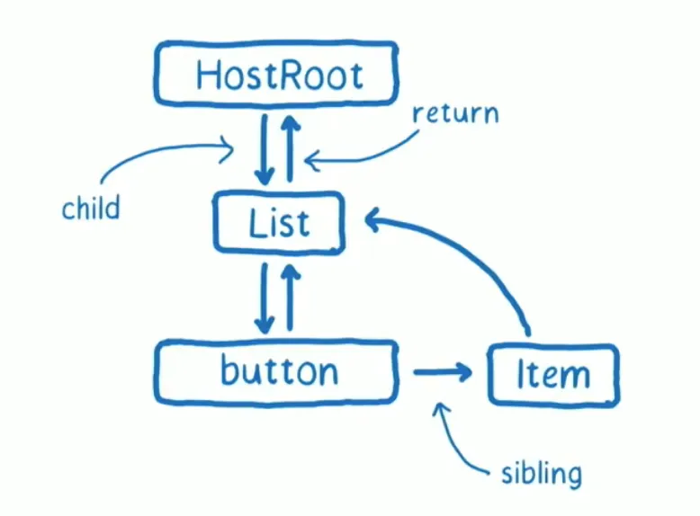
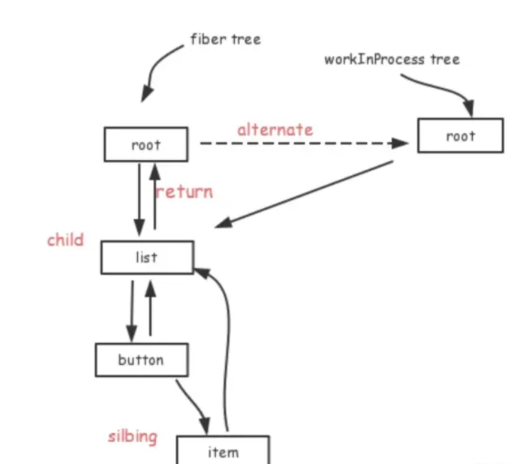

# fiber

react16版本开始采用了新的reconciler(调和器)来实现异步可中断的更新，reconciler内部采用了全新的Fiber架构来实现。

## reconciler干了啥

在React中，reconciler是一个用于协调组件状态和DOM更新的模块。它的工作原理如下：

* 比较新旧虚拟DOM：reconciler会比较新旧虚拟DOM，找出需要更新的部分。这个过程称为diffing。
* 生成更新队列：reconciler会生成一个更新队列，记录需要更新的部分。这个队列会传递给渲染器（renderer）。
* 更新DOM：渲染器会根据更新队列，更新实际的DOM。这个过程称为patching。

需要注意的是，reconciler是一个相对独立的模块，它不直接操作DOM，而是生成一个更新队列，将更新操作交给渲染器。这种设计可以使得React的渲染过程更加灵活和可扩展，同时也可以实现异步渲染等高级特性。

## Fiber架构的起源

在react15以前，reconciler采用递归的方式创建虚拟DOM，递归过程是不能中断的。如果组件DOM树的层级很深，递归会占用线程很多时间，造成卡顿（因为浏览器每一帧除了js执行外，还需要预留一些时间用于渲染，这样才不至于卡顿），如果全部的时间都由js占用了，则不利于页面的渲染、绘制。另一方吧，react16采用了调用堆栈的方式，造成调用栈过深，难以执行等问题。

为了解决上述问题，react16就引入了schedule调度器，进行时间片的调度，给每个task工作单元分配一定时间，如果在这个时间内任务没有执行完成，也要交出执行权给浏览器进行回流和重绘，因此实现异步可终端的更新，需要一定的数据结构在内存中保存完整的task工作单元的信息（上下文），也就是说层级的虚拟DOM数据结构已经无法满足需要，因此有了新的数据结构，也就是Fiber。

React Fiber目标在于提高他在动画、布局、手势等领域的适用性。最重要的功能就说“增量渲染”（原来render不能被终端）：能够将渲染工作分成快，将其分散到多个帧上。其他的关键功能有：

* 在新更新到来时暂停、终止、重用工作的能力
* 能够为不同类型的更新分配优先级
* 新的并发原语？？

React Fiber是调用堆栈的重新实现，专门用于react组件，也就是一种“虚拟堆栈帧”，这种优点将堆栈帧保存在内存中，并随心所欲地执行他们。

## 认识Fiber

首先弄清楚React.element、Fiber节点、真实DOM节点三者关系。

* element：是React视图层在代码的表现，也就是我们写的JSX，这些都会被创建成element对象的形式，上面保存了props、children（也就是代码中的createElement返回的ReactElement）
* DOM节点：就说真实的浏览器渲染的DOM节点
* Fiber节点：有FiberRootNode、FiberNode，可以说是element节点和DOM节点的桥梁，每个element节点都有Fiber，element的变化引起更新流程都是通过Fiber做一次调和改变，然后通知渲染器形成新的DOM渲染。

## Fiber作用

* 工作单元，任务分解 Fiber最重要的功能就说作为工作单元，保存原生节点或者组件节点对应的信息（包括优先级），这些节点通过链表结构组合，形成Fiber树
* 增量渲染 通过JSX对象和current fiber对比，生成最小的差异补丁，应用到真实节点上
* 根据优先级暂停、继续、排列优先级 Fiber节点上保存优先级，能通过不同节点的优先级对比，达到任务的暂停、继续、排列优先级等能力，也为上层实现批量更新、Suspense提供基础
* 保存状态 因为Fiber也能保存状态和更新信息，所以就能实现函数组件的状态更新，也就是Hooks

## Fiber含义

1. 作为架构来说，React15的Reconciler采用递归方式进行，数据保存在调用站中，因此也叫做stack reconciler。 React16的Reconciler基于Fiber节点实现，印象成为Fiber Reconciler。
2. 作为静态数据结构来说，每个Fiber节点，对应一个React Element,保存该节点的相关信息。
3. 作为动态的工作单元，每个Fiber节点保存了本次更新中该组件改变的状态，要执行的工作（effectList）

## Fiber结构

Fiber 是一个 JS 对象，Fiber 的创建是根据 React 元素来创建的，在整个 React 构建的虚拟 DOM 树中，每一个元素都有对应的 Fiber，从而构建一个 Fiber 树，每个 Fiber 不仅仅包含每个元素的信息，还包含更多的信息，以方便 Scheduler 来进行调度。 我们知道了 Fiber 可以保存真实的 DOM ，真实的 DOM 对应在内存中的 Fiber 节点会形成 Fiber 树。 Fiber 树通过 return、child、slibing 指针形成，连接父子兄弟节点以构成一颗单链表 fiber 树，其扁平化的单链表结构的特点将以往递归遍历改为了循环遍历，实现深度优先遍历。

同时，这颗由真实DOM 构建成的 Fiber 树也就是 current Fiber Tree，而正在构建的 Fiber 树叫做 WIP Fiber，这两颗树的节点通过 alternate 指针相连，这也是 Fiber 架构的双缓存机制，下面会讲到

alternate指针的两端分别指向两棵Fiber树，一个current Fiber树，一个workInProgress Fiber树。 current Fiber：当前真正显示的一颗 Fiber 树，workInProgress Fiber：正在内存中构建的 Fiber 树。 在下一次渲染时，React 会直接复用 workInProgress Fiber 树作为下一次的渲染树，上一次的渲染树又作为缓存树，这样不仅防止只有一棵树容易状态丢失的问题，又加快了 DOM 节点的更新和替换。

## 整体更新流程

* 初始化渲染，根据 React Element 生成对应的 Fiber 树
* 进行 setState 等操作，触发更新
* 创建 workInProgress 副本，进入 Reconciliation 执行对应的 render 更新。
* 记录有副作用的 fiber 节点，放入一个队列
* 完成 Reconciliation，进入 Commit 阶段，取出有副作用的 fiber 节点，通过 fiber 节点的 nextEffect 属性访问有副作用的节点，进行更新

参考：https://mp.weixin.qq.com/s/T7fs4IppblQkYQu2t9M18w
