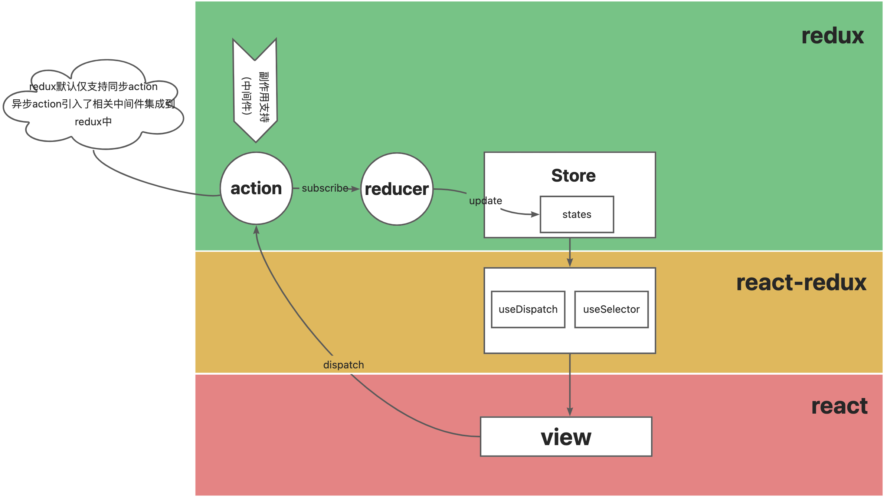

# react15-

<figure><figcaption></figcaption></figure>

## 1. 组件挂载、初始化渲染阶段 

componentWillMount：在render之前进行，因此可以使用setState，如果componentWillMount里面执行同步setState更新不会引起什么问题，但是执行异步setState更新，会引起re-render。

## 2. 组件更新 

两条路径

* props变更，由父组件引起
*
  * componentWillReceiveProps->shouldComponentUpdate->componentWillUpdate->render->componentDidUpdate
* state变更，由setState或者forceUpdate触发
*
  * shouldComponentUpdate->componentWillUpdate->render->componentDidUpdate

## 3. 组件卸载 

略
