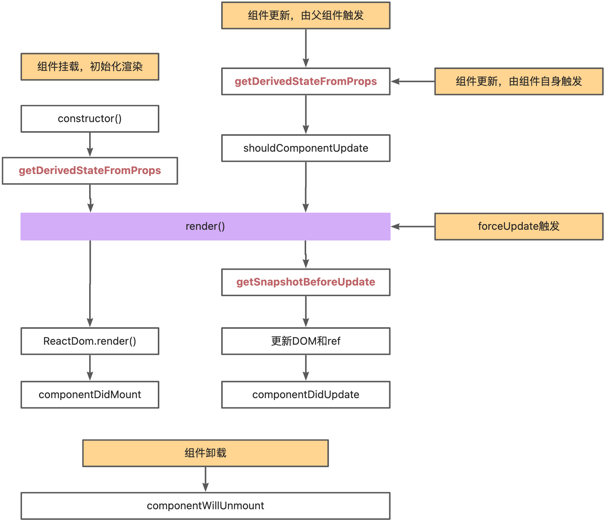

# react16+

<figure><figcaption></figcaption></figure>

## 1. 组件挂载、初始化渲染阶段 <a href="#lu4zb" id="lu4zb"></a>

相比react15，react16移除了componentWillMount，新增了getDerivedStateFromProps。

```
getDirivedStateFromProps不是componentWillMount的替代品,它是为了废除之前的bug(副作用带入)。

getDerivedStateFromProps 的存在只有一个目的：让组件在 props 变化时更新state。

getDerivedStateFromProps方法对state的更新动作并非“覆盖式”的更新，而是针对某个属性的“定向”（merge）更新。
```

```
static getDerivedStateFromProps(props, state)
//内部不能调用组件实例,也就是this拿不到
```

**【优势】**

* 【**无副作用**】 **getDerivedStateFromProps是一个静态函数**，也就是这个函数不能通过this.setState访问到class的属性，也并不推荐直接访问属性。而是应该通过参数提供的nextProps以及prevState来进行判断，根据新传入的props来映射到state。
* \*\*【阻止state更新，阻止render】\*\*getDerivedStateFromProps 会在调用 render 方法之前调用，并且在初始挂载及后续更新时都会被调用。它应返回一个对象来更新 state，如果返回 null 则不更新任何内容。
* 【**render之前调用，所以不会引起无效渲染或抖动**】遇到了的props短时间内多次变化，也只会触发一次render，也就是只触发一次getDerivedStateFromProps，从而提高了性能。

## 2. 组件更新 <a href="#azeni" id="azeni"></a>

和React15相比，删除了componentWillReceiveProps，新增了getDerivedStateFromProps，它的优势是不带入副作用等，参考上文描述。

另外删除了render之前的ComponentWillUpdate，原因是ComponentWillUpdate在滥用的情况下，也会带来副作用。

新增了**getSnapshotBeforeUpdate**，用来保存待更新DOM和ref的快照。由于react16 更改DOM和Ref任务和render（DIFF）任务是拆分开的（以前是执行完了render立即执行更改DOM和Ref，并统称为render），任务可以被打断，因此，需要保留快照，便于在任务被打断的情况下能重新执行更改DOM和Ref任务。

## 3. 组件卸载 <a href="#muxur" id="muxur"></a>

略。
