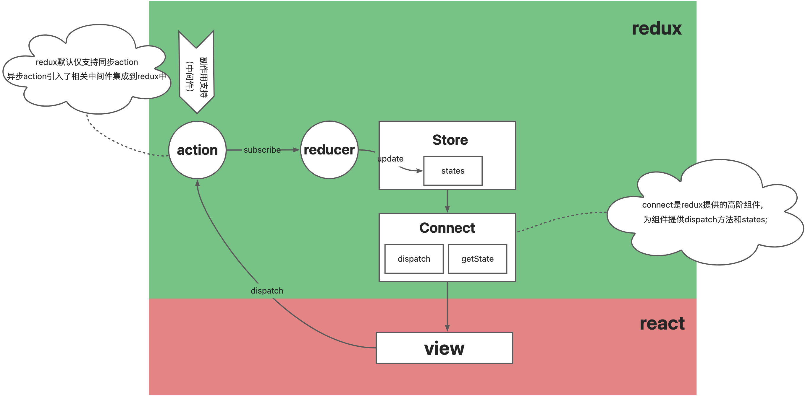

# redux架构

## 1. 核心

核心概念&工作流程

<figure><figcaption></figcaption></figure>

* Store：存储状态的容器，JS对象
* View：视图层，HTML页面
* Actions：对象，描述对状态进行怎样的操作。可以是同步action对象，或异步action。
* Reducers：函数，操作状态后返回新的状态

### disptach

分发，View不能直接修改Store，必须通过以下两种方式修改状态

```typescript
// 普通action是一个对象
type Action = Object
// 异步action
type AsyncAction = any
// 分发普通同步的action
type BaseDispatch = (a: Action) => Action
// 分发异步action
type Dispatch = (a: Action | AsyncAction) => any
```

1. **分发同步action**

入参是一个对象，包含操作类型type，用来描述将对状态做什么操作，payload用来修改state所需的替换数据

```javascript
// 同步dispatch
// dispatch一个名为page1/pagination的reducer
dispatch({
    type:'page1/pagination',
    payload:{
        pageNum:1,
        pageSize:20,
        total:100
    }
})
```

2. **分发异步action**

异步action通过使用<mark style="background-color:purple;">redux-thunk</mark>中间件来实现，使得dispatch可以接受一个函数，该函数内部可以自由实现异步操作，如可以调用其他异步dispatch，也可以调用同步dispatch更改state状态。

下图异步dispatch的入参是一个方法，这个方法的入参是dispatch，这个方法中异步获得了列表的list数据和Pagination数据之后，通过同步dispatch分发了'page1/setPagination'和'page1/setList'两个action来改变状态。

```javascript
// 异步dispatch案例
// dispatch一个getList()这个action方法，这个方法可以实现异步或者同步修改状态。
function getList(payload){
        return async(dispatch)=>{
                const data = await getPageList(payload)
                if(data){
                        const {list, pageSize, pageNum, total} = data||{}Ï
                        dispatch({
                            type:'page1/setPagination',
                            payload:{
                                pageNum,
                                pageSize,
                                total
                            }
                        })
                        dispatch({
                            type:'page1/setList',
                            payload:{
                                list
                            }
                        })
                }
        }
}

dispatch(getList({
        pageNum:1,
        pageSize:20,
        total:100
}))
```

&#x20;<mark style="color:red;">拓展：如何利用Middleware自定义dispatch中间件</mark>

&#x20;       Middleware 是一个高阶函数，它用来组合[dispatch function](https://cn.redux.js.org/understanding/thinking-in-redux/glossary#dispatching-function)并返回一个新的 dispatch function，通常将[异步 action](https://cn.redux.js.org/understanding/thinking-in-redux/glossary#%E5%BC%82%E6%AD%A5-action) 转换成 action。

&#x20;        Middleware 利用复合函数使其可以组合其他函数，可用于记录 action 日志、产生其他诸如变化路由的副作用，或将异步的 API 调用变为一组同步的 action。

&#x20;           请见 [`applyMiddleware(...middlewares)`](https://cn.redux.js.org/understanding/thinking-in-redux/api/applyMiddleware.md) 获取 middleware 的详细内容。

```typescript
type MiddlewareAPI = { dispatch: Dispatch, getState: () => State }
type Middleware = (api: MiddlewareAPI) => (next: Dispatch) => Dispatch
```

### subscribe(底层订阅，一般不用）

意思为订阅，订阅一个监听state变更的listener。当Store中状态发生改变时，就会执行这个listener，从而拿到最新的state。

每当 dispatch action 的时候就会执行，state 树中的一部分可能已经变化。你可以在回调函数里调用 [`getState()`](https://cn.redux.js.org/api/store#getstate) 来拿到当前 state。

你可以在变化监听器里面进行 [`dispatch()`](https://cn.redux.js.org/api/store#dispatchaction)，但你需要注意下面的事项：

1. 监听器调用 [`dispatch()`](https://cn.redux.js.org/api/store#dispatchaction) 仅仅应当发生在响应用户的 actions 或者特殊的条件限制下（比如： 在 store 有一个特殊的字段时 dispatch action）。虽然没有任何条件去调用 [`dispatch()`](https://cn.redux.js.org/api/store#dispatchaction) 在技术上是可行的，但是随着每次 [`dispatch()`](https://cn.redux.js.org/api/store#dispatchaction) 改变 store 可能会导致陷入无穷的循环。
2. 订阅器（subscriptions） 在每次 [`dispatch()`](https://cn.redux.js.org/api/store#dispatchaction) 调用之前都会保存一份快照。当你在正在调用监听器（listener）的时候订阅(subscribe)或者去掉订阅（unsubscribe），对当前的 [`dispatch()`](https://cn.redux.js.org/api/store#dispatchaction) 不会有任何影响。但是对于下一次的 [`dispatch()`](https://cn.redux.js.org/api/store#dispatchaction)，无论嵌套与否，都会使用订阅列表里最近的一次快照。
3. 订阅器不应该注意到所有 state 的变化，在订阅器被调用之前，往往由于嵌套的 [`dispatch()`](https://cn.redux.js.org/api/store#dispatchaction) 导致 state 发生多次的改变。保证所有的监听器都注册在 [`dispatch()`](https://cn.redux.js.org/api/store#dispatchaction) 启动之前，这样，在调用监听器的时候就会传入监听器所存在时间里最新的一次 state。

这是一个底层 API。多数情况下，你不会直接使用它，会使用一些 React（或其它库）的绑定。如果你想让回调函数执行的时候使用当前的 state，你可以 [写一个定制的 `observeStore` 工具](https://github.com/rackt/redux/issues/303#issuecomment-125184409)。 `Store` 也是一个 [`Observable`](https://github.com/zenparsing/es-observable)， 所以你可以使用 [RxJS](https://github.com/ReactiveX/RxJS) 的这样的库来 `subscribe` 订阅更新。

如果需要解绑这个变化监听器，执行 `subscribe` 返回的函数即可。

**参数**[**​**](https://cn.redux.js.org/api/store#%E5%8F%82%E6%95%B0-1)

1. `listener` (_Function_): 每当 dispatch action 的时候都会执行的回调。state 树中的一部分可能已经变化。你可以在回调函数里调用 [`getState()`](https://cn.redux.js.org/api/store#getstate) 来拿到当前 state。store 的 reducer 应该是纯函数，因此你可能需要对 state 树中的引用做<mark style="background-color:purple;">深度比较</mark>来确定它的值是否有变化。

**返回值**[**​**](https://cn.redux.js.org/api/store#%E8%BF%94%E5%9B%9E%E5%80%BC-1)

(_Function_): 一个可以解绑变化监听器的函数。

**示例**

```javascript
function select(state) {
  return state.some.deep.property
}

let currentValue
function handleChange() {
  let previousValue = currentValue
  currentValue = select(store.getState())

  if (previousValue !== currentValue) {
    console.log(
      'Some deep nested property changed from',
      previousValue,
      'to',
      currentValue
    )
  }
}

const unsubscribe = store.subscribe(handleChange)
unsubscribe()
```

### 案例

```html
<body>
    <button id='inc'>+</button> 
    <span id='counter'>0</span>  
    <button id='dec'>+</button>
</body>
```

要求‘+’号button点击后，counter+1，‘-’号button点击后，counter-1。

<pre class="language-javascript"><code class="lang-javascript">const initState = {
    count:0
}
const reducer = (state=initState,action)=>{
    (action.type){}
    
}
let store = redux.createStore(reducer)
const incrementAction = {type:'inc'}
const decrementAction = {type:'dec'}
// '+'按钮的点击事件
document.getElementById('inc').onClick=()=>{
    const dispatch = store.dispatch
    dispatch(incrementAction)
}
// '-'按钮的点击事件
document.getElementById('dec').onClick=()=>{
    dispatch(decrementAction)
}
<strong>
</strong></code></pre>

## redux for react15

<figure><figcaption><p>redux for react15</p></figcaption></figure>

## redux for react16

<figure><figcaption><p>redux for react16</p></figcaption></figure>

react-redux是react的模块之一。

redux利用了react-redux暴露的useDispatch和useSelector等hooks，通过改变组件中的state，从而更新视图。
