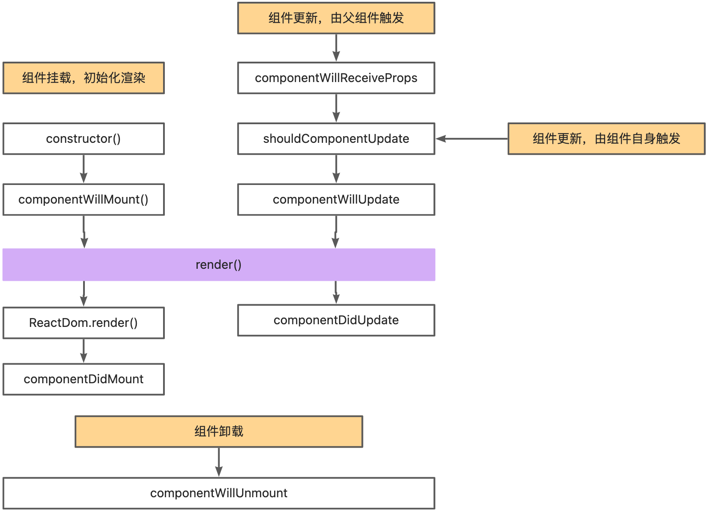

# redux架构

## redux for react15

<figure><figcaption>
redux for react15
</figcaption></figure>

## redux for react16

<figure><figcaption>
redux for react16
</figcaption></figure>

react-redux是react的模块之一。

redux利用了react-redux暴露的useDispatch和useSelector等hooks，通过改变组件中的state，从而更新视图。
