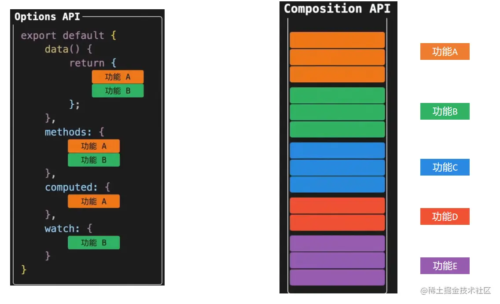

<!--
 * @Author: jiangmengxia jiangmengxia@nnuo.com
 * @Date: 2024-08-14 13:18:18
 * @LastEditors: jiangmengxia jiangmengxia@nnuo.com
 * @LastEditTime: 2024-08-14 17:26:01
 * @FilePath: \jiangmengxia.github.io\terms\terms.md
 * @Description: Description
-->
# 术语

## 选项式API & 组合式API



## 选项式API
选项式API(options API)（Vue2）开发出来的vue应用如左图所示。它的特点是模板化的，理解容易，好上手。因为各个选项都有固定的书写位置（比如数据就写到data选项中，操作方法就写到methods中，等等），应用大了之后，相信大家都遇到过来回上下找代码的困境。

## 组合式API
组合式API（Composition API）是Vue 3引入的一种新的API，它提供了一种更灵活的方式来组织和复用逻辑。主要用于在大型组件中提高代码逻辑的可复用性。
Vue3 使用组合式 API 的地方为 setup。
在 setup 中，我们可以按逻辑关注点对部分代码进行分组，然后提取逻辑片段并与其他组件共享代码。因此，组合式 API（Composition API） 允许我们编写更有条理的代码。

## 纯函数
无副作用的函数，输入相同，输出相同。

## 闭包
函数和对其周围状态（词法环境）的引用捆绑在一起（或者说函数被引用包围），这样的组合就是闭包（closure）。也就是说，闭包让你可以在一个内层函数中访问到其外层函数的作用域。在 JavaScript 中，每当创建一个函数，就会在函数对象中创建一个[[scope]]属性，这个属性包含了一个函数被创建时的作用域中的对象的集合。
下面的代码中，函数 f1 是一个闭包，因为它可以访问到其外层函数 f 的变量 i。
```js
function f1() {
  let i = 0;
  return function() {
    console.log(i++);
  }
}

const f = f1();
f(); // 0
f(); // 1
```
闭包的应用场景：
1. 模拟私有变量
2. 回调函数
3. 柯里化
4. 函数防抖和节流
5. 组合函数
6. 高阶组件等

## 惰性函数
惰性函数是一种只在第一次调用时执行函数体的函数。在后续的调用中，函数体将不再执行，而是直接返回第一次执行的结果。惰性函数可以提高代码的性能，因为它避免了在每次调用函数时都执行相同的代码。
使用场景：
1. 延迟加载
2. 条件判断
3. 性能优化
4. 避免重复计算
5. 动态类型检测等

## 柯里化
将一个多参数的函数转换成多个单参数的函数，并且返回接受余下的参数且返回结果的新函数的技术。
```js
function add(a, b, c) {
  return a + b + c;
}

function curryingAdd(a) {
  return function(b) {
    return function(c) {
      return a + b + c;
    }
  }
}

curryingAdd(1)(2)(3) // 6
```
优点：1. 参数复用 2. 提前返回 3. 延迟计算/运行
缺点：1. 代码量增加 2. 可读性下降

## 组合函数
组合函数是将多个函数组合成一个函数的技术。组合函数可以让你将多个函数的结果传递给下一个函数，从而实现函数的链式调用。

实现：组合函数可以通过递归的方式实现。例如，以下是一个将多个函数组合在一起的函数：
```js
function compose(...funcs) {
  return function(...args) {
    let result = funcs[0](...args);
    for (let i = 1; i < funcs.length; i++) {
      result = funcs[i](result);
    }
    return result;
  }
}
```
使用这个函数，可以将多个函数组合在一起

```js
function add1(x) {
  return x + 1;
}

function add2(x) {
  return x + 2;
}

function add3(x) {
  return x + 3;
}

const add = compose(add1, add2, add3);
add(1); // 7
```
compose执行，会把传进来的函数预先存起来，也就是上面的add方法；再把返回的函数（add）执行，才使用存起来的函数，所以这里也是闭包的保存作用。

优点：组合函数可以提高代码的可读性和可维护性。例如，可以将多个函数组合在一起，形成一个新的函数，从而实现更复杂的逻辑。同时，由于组合函数使用链式调用，因此可以简化代码。
缺点：组合函数可能会导致代码的嵌套层次增加，从而降低代码的可读性。同时，由于组合函数需要预先存储函数，因此可能会导致性能问题。


## 高阶函数
接受函数作为参数或者返回一个函数的函数。
使用场景：
1. 函数作为参数传递
2. 函数作为返回值
3. 函数柯里化
4. 函数防抖和节流
5. 函数组合
6. 高阶组件等


